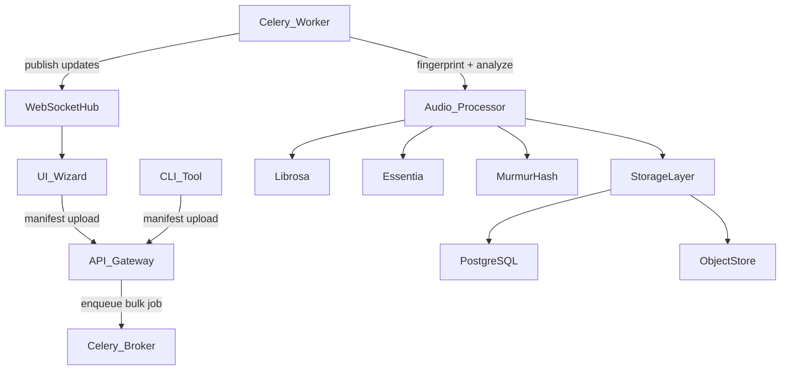

# Phase 1 — Intelligent Asset Ingestion: Bulk Importer Blueprint

## 1. Mission & Success Criteria
- **Objective:** ingest thousands of audio assets in minutes, deduplicate by waveform, and enrich each file with core metadata (BPM, key, duration) at ingest time.
- **Target KPIs:**
  - ≥10k files/hour baseline on a 4-core machine.
  - Duplicate detection accuracy ≥99% across varied lossy/lossless formats.
  - Accurate BPM within ±1.5 BPM and key detection within ±1 semitone for 90% of tested material.
- **Beta Definition of Done:** import wizard + API pipeline deployed, integration tests green, real-time status updates visible in UI, and a dry-run on a 5k sample folder completes with zero crashes.

## 2. Deliverables Checklist
1. **Backend ingest service** with waveform hashing, BPM/key analysis, and Celery worker orchestration.
2. **FastAPI endpoints**
   - `POST /api/v1/audio/bulk-import/init` (start job, return task id)
   - `POST /api/v1/audio/bulk-import/ingest` (upload manifest or S3 pointer)
   - `GET /api/v1/audio/bulk-import/{job_id}/status`
3. **WebSocket stream** broadcasting job progress (`bulk_import.update`).
4. **Database extensions**
   - new table for import jobs (status, totals, error log)
   - optional fingerprint column on `audio_files` (stored hash for dedupe).
5. **CLI + Next.js wizard** letting users point to local folders/cloud buckets, preview metadata, and resolve collisions.
6. **Test harness** (Pytest + sample fixtures) covering duplicates, multi-format ingest, and failure retries.

## 3. Architecture Overview

### Key Components
- **Manifest**: JSON describing file URI (local path, S3 URL), checksum, optional tags.
- **Fingerprinting**: use `librosa.feature.mfcc` or `pydub` to produce canonical waveform; hash via `xxhash` or `murmurhash3`.
- **Analysis Pipeline**: reuse existing feature extraction utilities where possible; fall back to `librosa.beat.beat_track` for BPM and `librosa.pitch`/`essentia.standard.KeyExtractor` for key.
- **Storage**: fingerprints stored in new column `fingerprint` (SHA256/xxhash) on `audio_files`; enforce unique constraint per user.
- **Progress Tracking**: `import_jobs` table with counters (queued, processing, completed, duplicates, failed).

## 4. Implementation Steps
### Step 1 — Scaffolding & Data Model
- Add Alembic migration introducing `import_jobs` table + `fingerprint` column.
- Define SQLAlchemy models + Pydantic schemas for jobs and manifest entries.

### Step 2 — API & Task Queue Integration
- Create FastAPI router `bulk_import.py` under `app/api/v1/`.
- Wire Celery tasks (or background worker if Celery not ready) to process manifest entries in batches (e.g., 32 files chunk size).
- Implement status polling endpoint + WebSocket channel for live updates (reuse existing WS infra).

### Step 3 — Audio Processing Pipeline
- Add utility module `app/services/audio_ingest.py` handling:
  - format normalization (convert to WAV if needed)
  - fingerprint computation
  - BPM/key/duration extraction
  - storage of metadata + detection of duplicates
- Ensure operations are cancellable + idempotent.

### Step 4 — UX Integrations
- CLI command `sm-import` that builds manifest and triggers API call.
- Next.js wizard (new route `app/import/wizard`) that lets producers select folders (via Electron/desktop bridge or upload zipped manifests), shows progress, and resolves duplicates.

### Step 5 — Testing & Validation
- Write Pytest suites with fixture audio files (120 BPM, 90 BPM, duplicates) verifying:
  - fingerprint collisions flagged correctly
  - BPM/key metadata accuracy
  - job status transitions (queued → running → completed/failed)
- Add rate-limit/load test plan (Locust/k6 stub) to ensure throughput target is feasible.

## 5. Open Questions
1. **Storage Destination**: confirm short-term plan (local disk vs. S3) for imported assets during beta.
2. **Queue Strategy**: reuse Celery (already in stack) or rely on background tasks for MVP?
3. **Manifest Generation**: rely on client upload vs. server-side directory scan via remote agent?
4. **Fingerprint Size**: choose between full fingerprint (longer processing) or truncated hash (faster but potentially less unique).
5. **User Quotas**: should importer enforce per-user quotas or project-level limits during beta?

## 6. Timeline (Aggressive Beta Sprint)
- **Day 1–2**: migrations, schemas, API skeleton, manifest ingestion.
- **Day 3–4**: processing pipeline + fingerprinting + dedupe logic.
- **Day 5**: CLI & wizard MVP, WebSocket updates.
- **Day 6**: automated tests, sample fixture validation, load test stub.
- **Day 7**: polish, docs (`INGEST_GUIDE.md`), dry-run with seed library, stakeholder review.

## 7. Next Actions
- [ ] Confirm answers to open questions with product + infra leads.
- [ ] Spin up dedicated branch `feature/bulk-importer`.
- [ ] Implement Step 1 (migrations + models) and request early review.
- [ ] Prepare sample fixture library (at least 10 files with known BPM/key).
