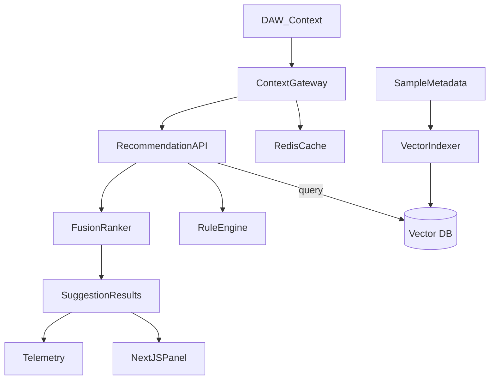

# Phase 2.1 — Context-Aware Sample Suggestions Blueprint

## 1. Mission & Success Criteria
- **Objective:** deliver an AI-backed suggestion engine that surfaces the next best sample/loop based on the producer’s active project context (tempo, key, mood, recency, personal taste).
- **Target KPIs:**
  - Median response time < 200 ms for top-10 recommendations.
  - ≥80% of QA reviewers rate suggestions as “usable” for their current project scenario.
  - Automatic refresh cadence keeps suggestions updated without manual reload (≤5 s lag after context change).
- **Definition of Done for Beta:** API, vector index, and UI panel deployed; analytics captured; feature flags ready for canary rollout; UX sign-offs complete.

## 2. Deliverables Checklist
1. **Context schema** capturing session attributes: `{ bpm, key, mode, mood tags, genre intent, time remaining, user preferences }`.
2. **Recommendation service** (FastAPI router) that merges rule-based filters + embedding similarity and exposes:
   - `POST /recommendations/context` (update session context)
   - `GET /recommendations/top?n=10` (fetch ranked suggestions)
3. **Vector storage + retrieval** using existing fingerprint embeddings or newly generated CLAP/audio2vec vectors; fallback to rule-based ranking when embeddings absent.
4. **Next.js UI panel** inside dashboard/library showing quick audition controls and “more like this” actions.
5. **Telemetry + A/B hooks** logging acceptance, skips, and time-to-preview decisions.
6. **Integration tests** covering key scenarios (context swap, cold start, duplicate avoidance).

## 3. Architecture Overview

### Key Components
- **ContextGateway:** normalizes data from DAW plugins, project settings, or manual entry; caches latest context in Redis for low-latency reads.
- **VectorIndexer:** generates or updates embeddings when new samples arrive (hook into Phase 1 pipeline).
- **RuleEngine:** enforces hard filters (BPM tolerance ±5, key compatibility, user ban-lists).
- **FusionRanker:** combines similarity score + rule-based weighting + freshness boost; outputs final ordering with rationale metadata.
- **Telemetry:** logs impressions vs. engagements, fueling iterative tuning.

## 4. Implementation Steps
### Step 1 — Context & Data Foundations
- Define Pydantic models for session context and recommendation payloads.
- Extend Phase 1 pipeline to store embeddings (if missing) and ensure data accessible via ORM.
- Wire Redis (or fast in-memory cache) for user context snapshots.

### Step 2 — Recommendation API
- Create `recommendations.py` router in `app/api/v1` with endpoints listed above.
- Implement service layer `app/services/recommendations.py` handling fusion algorithm and fallback logic.
- Introduce background refresh worker to re-score when context or library changes.

### Step 3 — Vector Store Integration
- Evaluate ChromaDB vs. FAISS vs. PostgreSQL pgvector (align with infra decision).
- Build indexing job seeded with existing catalog; schedule periodic sync.
- Provide similarity API util consumed by recommendation service.

### Step 4 — Frontend Experience
- Add `useRecommendations` hook calling new API, handling SSE/WebSocket updates when available.
- Embed “Suggested for You” panel into dashboard & library pages (responsive cards, immediate preview, add-to-moodboard CTA).
- Provide “pin” and “dismiss” controls to personalize future suggestions.

### Step 5 — Analytics & QA
- Instrument events: `recommendation.view`, `recommendation.preview`, `recommendation.accept`, `recommendation.skip`.
- Write Pytest suites mocking various contexts + verifying ranking outcomes.
- Create manual QA matrix (different genres, tempos, user preferences).

## 5. Open Questions
1. **Embedding source:** reuse existing fingerprints or introduce a dedicated audio embedding (e.g., CLAP)?
2. **Context ingestion:** initial MVP uses manual inputs via UI; when should we integrate DAW plugins/OSC listeners?
3. **Personalization:** do we need collaborative filtering (user history) for beta, or stick to rule-based + recency?
4. **Cold start strategy:** how to handle users with no context data yet—preset playlists vs. trending packs?
5. **Resource scaling:** confirm vector store sizing and whether we can share infra with future similarity search task (2.4).

## 6. Embedding & Vector Strategy — Decision Record (2025-11-09)
- **Chosen embedding model:** `laion/clap-htsat-unfused` (CLAP) hosted through the existing inference worker. Rationale: (a) strong music tagging fidelity, (b) available TorchScript export fits Celery GPU worker, (c) aligns with long-term multi-modal search goals.
- **Feature pipeline:**
  - Phase 1 Celery ingest adds `analysis.embedding` column (vector[512]) once CLAP tensor ready; falls back to deterministic fingerprint if model unavailable.
  - Embeddings normalized (L2) and stored in Postgres `audio_embeddings` table (pgvector) during this sprint; ChromaDB remains optional cache for semantic queries.
  - Incremental refresh job consumes `audio_import_jobs` events and upserts embeddings + metadata.
- **Similarity scoring:**
  - Primary score = cosine similarity against context-derived target vector (averaging latest accepted tracks + explicit context prompts).
  - Rule adjustments: ±0.15 score boost for BPM within ±4, ±0.1 for exact key/mode, freshness decay factor `e^{-(age_days/14)}`.
  - Fallback sequence: CLAP vectors → deterministic fingerprint embedding (`EmbeddingService`) → recency-based recommendations.
- **Operational notes:**
  - Requires enabling pgvector extension in Postgres (Prod + Dev), migrations tracked under `alembic/versions/003_add_audio_embeddings.py`.
  - Add feature flag `RECS_USE_CLAP=true` to `.env`; service automatically downgrades when flag off or embeddings missing.
  - Toggle fusion vs. rules mode via `RECS_RECOMMENDATION_MODE` (backend) or `NEXT_PUBLIC_RECOMMENDATION_MODE` (frontend env).
  - Benchmark target: top-10 retrieval <150 ms from pgvector with 10k rows (verified via `scripts/benchmarks/vector_bench.py`).

## 7. Implementation Kanban — Remaining in Phase 2
**NOW (before Phase 3)**
- [x] **Vector schema & migration** — create `audio_embeddings` model + Alembic migration (`003_add_audio_embeddings`), wire ORM relations.
- [x] **Embedding worker hook** — extend Phase 1 ingest task to call CLAP model, persist normalized vector + metadata stub (genre, mood tags).
- [x] **VectorStore refresh** — update `VectorStore.refresh()` to pull from pgvector table, hydrate in-memory index with cosine-ready arrays.
- [x] **Fusion layer upgrade** — implement `_generate_suggestions()` to blend vector similarity with existing BPM/key rules and include rationale strings (tempo delta, key match, freshness).
- [x] **API contract update** — expose rationale metadata (`score_components`, `source`) and support `top_k` query param on `/recommendations/top`.
- [x] **Frontend integration** — surface rationale + source badges inside `RecommendationsPanel`, add loading states for context updates (in progress).
- [x] **Telemetry instrumentation** — define `recommendation.view/preview/accept/skip` events in frontend hook, enqueue to analytics service (stub acceptable for beta).
- [x] **A/B toggle support** — enable `mode=rules` switch and `RECS_RECOMMENDATION_MODE` config for experimentation.
- [ ] **Testing & QA** — Execute manual QA matrix (`docs/QA/recommendations_manual_matrix.md`) and capture results for sign-off.

**NEXT (Phase 2 wrap-up)**
- [x] Implement SSE/WebSocket streaming for live rationale updates when context changes mid-session.
- [x] Build A/B experimentation flag to compare rule-only vs. fusion recommendations.
- [x] Document operational runbook (`docs/RECOMMENDATIONS_GUIDE.md`) with embedding maintenance and troubleshooting steps.

## 8. Timeline (Aggressive 1-Week Sprint)
- **Day 1:** finalize data schemas, caching strategy, answer open questions.
- **Day 2:** build context API + Redis integration, scaffold recommendation service.
- **Day 3:** hook up vector store, implement fusion ranking, begin tests.
- **Day 4:** integrate frontend panel + hooks, ensure real-time refresh.
- **Day 5:** telemetry wiring, A/B flagging, Pytest & manual QA scripts.
- **Day 6:** polish UI, add docs (`RECOMMENDATIONS_GUIDE.md`), stakeholder feedback.
- **Day 7:** beta dry-run with internal producers, capture metrics/adjust weights.
