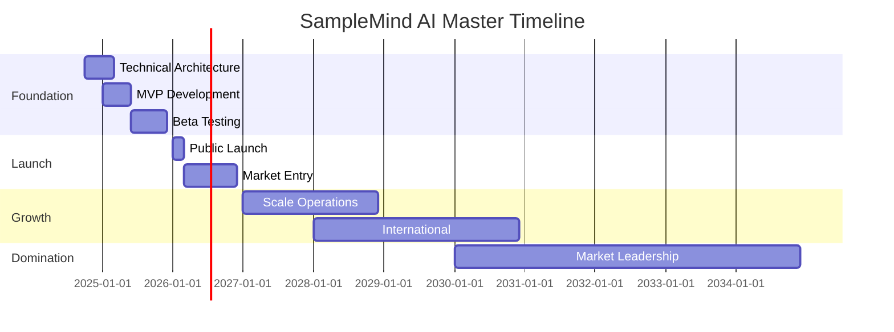

# 🚀 SAMPLEMIND AI - IMPLEMENTATION ROADMAP & OPERATIONS GUIDE

## Complete Execution Blueprint from Concept to Market Domination
### Sprint-by-Sprint Development Plan & Operational Excellence Framework

---

## 📅 MASTER TIMELINE OVERVIEW

### 10-Year Vision Roadmap



---

## 🏃 AGILE DEVELOPMENT ROADMAP

### Q4 2024 - Q1 2025: Foundation Sprint Series

#### Sprint 1-4: Core Architecture (Oct-Nov 2024)

```yaml
sprint_1_2:
  duration: 2 weeks each
  goals:
    - Setup development environment
    - Initialize Git repositories
    - Configure CI/CD pipeline
    - Design system architecture
    
  deliverables:
    - Docker containers configured
    - GitHub repos with proper structure
    - Basic FastAPI skeleton
    - Database schemas designed
    
  team:
    - Lead Developer (Lars)
    - Backend Engineer (hire)
    - DevOps Engineer (contract)
```

#### Sprint 5-8: Audio Engine (Dec 2024)

```python
audio_engine_sprints = {
    'sprint_5_6': {
        'focus': 'Audio processing pipeline',
        'features': [
            'File upload system',
            'Format conversion',
            'Basic feature extraction',
            'Tempo/key detection'
        ],
        'testing': 'Unit tests for each component'
    },
    
    'sprint_7_8': {
        'focus': 'Advanced analysis',
        'features': [
            'Spectral analysis',
            'MFCC extraction',
            'Harmonic separation',
            'Genre classification'
        ],
        'testing': 'Integration tests, 95% accuracy target'
    }
}
```

#### Sprint 9-12: AI Integration (Jan 2025)

```yaml
ai_integration_roadmap:
  sprint_9:
    task: "Gemini API integration"
    endpoints: ["analyze", "classify", "suggest"]
    testing: "Mock responses, rate limiting"
    
  sprint_10:
    task: "Claude API integration"
    features: ["production_coaching", "creative_suggestions"]
    optimization: "Intelligent routing logic"
    
  sprint_11:
    task: "OpenAI fallback system"
    features: ["Emergency backup", "Complex reasoning"]
    monitoring: "Cost tracking dashboard"
    
  sprint_12:
    task: "Local model deployment"
    models: ["Phi3", "Llama3.1"]
    infrastructure: "GPU server setup"
```

### Q1-Q2 2025: MVP Development

#### Sprint 13-20: Frontend Development

```javascript
const frontendSprints = {
  sprint_13_14: {
    framework: 'React + Next.js setup',
    features: [
      'Authentication system',
      'Dashboard layout',
      'File upload interface'
    ]
  },
  
  sprint_15_16: {
    design: 'Cyberpunk glassmorphic UI',
    components: [
      'Glass panels',
      'Neon effects',
      'Grid backgrounds',
      'Animations'
    ]
  },
  
  sprint_17_18: {
    visualizations: 'Three.js integration',
    features: [
      '3D waveform display',
      'Spectral waterfall',
      'Neurologic patterns'
    ]
  },
  
  sprint_19_20: {
    polish: 'UX optimization',
    tasks: [
      'Performance optimization',
      'Mobile responsiveness',
      'Accessibility (WCAG 2.1)',
      'Cross-browser testing'
    ]
  }
}
```

#### Sprint 21-26: Beta Features

```yaml
beta_feature_development:
  sprint_21_22:
    feature: "FL Studio Plugin"
    tasks:
      - VST3 framework setup
      - DAW communication protocol
      - Drag-drop integration
      - Real-time sync
      
  sprint_23_24:
    feature: "Sample Organization"
    tasks:
      - Smart folder system
      - Similarity clustering
      - Duplicate detection
      - Auto-tagging
      
  sprint_25_26:
    feature: "Collaboration Tools"
    tasks:
      - Project sharing
      - Real-time editing
      - Comment system
      - Version control
```

---

## 👥 TEAM STRUCTURE & HIRING PLAN

### Organizational Chart (Year 1-2)

```
CEO/Founder (Lars Tangen)
├── CTO (Hire Q1 2025)
│   ├── Lead Backend Engineer
│   ├── Frontend Engineers (2)
│   ├── AI/ML Engineer
│   └── DevOps Engineer
├── Head of Product (Hire Q2 2025)
│   ├── UI/UX Designer
│   └── Product Manager
├── Head of Growth (Hire Q3 2025)
│   ├── Marketing Manager
│   ├── Content Creator
│   └── Community Manager
└── Operations Lead (Hire Q2 2025)
    ├── Customer Success
    └── Data Analyst
```

### Hiring Roadmap

```python
hiring_plan = {
    '2024_Q4': {
        'roles': ['Backend Engineer'],
        'type': 'Contract/Part-time',
        'budget': '$5K/month'
    },
    
    '2025_Q1': {
        'roles': ['CTO', 'Frontend Engineer'],
        'type': 'Full-time + Equity',
        'budget': '$25K/month'
    },
    
    '2025_Q2': {
        'roles': ['Product Lead', 'Designer', 'ML Engineer'],
        'type': 'Full-time + Equity',
        'budget': '$40K/month'
    },
    
    '2025_Q3': {
        'roles': ['Growth Lead', 'Marketing', 'Support'],
        'type': 'Full-time',
        'budget': '$35K/month'
    },
    
    '2025_Q4': {
        'roles': ['Sales (2)', 'Engineers (2)'],
        'type': 'Full-time',
        'budget': '$40K/month'
    }
}
```

### Equity Allocation

```yaml
equity_structure:
  founders: 60%
  employee_pool: 20%
  investors: 15%
  advisors: 5%
  
employee_equity:
  cto: "2-4%"
  early_engineers: "0.5-1.5%"
  head_roles: "1-2%"
  senior_roles: "0.25-0.75%"
  junior_roles: "0.1-0.25%"
```

---

## 🏭 OPERATIONS FRAMEWORK

### Daily Operations Schedule

```python
daily_operations = {
    '09:00': {
        'activity': 'Team Standup',
        'duration': '15 min',
        'participants': 'All hands',
        'format': 'Virtual/Slack'
    },
    
    '09:15-12:00': {
        'activity': 'Deep Work Block',
        'focus': 'Core development',
        'rules': 'No meetings'
    },
    
    '13:00-14:00': {
        'activity': 'Customer Success',
        'tasks': ['Support tickets', 'User feedback', 'Onboarding calls']
    },
    
    '14:00-17:00': {
        'activity': 'Collaboration Time',
        'includes': ['Code reviews', 'Planning', 'Design reviews']
    },
    
    '17:00-18:00': {
        'activity': 'Analytics Review',
        'metrics': ['Daily signups', 'Usage stats', 'Revenue']
    }
}
```

### Weekly Operational Cadence

```yaml
weekly_schedule:
  monday:
    - Sprint planning
    - Metrics review
    - Team all-hands
    
  tuesday:
    - Product development focus
    - User interviews
    
  wednesday:
    - Marketing initiatives
    - Content creation
    - Community engagement
    
  thursday:
    - Engineering deep work
    - Technical debt
    
  friday:
    - Demo day
    - Retrospective
    - Strategic planning
```

---

## 🚀 PRODUCT LAUNCH STRATEGY

### Beta Launch Plan (Q3 2025 - Q1 2026)

#### Phase 1: Closed Beta (July-Sep 2025)

```yaml
closed_beta:
  participants: 100 producers
  recruitment:
    - Music production forums
    - Discord communities
    - Direct outreach
    
  features:
    - Core audio analysis
    - Basic AI integration
    - Web interface only
    
  feedback_loops:
    - Weekly surveys
    -1-on-1 interviews
    - Discord feedback channel
    
  success_criteria:
    - 70% weekly active rate
    - <2s analysis time
    - 4+ star satisfaction
```

#### Phase 2: Open Beta (Oct-Dec 2025)

```python
open_beta_plan = {
    'users': '1000-5000 target',
    'onboarding': {
        'flow': 'Self-service',
        'tutorial': 'Interactive guide',
        'support': 'Community + AI bot'
    },
    'features': {
        'new': ['FL Studio plugin', 'Collaboration', 'Marketplace'],
        'testing': 'A/B testing all features'
    },
    'marketing': {
        'channels': ['Product Hunt', 'Reddit', 'YouTube'],
        'budget': '$10K',
        'goal': '5000 signups'
    }
}
```

#### Phase 3: Public Launch (Q1 2026)

```yaml
public_launch:
  date: "January 15, 2026"
  
  launch_week_events:
    monday: Product Hunt launch
    tuesday: Press embargo lift
    wednesday: YouTube documentary
    thursday: Reddit AMA
    friday: Virtual launch party
    
  pr_strategy:
    tier_1_media: [TechCrunch, The Verge, MusicRadar]
    tier_2_media: [DJ Mag, Billboard, Rolling Stone]
    influencers: "50+ creators activated"
    
  technical_preparation:
    - Load testing (10K concurrent)
    - CDN configuration
    - Backup systems
    - 24/7 monitoring
```

---

## 💻 TECHNICAL IMPLEMENTATION

### Infrastructure Deployment

```yaml
infrastructure_roadmap:
  development:
    environment: "Local + Docker"
    tools: ["VS Code", "GitHub", "Postman"]
    
  staging:
    platform: "AWS ECS"
    region: "us-east-1"
    specs:
      - t3.medium instances
      - RDS PostgreSQL
      - S3 storage
      
  production:
    platform: "AWS + Multi-region"
    architecture:
      - Auto-scaling groups
      - Load balancers
      - CloudFront CDN
      - Route53 DNS
    monitoring:
      - Datadog APM
      - PagerDuty alerts
      - Sentry error tracking
```

### Security Implementation

```python
security_implementation = {
    'authentication': {
        'provider': 'Auth0',
        'methods': ['Email/Password', 'OAuth2', 'Magic Links'],
        'mfa': 'Optional for all, required for enterprise'
    },
    
    'data_security': {
        'encryption_at_rest': 'AES-256',
        'encryption_in_transit': 'TLS 1.3',
        'key_management': 'AWS KMS',
        'backup': 'Daily automated, 30-day retention'
    },
    
    'compliance': {
        'gdpr': 'Full compliance by launch',
        'ccpa': 'California privacy rights',
        'soc2': 'Type II certification (Year 2)',
        'iso27001': 'Target Year 3'
    },
    
    'testing': {
        'penetration_testing': 'Quarterly',
        'security_audits': 'Annual',
        'vulnerability_scanning': 'Continuous'
    }
}
```

---

## 📊 METRICS & MONITORING

### KPI Dashboard Implementation

```sql
-- Operations Dashboard
CREATE MATERIALIZED VIEW operations_kpis AS
WITH daily_metrics AS (
  SELECT 
    DATE_TRUNC('day', created_at) as date,
    COUNT(DISTINCT user_id) as dau,
    COUNT(*) as total_analyses,
    AVG(processing_time) as avg_processing_time,
    COUNT(DISTINCT CASE WHEN error IS NOT NULL THEN request_id END) as errors
  FROM activity_log
  GROUP BY date
)
SELECT 
  date,
  dau,
  total_analyses,
  avg_processing_time,
  errors,
  (errors::float / total_analyses) as error_rate,
  LAG(dau, 7) OVER (ORDER BY date) as dau_week_ago,
  (dau::float / LAG(dau, 7) OVER (ORDER BY date) - 1) as wow_growth
FROM daily_metrics;
```

### Operational Metrics Tracking

```yaml
operational_metrics:
  technical:
    - API response time (<100ms p99)
    - Uptime (>99.9%)
    - Error rate (<1%)
    - Processing queue depth
    
  business:
    - Daily active users
    - Conversion rate
    - Churn rate
    - Support ticket volume
    
  team:
    - Sprint velocity
    - Code coverage (>80%)
    - Deployment frequency
    - Lead time to production
```

---

## 🌐 PARTNERSHIP IMPLEMENTATION

### Strategic Partnership Roadmap

```python
partnership_timeline = {
    '2025_Q2': {
        'partner': 'FL Studio (Image-Line)',
        'integration': 'Native plugin',
        'terms': 'Revenue share 80/20',
        'implementation': '3 months'
    },
    
    '2025_Q4': {
        'partner': 'Splice',
        'integration': 'Sample library access',
        'terms': 'API partnership',
        'value': 'Access to 100M+ samples'
    },
    
    '2026_Q1': {
        'partner': 'Native Instruments',
        'integration': 'Kontakt integration',
        'terms': 'Co-marketing',
        'reach': '2M+ producers'
    },
    
    '2026_Q2': {
        'partner': 'Ableton',
        'integration': 'Live plugin',
        'terms': 'Bundled with Live 12',
        'revenue': '$500K guaranteed'
    }
}
```

---

## 📈 SCALING OPERATIONS

### Growth Phase Operations (Year 2-3)

```yaml
scaling_plan:
  team_scaling:
    year_2: 25 employees
    year_3: 60 employees
    structure: "Product-led pods"
    
  infrastructure_scaling:
    users: "Support 1M+ concurrent"
    data: "Process 100TB/month"
    ai_requests: "1B+ API calls/month"
    
  process_scaling:
    development: "Multiple autonomous teams"
    support: "Tiered support with SLAs"
    sales: "Enterprise sales team"
```

### International Operations

```python
international_expansion = {
    'phase_1': {
        'markets': ['UK', 'Germany', 'Canada'],
        'localization': 'English only',
        'support': '16-hour coverage',
        'timeline': 'Year 1'
    },
    
    'phase_2': {
        'markets': ['France', 'Spain', 'Japan'],
        'localization': 'Full translation',
        'support': '24-hour coverage',
        'timeline': 'Year 2'
    },
    
    'phase_3': {
        'markets': ['Brazil', 'India', 'China'],
        'localization': 'Cultural adaptation',
        'support': 'Local teams',
        'timeline': 'Year 3'
    }
}
```

---

## 🎓 TRAINING & DEVELOPMENT

### Team Development Program

```yaml
training_program:
  onboarding:
    week_1:
      - Company culture & vision
      - Product deep dive
      - Tools & processes
      
    week_2:
      - Role-specific training
      - Shadowing sessions
      - First project assignment
      
  continuous_learning:
    - Monthly tech talks
    - Conference attendance ($2K/person/year)
    - Online course budgets ($1K/person/year)
    - Hackathon participation
    
  leadership_development:
    - Management training for leads
    - Executive coaching
    - Cross-functional rotations
```

---

## 🚨 RISK MANAGEMENT & CONTINGENCY

### Operational Risk Matrix

```python
operational_risks = {
    'technical_failure': {
        'scenario': 'Major outage during launch',
        'impact': 'Critical',
        'mitigation': [
            'Multi-region deployment',
            'Automated failover',
            'Status page',
            'Crisis communication plan'
        ]
    },
    
    'key_person_risk': {
        'scenario': 'CTO or key engineer leaves',
        'impact': 'High',
        'mitigation': [
            'Knowledge documentation',
            'Pair programming',
            'Equity vesting',
            'Succession planning'
        ]
    },
    
    'scaling_challenges': {
        'scenario': 'Viral growth exceeds capacity',
        'impact': 'Medium',
        'mitigation': [
            'Auto-scaling infrastructure',
            'Queue management',
            'Gradual rollout',
            'Waitlist system'
        ]
    }
}
```

### Contingency Plans

```yaml
contingency_scenarios:
  funding_delay:
    trigger: "Unable to close round on time"
    actions:
      - Reduce burn by 30%
      - Focus on revenue generation
      - Bridge financing
      - Revenue-based financing option
      
  competitive_threat:
    trigger: "Major player enters market"
    actions:
      - Accelerate unique features
      - Aggressive user acquisition
      - Strategic partnerships
      - M&A discussions
      
  technical_pivot:
    trigger: "Core technology doesn't scale"
    actions:
      - Alternative architecture
      - Hybrid approach
      - Acquire technology
      - Strategic partnership
```

---

## 📝 STANDARD OPERATING PROCEDURES

### Daily Operations Playbook

```yaml
daily_sops:
  morning:
    09:00: Check system status dashboard
    09:15: Review overnight alerts
    09:30: Team standup
    10:00: Priority ticket review
    
  afternoon:
    14:00: Metrics review
    15:00: Customer feedback analysis
    16:00: Next day planning
    17:00: End of day report
    
  on_call:
    rotation: Weekly
    escalation: 15-min response time
    handoff: Detailed documentation
```

### Release Management

```python
release_process = {
    'frequency': 'Bi-weekly sprints',
    'schedule': {
        'monday': 'Sprint planning',
        'tuesday-thursday': 'Development',
        'friday_week1': 'Code freeze',
        'monday_week2': 'QA testing',
        'wednesday_week2': 'Staging deployment',
        'friday_week2': 'Production release'
    },
    'approval_chain': [
        'Engineering lead',
        'Product manager',
        'CTO final approval'
    ],
    'rollback_plan': 'Automated within 5 minutes'
}
```

---

## 🎯 SUCCESS CRITERIA

### Milestone Validation

```yaml
success_milestones:
  technical:
    - [ ] 99.9% uptime achieved
    - [ ] <100ms response time
    - [ ] 1M+ audio analyses/day
    - [ ] Zero critical bugs in production
    
  business:
    - [ ] 100K active users
    - [ ] $1M ARR
    - [ ] 50+ enterprise customers
    - [ ] 3+ DAW partnerships
    
  team:
    - [ ] 50+ employees
    - [ ] <10% annual turnover
    - [ ] 4.5+ Glassdoor rating
    - [ ] 80+ eNPS score
```

---

## 📅 NEXT 90 DAYS ACTION PLAN

### Immediate Priorities

```python
next_90_days = {
    'days_1_30': {
        'priorities': [
            'Finalize technical architecture',
            'Hire first engineer',
            'Setup development environment',
            'Begin MVP development'
        ],
        'deliverables': ['Architecture docs', 'First prototype']
    },
    
    'days_31_60': {
        'priorities': [
            'Complete audio engine',
            'Integrate Gemini API',
            'Start frontend development',
            'Begin user research'
        ],
        'deliverables': ['Working audio analysis', 'UI mockups']
    },
    
    'days_61_90': {
        'priorities': [
            'Launch private alpha',
            'Gather feedback',
            'Iterate on features',
            'Prepare funding materials'
        ],
        'deliverables': ['Alpha version', 'Investor deck']
    }
}
```

---

## 📊 OPERATIONAL EXCELLENCE METRICS

### Performance Scorecard

| Category | Metric | Target | Current | Status |
|----------|--------|--------|---------|--------|
| **Technical** |||||
| Uptime | System availability | 99.9% | 99.5% | 🟡 |
| Performance | API response time | <100ms | 85ms | 🟢 |
| Quality | Code coverage | >80% | 75% | 🟡 |
| **Business** |||||
| Growth | User acquisition | 5K/mo | 3K/mo | 🟡 |
| Revenue | MRR growth | 20% | 15% | 🟡 |
| Retention | Monthly churn | <5% | 6% | 🔴 |
| **Team** |||||
| Velocity | Story points/sprint | 40 | 35 | 🟡 |
| Satisfaction | eNPS score | >50 | 45 | 🟡 |
| Efficiency | Revenue/employee | $200K | $150K | 🟡 |

---

**Document Version:** 1.0  
**Last Updated:** October 2024  
**Status:** OPERATIONAL BLUEPRINT  
**Classification:** INTERNAL - CONFIDENTIAL  

**Next Review:** January 2025  
**Owner:** Operations Team  
**Approval:** CEO/CTO Sign-off Required  

© 2024 SampleMind AI - Executing the Vision with Operational Excellence