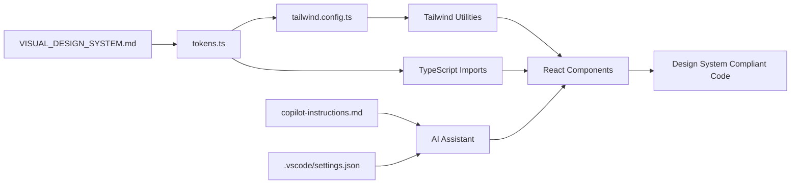

# 🤖 AI Design System Integration Guide
## Automated Design System Enforcement for SampleMind AI

**Version:** 1.0.0
**Created:** January 2025
**Purpose:** Configure AI coding assistants to automatically generate design-system-compliant code

---

## 🎯 Overview

This guide enables **AI-native development** where coding assistants (Kilo Code, GitHub Copilot) automatically reference your design system tokens and generate compliant code without manual specification.

### What's Been Set Up

✅ **Design Tokens** ([`web-app/src/design-system/tokens.ts`](../web-app/src/design-system/tokens.ts))
✅ **Tailwind Config** ([`web-app/tailwind.config.ts`](../web-app/tailwind.config.ts))
✅ **GitHub Copilot Instructions** ([`.github/copilot-instructions.md`](../.github/copilot-instructions.md))
✅ **VS Code Settings** ([`.vscode/settings.json`](../.vscode/settings.json))

---

## 🚀 Quick Start

### 1. Install Dependencies
```bash
cd web-app
npm install -D tailwindcss @types/tailwindcss postcss autoprefixer
npx tailwindcss init -p
```

### 2. Activate in VS Code
1. Open VS Code settings (Cmd/Ctrl + ,)
2. Search for "Kilo Code Custom Instructions"
3. Verify `kilocode.customInstructions` is loaded from `.vscode/settings.json`

### 3. Test AI Integration
Ask your AI assistant:
```
"Create a glassmorphic card component with a purple glow effect"
```

Expected output should reference:
- `glass-card` utility class
- `shadow-glow-purple` for neon effect
- Design system colors (no hardcoded values)

---

## 📚 File Structure

```
project-root/
├── web-app/
│   ├── src/
│   │   └── design-system/
│   │       └── tokens.ts           ← Source of truth for all design values
│   └── tailwind.config.ts          ← Tailwind integration with tokens
├── .vscode/
│   └── settings.json                ← Kilo Code integration
├── .github/
│   └── copilot-instructions.md      ← GitHub Copilot integration
└── docs/
    ├── VISUAL_DESIGN_SYSTEM.md      ← Complete design specifications
    └── AI_DESIGN_SYSTEM_INTEGRATION_GUIDE.md  ← This file
```

---

## 🎨 How It Works

### Design Token Flow


### When You Ask AI for a Component

1. **AI reads** `.github/copilot-instructions.md` or `.vscode/settings.json`
2. **AI references** design tokens pattern
3. **AI generates** code using:
   - Tailwind utilities (`className="bg-primary"`)
   - Token imports (`import { designTokens }`)
   - Standard patterns (glassmorphism, neon glows)
4. **Result:** Design-system-compliant code

---

## 💻 Using with Kilo Code

### Configuration
Kilo Code reads from `.vscode/settings.json`:

```json
{
  "kilocode.customInstructions": {
    "global": [
      "# SampleMind AI - Design System Integration",
      "**ALWAYS reference design tokens from `web-app/src/design-system/tokens.ts`**",
      // ... design system rules
    ]
  }
}
```

### Example Prompts

#### ✅ Good Prompts
```
"Create a button component with our design system"
"Add a glassmorphic card for audio waveform display"
"Build a navigation bar following our style guide"
```

#### ❌ Avoid These
```
"Create a purple button" (too vague, might hardcode colors)
"Make a card with rounded corners" (doesn't specify design system)
```

### Kilo Code Will Automatically:
- Import design tokens when needed
- Use Tailwind utilities from config
- Apply glassmorphism patterns
- Add neon glow effects
- Include proper aria labels
- Use 8pt grid spacing
- Follow typography scale

---

## 🤖 Using with GitHub Copilot

### Configuration
GitHub Copilot reads from `.github/copilot-instructions.md`

### Activation
1. Copilot automatically loads `.github/copilot-instructions.md`
2. Instructions apply to all file suggestions
3. No additional setup required

### Example Workflow

**1. Create new component file:**
```tsx
// src/components/ui/AudioCard.tsx
import { designTokens } from '@/design-system/tokens';

interface AudioCardProps {
  // Copilot will suggest props based on design system patterns
}
```

**2. Copilot suggests:**
```tsx
export function AudioCard({ title, waveformData }: AudioCardProps) {
  return (
    <div className="glass-card rounded-xl p-6 space-y-4">
      <h3 className="font-heading text-xl font-semibold text-text-primary">
        {title}
      </h3>
      {/* ... glassmorphic styling automatically applied */}
    </div>
  );
}
```

---

## 🎯 Design Token Usage

### Method 1: Tailwind Utilities (Preferred)

```tsx
// ✅ Use Tailwind classes from design system
<div className="bg-primary text-text-primary rounded-xl p-6">
  <button className="bg-gradient-purple shadow-glow-purple hover:shadow-glow-cyan">
    Click Me
  </button>
</div>
```

**Benefits:**
- Autocomplete in VS Code
- Type-safe (via Tailwind IntelliSense)
- Smaller bundle size
- Easier to maintain

### Method 2: Direct Token Import

```tsx
// ✅ Import when you need runtime access
import { designTokens } from '@/design-system/tokens';

const MyComponent = () => {
  return (
    <div style={{ background: designTokens.colors.background.primary }}>
      {/* Dynamic styling when needed */}
    </div>
  );
};
```

**Use When:**
- Dynamic values based on props/state
- Complex calculations
- Runtime theme switching
- Canvas/SVG styling

---

## 🎨 Common Patterns

### Glassmorphic Card
```tsx
<div className="glass-card rounded-xl p-6">
  <h2 className="text-2xl font-semibold text-text-primary">Title</h2>
  <p className="text-text-secondary">Content</p>
</div>
```

### Neon Button
```tsx
<button className="
  bg-gradient-purple px-6 py-3 rounded-lg
  shadow-glow-purple hover:shadow-glow-cyan
  transition-normal ease-out
  hover:scale-105 active:scale-95
">
  Action
</button>
```

### Audio Waveform
```tsx
<div className="flex items-end gap-1 h-20">
  {waveformData.map((height, i) => (
    <div
      key={i}
      className="flex-1 bg-gradient-to-t from-primary to-accent-cyan rounded-full"
      style={{ height: `${height}%` }}
    />
  ))}
</div>
```

---

## 🔧 Validation & Testing

### Manual Validation Checklist
- [ ] No hardcoded colors (check for hex codes)
- [ ] Uses Tailwind utilities or token imports
- [ ] Includes aria labels
- [ ] Responsive classes added (md:, lg:, etc.)
- [ ] Glassmorphism applied where appropriate
- [ ] Neon glow effects on interactive elements
- [ ] Proper semantic HTML
- [ ] 8pt grid spacing used

### Automated Testing (Coming Soon)
```bash
# Future: Design system linting
npm run lint:design-system

# Check for hardcoded values
npm run validate:colors

# Verify accessibility
npm run test:a11y
```

---

## 📖 Quick Reference

### Most Used Classes
```css
/* Backgrounds */
bg-primary          /* #8B5CF6 - Purple */
bg-bg-primary       /* #0A0A0F - Dark */
bg-gradient-purple  /* Purple gradient */
bg-gradient-cyber   /* Purple to Cyan */

/* Text */
text-text-primary   /* #FFFFFF */
text-text-secondary /* #94A3B8 */

/* Effects */
glass-card          /* Glassmorphic background */
shadow-glow-purple  /* Neon purple glow */
shadow-glow-cyan    /* Neon cyan glow */
shadow-glow-pink    /* Neon pink glow */

/* Spacing (8pt grid) */
p-4                 /* 16px padding */
p-6                 /* 24px padding */
p-8                 /* 32px padding */
gap-4               /* 16px gap */

/* Animations */
transition-normal   /* 300ms transition */
ease-out            /* Ease out timing */
hover:scale-105     /* Subtle scale on hover */
```

### Color Tokens
```typescript
import { designTokens } from '@/design-system/tokens';

// Primary
designTokens.colors.primary.purple      // #8B5CF6
designTokens.colors.accent.cyan         // #06B6D4
designTokens.colors.accent.pink         // #EC4899

// Backgrounds
designTokens.colors.background.primary  // #0A0A0F
designTokens.colors.glass.surface       // rgba(26, 26, 36, 0.5)

// Gradients
designTokens.gradients.purple           // Purple gradient
designTokens.gradients.cyber            // Purple to Cyan
```

---

## 🚫 Common Mistakes

### ❌ DON'T Do This
```tsx
// Hardcoded colors
<div style={{ background: '#8B5CF6', color: '#FFFFFF' }}>

// Inconsistent spacing
<div style={{ padding: '15px' }}>

// Missing accessibility
<div onClick={handleClick}>Click me</div>

// Random animations
<div style={{ transition: '0.2s' }}>
```

### ✅ DO This Instead
```tsx
// Use design system
<div className="bg-primary text-text-primary">

// 8pt grid spacing
<div className="p-4">

// Proper accessibility
<button onClick={handleClick} aria-label="Click me">

// Standard transitions
<div className="transition-normal ease-out">
```

---

## 📊 Measuring Success

### Your AI Assistant is Working When:
✅ Components use `glass-card` without prompting
✅ Neon glows applied to buttons automatically
✅ No hardcoded hex colors in generated code
✅ Spacing uses 8pt grid (4, 6, 8, 12, etc.)
✅ Aria labels included by default
✅ Typography follows scale (text-base, text-xl, etc.)
✅ Responsive classes added (md:, lg:)

### Red Flags:
❌ Seeing hex codes like `#8B5CF6` in className
❌ Inline styles for colors/spacing
❌ Inconsistent spacing (13px, 17px, etc.)
❌ Missing aria labels
❌ Non-semantic HTML (`<div onClick>`)

---

## 🔄 Updating the System

### When to Update

**Update `tokens.ts` when:**
- Adding new colors
- Changing brand colors
- Adding new spacing values
- Modifying typography scale

**Update `tailwind.config.ts` when:**
- Tokens change
- Adding new utilities
- Modifying breakpoints

**Update `.github/copilot-instructions.md` when:**
- New component patterns emerge
- Best practices evolve
- Common mistakes identified

**Update `.vscode/settings.json` when:**
- Kilo Code capabilities expand
- New reference files added

### Propagation Flow
```
1. Update tokens.ts
2. Tailwind config auto-updates (imports tokens)
3. Update AI instructions to reflect changes
4. Document in VISUAL_DESIGN_SYSTEM.md
```

---

## 🎓 Training AI for Your Patterns

### Example Conversation Log

**You:** "Create a card for displaying audio files"

**AI (Before Integration):**
```tsx
<div style={{ background: '#1a1a1a', padding: '20px' }}>
```

**AI (After Integration):**
```tsx
<div className="glass-card rounded-xl p-6">
```

### Building AI Understanding
1. Start with simple components
2. Provide feedback when it deviates
3. Reference the instructions explicitly
4. Share examples of good patterns
5. AI learns your preferences over time

---

## 🐛 Troubleshooting

### AI Not Following Design System

**Problem:** AI generates hardcoded colors
**Solution:**
1. Verify `.github/copilot-instructions.md` exists
2. Check `.vscode/settings.json` has `kilocode.customInstructions`
3. Restart VS Code
4. Explicitly mention "use design system" in prompt

**Problem:** Tailwind classes not recognized
**Solution:**
1. Install Tailwind CSS IntelliSense extension
2. Run `npm install` in web-app/
3. Verify `tailwind.config.ts` imports tokens correctly

**Problem:** Types not found for tokens.ts
**Solution:**
1. Check `web-app/src/design-system/tokens.ts` exists
2. Verify `tsconfig.json` includes src/ directory
3. Restart TypeScript server (Cmd+Shift+P → "Restart TS Server")

---

## 📚 Additional Resources

- **[Visual Design System](VISUAL_DESIGN_SYSTEM.md)** - Complete design specifications
- **[Implementation Guide](VISUAL_DESIGN_IMPLEMENTATION_GUIDE.md)** - Visual asset usage
- **[Master System Prompt](KILO_CODE_MASTER_SYSTEM_PROMPT.md)** - Development guidelines

---

## ✅ Next Steps

1. **Install Dependencies**
   ```bash
   cd web-app && npm install
   ```

2. **Test AI Integration**
   - Ask AI to create a component
   - Verify it uses design tokens
   - Check for glassmorphic styling

3. **Create First Components**
   - Button
   - Card
   - Input
   - Navigation

4. **Build Component Library**
   - Document each pattern
   - Add to Storybook (coming soon)
   - Create usage examples

5. **Iterate & Improve**
   - Update instructions as patterns emerge
   - Share learnings with team
   - Refine based on AI behavior

---

**Status:** ✅ Ready for Use
**Last Updated:** January 2025
**Maintainer:** SampleMind AI Team

**Your AI coding assistants are now trained on your design system. Start building! 🚀**
