# 📐 SampleMind AI - Architecture Diagrams

**Version:** 1.0  
**Last Updated:** October 6, 2025  
**Status:** Production

---

## 📋 Table of Contents

- [System Architecture Overview](#system-architecture-overview)
- [Deployment Architecture](#deployment-architecture)
- [Data Flow Diagrams](#data-flow-diagrams)
- [Security Architecture](#security-architecture)
- [Monitoring Architecture](#monitoring-architecture)
- [Network Topology](#network-topology)
- [Integration Points](#integration-points)

---

## 🏗️ System Architecture Overview

### High-Level Architecture

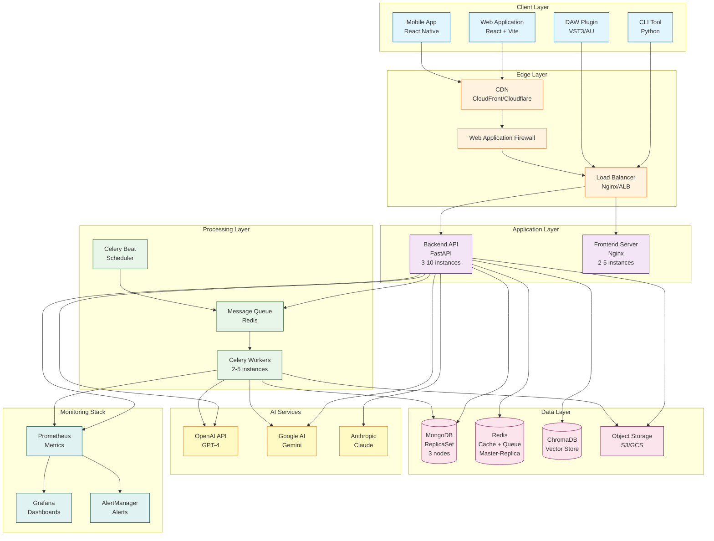

### Component Responsibilities

| Component | Responsibility | Technology |
|-----------|----------------|------------|
| **Web Application** | User interface for audio management | React, TypeScript, Tailwind |
| **Backend API** | RESTful API, business logic | FastAPI, Python 3.12 |
| **Celery Workers** | Async task processing (audio analysis) | Celery, Python |
| **MongoDB** | Primary data store | MongoDB 7.0 ReplicaSet |
| **Redis** | Caching + message broker | Redis 7.2 |
| **ChromaDB** | Vector embeddings for semantic search | ChromaDB |
| **Object Storage** | Audio file storage | AWS S3 / GCS |

---

## 🚀 Deployment Architecture

### Kubernetes Production Deployment

```mermaid
graph TB
    subgraph "External"
        Users[Users]
        DNS[DNS<br/>Route53/CloudDNS]
    end

    subgraph "Kubernetes Cluster"
        subgraph "Ingress Layer"
            Ingress[Ingress Controller<br/>NGINX<br/>cert-manager]
        end

        subgraph "Frontend Namespace"
            FrontendDeploy[Frontend Deployment<br/>2-5 replicas]
            FrontendHPA[Frontend HPA<br/>CPU: 60%, Mem: 70%]
            FrontendService[Frontend Service<br/>ClusterIP]
        end

        subgraph "Backend Namespace"
            BackendDeploy[Backend Deployment<br/>3-10 replicas]
            BackendHPA[Backend HPA<br/>CPU: 70%, Mem: 80%]
            BackendService[Backend Service<br/>ClusterIP]
        end

        subgraph "Processing Namespace"
            CeleryDeploy[Celery Deployment<br/>2-5 replicas]
            CeleryHPA[Celery HPA<br/>CPU: 80%, Mem: 85%]
            BeatDeploy[Beat Deployment<br/>1 replica]
            FlowerDeploy[Flower Deployment<br/>1 replica]
        end

        subgraph "Data Namespace"
            MongoStatefulSet[MongoDB StatefulSet<br/>3 replicas]
            MongoService[MongoDB Service<br/>Headless]
            RedisStatefulSet[Redis StatefulSet<br/>Master + Replica]
            RedisService[Redis Service<br/>ClusterIP]
            ChromaDeployment[ChromaDB Deployment<br/>1 replica]
        end

        subgraph "Monitoring Namespace"
            PrometheusOp[Prometheus Operator]
            Prometheus[Prometheus<br/>2 replicas]
            GrafanaDeploy[Grafana Deployment]
            AlertManagerDeploy[AlertManager Deployment]
        end

        subgraph "Storage"
            PVC1[MongoDB PVC<br/>100Gi SSD]
            PVC2[Redis PVC<br/>20Gi SSD]
            PVC3[ChromaDB PVC<br/>50Gi SSD]
        end
    end

    subgraph "External Services"
        S3[S3/GCS<br/>Object Storage]
        AI[AI APIs<br/>OpenAI, Google]
    end

    Users --> DNS
    DNS --> Ingress
    Ingress --> FrontendService
    Ingress --> BackendService
    FrontendDeploy -.->|scales| FrontendHPA
    BackendDeploy -.->|scales| BackendHPA
    CeleryDeploy -.->|scales| CeleryHPA
    FrontendService --> FrontendDeploy
    BackendService --> BackendDeploy
    BackendDeploy --> RedisService
    BackendDeploy --> MongoService
    BackendDeploy --> ChromaDeployment
    BackendDeploy --> S3
    BackendDeploy --> AI
    BeatDeploy --> RedisService
    CeleryDeploy --> RedisService
    CeleryDeploy --> MongoService
    CeleryDeploy --> S3
    CeleryDeploy --> AI
    MongoStatefulSet --> PVC1
    RedisStatefulSet --> PVC2
    ChromaDeployment --> PVC3
    BackendDeploy -.->|metrics| Prometheus
    CeleryDeploy -.->|metrics| Prometheus
    Prometheus --> GrafanaDeploy
    Prometheus --> AlertManagerDeploy

    classDef external fill:#e1f5ff,stroke:#01579b
    classDef ingress fill:#fff3e0,stroke:#e65100
    classDef app fill:#f3e5f5,stroke:#4a148c
    classDef data fill:#fce4ec,stroke:#880e4f
    classDef monitoring fill:#e0f2f1,stroke:#004d40
    classDef storage fill:#f1f8e9,stroke:#33691e

    class Users,DNS,S3,AI external
    class Ingress ingress
    class FrontendDeploy,BackendDeploy,CeleryDeploy,BeatDeploy,FlowerDeploy app
    class MongoStatefulSet,RedisStatefulSet,ChromaDeployment data
    class PrometheusOp,Prometheus,GrafanaDeploy,AlertManagerDeploy monitoring
    class PVC1,PVC2,PVC3 storage
```

### Auto-Scaling Behavior

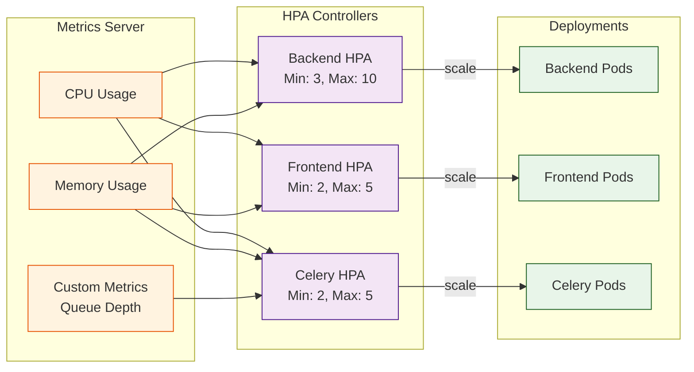

---

## 📊 Data Flow Diagrams

### Audio Upload and Processing Flow

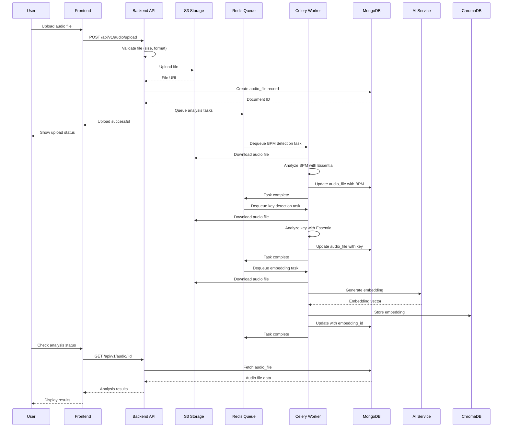

### Semantic Search Flow

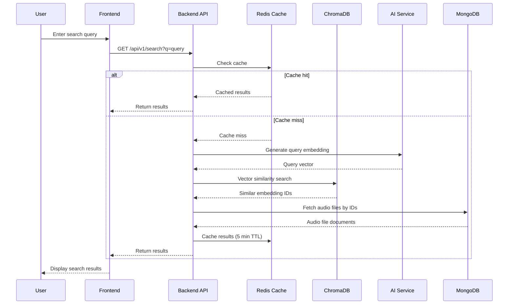

### Real-time Analysis Pipeline

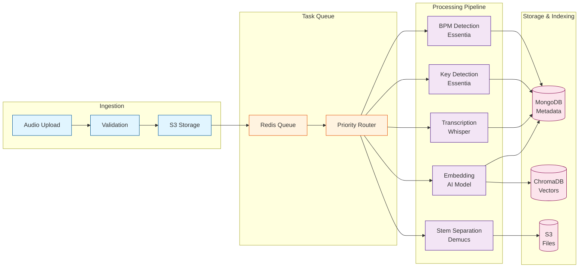

---

## 🔒 Security Architecture

### Security Layers

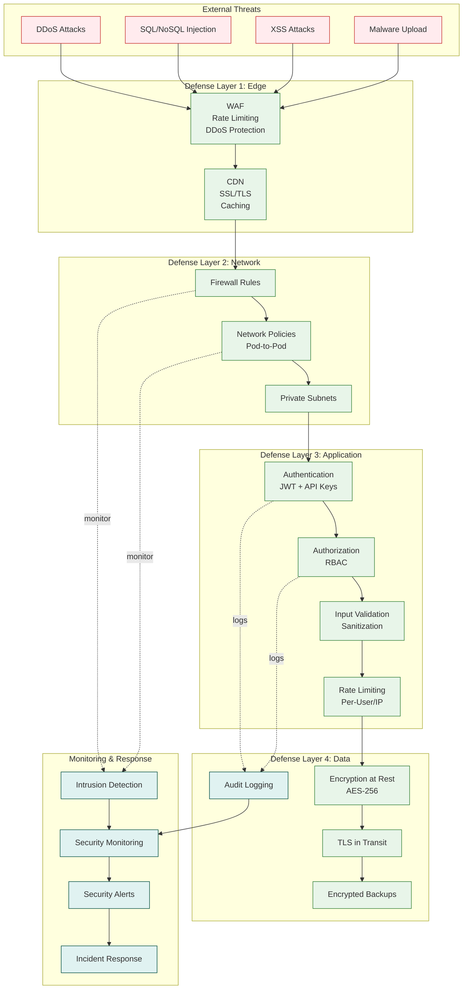

### Authentication & Authorization Flow

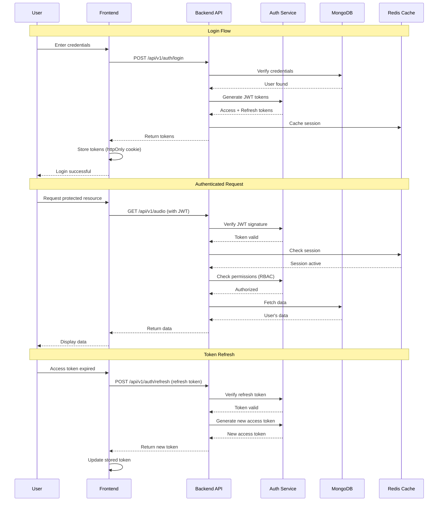

---

## 📈 Monitoring Architecture

### Observability Stack

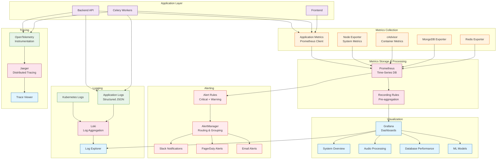

### Alert Flow

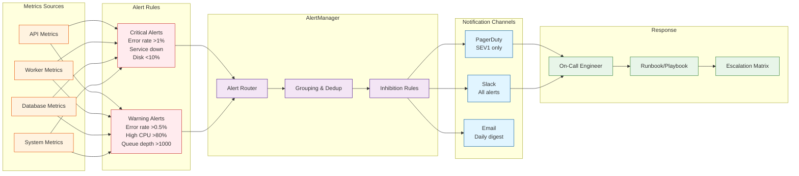

---

## 🌐 Network Topology

### Kubernetes Network Architecture

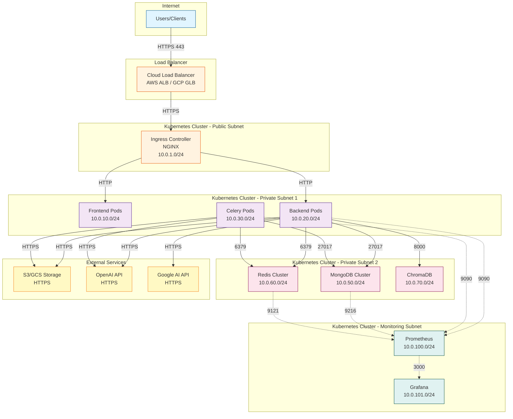

### Network Policies

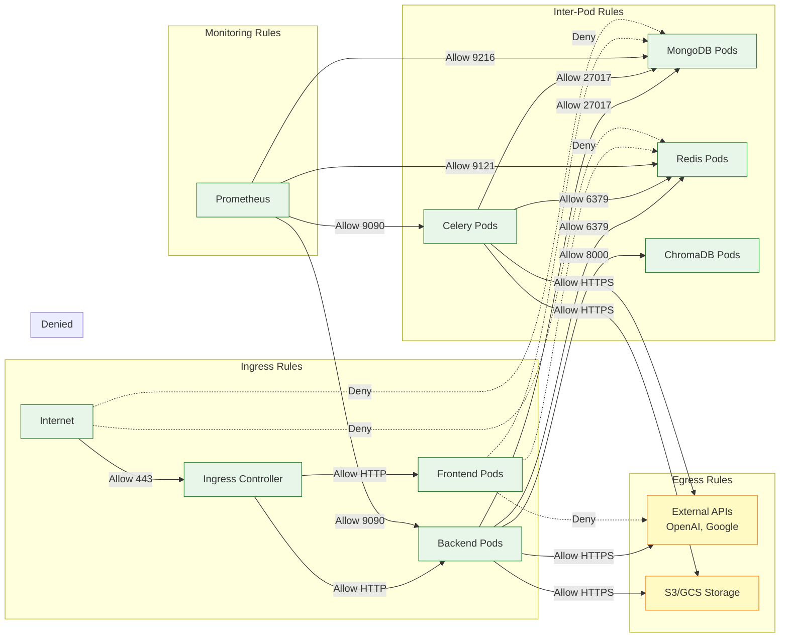

---

## 🔗 Integration Points

### External Service Integrations

```mermaid
graph TB
    subgraph "SampleMind AI Core"
        API[Backend API]
        Worker[Celery Workers]
    end

    subgraph "AI/ML Services"
        OpenAI[OpenAI API<br/>- GPT-4 for chat<br/>- Whisper for transcription<br/>- Embeddings]
        Google[Google AI<br/>- Gemini Pro<br/>- Text embeddings]
        Anthropic[Anthropic<br/>- Claude for analysis]
    end

    subgraph "Storage Services"
        S3[AWS S3 / GCS<br/>- Audio file storage<br/>- Backup storage<br/>- Static assets]
    end

    subgraph "Authentication"
        OAuth[OAuth Providers<br/>- Google<br/>- GitHub<br/>- Microsoft]
    end

    subgraph "Payment Processing"
        Stripe[Stripe<br/>- Subscriptions<br/>- Usage billing]
    end

    subgraph "Communication"
        SendGrid[SendGrid<br/>- Transactional email<br/>- Notifications]
        Twilio[Twilio<br/>- SMS alerts<br/>- Voice notifications]
    end

    subgraph "Monitoring & Analytics"
        Sentry[Sentry<br/>- Error tracking<br/>- Performance monitoring]
        Mixpanel[Mixpanel<br/>- Product analytics<br/>- User tracking]
    end

    API -->|REST API| OpenAI
    API -->|REST API| Google
    API -->|REST API| Anthropic
    API -->|S3 SDK| S3
    API -->|OAuth 2.0| OAuth
    API -->|Stripe SDK| Stripe
    API -->|REST API| SendGrid
    API -->|REST API| Twilio
    API -->|Sentry SDK| Sentry
    API -->|REST API| Mixpanel
    
    Worker -->|REST API| OpenAI
    Worker -->|REST API| Google
    Worker -->|S3 SDK| S3

    classDef core fill:#f3e5f5,stroke:#4a148c
    classDef ai fill:#e1f5ff,stroke:#01579b
    classDef storage fill:#fff3e0,stroke:#e65100
    classDef auth fill:#e8f5e9,stroke:#2e7d32
    classDef payment fill:#fff9c4,stroke:#f57f17
    classDef comm fill:#fce4ec,stroke:#880e4f
    classDef monitor fill:#e0f2f1,stroke:#004d40

    class API,Worker core
    class OpenAI,Google,Anthropic ai
    class S3 storage
    class OAuth auth
    class Stripe payment
    class SendGrid,Twilio comm
    class Sentry,Mixpanel monitor
```

### API Integration Patterns

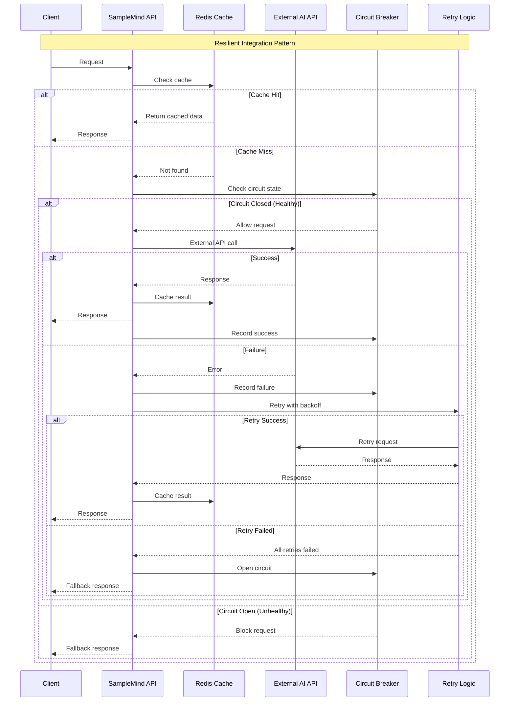

---

## 📚 Related Documentation

- [`DEPLOYMENT_GUIDE.md`](DEPLOYMENT_GUIDE.md:1) - Deployment procedures
- [`OPERATIONS_MANUAL.md`](OPERATIONS_MANUAL.md:1) - Operations guide
- [`INCIDENT_RESPONSE.md`](INCIDENT_RESPONSE.md:1) - Incident response
- [`docs/ARCHITECTURE.md`](ARCHITECTURE.md:1) - Detailed architecture

---

## 📝 Version History

| Version | Date | Changes | Author |
|---------|------|---------|--------|
| 1.0 | 2025-10-06 | Initial architecture diagrams | Architecture Team |

---

**Document Owner:** Architecture Team  
**Review Schedule:** Quarterly  
**Last Reviewed:** October 6, 2025

**Note:** Diagrams are rendered using Mermaid. View in GitHub or any Mermaid-compatible viewer.