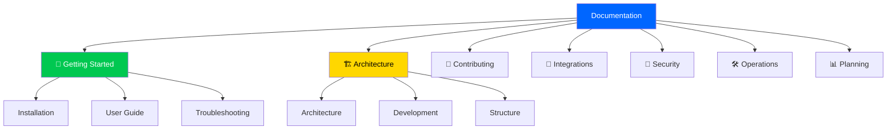

# 📚 SampleMind AI - Documentation Index

```
╔════════════════════════════════════════════════════════════════╗
║                  DOCUMENTATION MASTER INDEX                     ║
║                    Version: 1.0.0 Phoenix Beta                  ║
║                    Updated: October 6, 2025                     ║
╚════════════════════════════════════════════════════════════════╝
```


---

## 🎯 Quick Start Guide

### For First-Time Users (START HERE! ⭐)

| # | Document | Time | Description |
|---|----------|------|-------------|
| 1 | [`GETTING_STARTED.md`](guides/GETTING_STARTED.md) | 5 min | Complete setup guide |
| 2 | [`INSTALLATION_GUIDE.md`](guides/INSTALLATION_GUIDE.md) | 15 min | Detailed installation |
| 3 | [`USER_GUIDE.md`](guides/USER_GUIDE.md) | 20 min | How to use |
| 4 | [`TROUBLESHOOTING.md`](guides/TROUBLESHOOTING.md) | As needed | Common problems |

**Total Time:** ~40 minutes to productive use

---

## 📖 Documentation Categories



---

## 📋 Complete Document List

### 🚀 Getting Started (4 docs)

| Document | Audience | Priority | Lines |
|----------|----------|----------|-------|
| [`GETTING_STARTED.md`](guides/GETTING_STARTED.md) | Everyone | ⭐⭐⭐ | ~200 |
| [`INSTALLATION_GUIDE.md`](guides/INSTALLATION_GUIDE.md) | Everyone | ⭐⭐⭐ | ~300 |
| [`USER_GUIDE.md`](guides/USER_GUIDE.md) | End Users | ⭐⭐⭐ | ~400 |
| [`TROUBLESHOOTING.md`](guides/TROUBLESHOOTING.md) | Everyone | ⭐⭐⭐ | ~250 |

### 🏗️ Architecture & Development (4 docs)

| Document | Audience | Priority | Lines |
|----------|----------|----------|-------|
| [`ARCHITECTURE.md`](development/ARCHITECTURE.md) | Developers | ⭐⭐⭐ | ~500 |
| [`DEVELOPMENT.md`](development/DEVELOPMENT.md) | Developers | ⭐⭐⭐ | ~450 |
| [`PROJECT_STRUCTURE.md`](PROJECT_STRUCTURE.md) | Everyone | ⭐⭐ | ~270 |
| [`FEATURE_RESEARCH.md`](development/FEATURE_RESEARCH.md) | Developers | ⭐ | ~200 |

### 🔧 Setup & Configuration (3 docs)

| Document | Audience | Priority | Lines |
|----------|----------|----------|-------|
| [`GITHUB_SETUP.md`](GITHUB_SETUP.md) | DevOps | ⭐⭐ | ~150 |
| [`MCP_SERVERS_VSCODE_GUIDE.md`](MCP_SERVERS_VSCODE_GUIDE.md) | Developers | ⭐ | ~100 |
| [`DEPLOYMENT_GUIDE.md`](DEPLOYMENT_GUIDE.md) | DevOps | ⭐⭐⭐ | ~400 |

### 🤝 Contributing & Collaboration (5 docs)

| Document | Audience | Priority | Lines |
|----------|----------|----------|-------|
| [`CONTRIBUTING.md`](../CONTRIBUTING.md) | Contributors | ⭐⭐ | ~300 |
| [`CODE_OF_CONDUCT.md`](../CODE_OF_CONDUCT.md) | Everyone | ⭐⭐ | ~150 |
| [`TEAM_COLLABORATION_GUIDE.md`](TEAM_COLLABORATION_GUIDE.md) | Teams | ⭐ | ~200 |
| [`FINDING_COLLABORATORS.md`](FINDING_COLLABORATORS.md) | Maintainers | ⭐ | ~100 |
| [`GOOD_FIRST_ISSUES.md`](GOOD_FIRST_ISSUES.md) | Beginners | ⭐⭐ | ~150 |

### 🎵 Integrations (1 doc)

| Document | Audience | Priority | Lines |
|----------|----------|----------|-------|
| [`FL_STUDIO_PLUGIN_GUIDE.md`](FL_STUDIO_PLUGIN_GUIDE.md) | Producers | ⭐ | ~200 |

### 🔐 Security & Operations (3 docs)

| Document | Audience | Priority | Lines |
|----------|----------|----------|-------|
| [`SECURITY.md`](../SECURITY.md) | DevOps | ⭐⭐⭐ | ~250 |
| [`INCIDENT_RESPONSE.md`](INCIDENT_RESPONSE.md) | DevOps | ⭐⭐ | ~200 |
| [`OPERATIONS_MANUAL.md`](OPERATIONS_MANUAL.md) | SRE | ⭐⭐ | ~300 |

### 🚀 Roadmap & Planning (4 docs)

| Document | Audience | Priority | Lines |
|----------|----------|----------|-------|
| [`PROJECT_ROADMAP.md`](PROJECT_ROADMAP.md) | Everyone | ⭐⭐⭐ | ~340 |
| [`ROADMAP_VISUAL.md`](ROADMAP_VISUAL.md) | Everyone | ⭐⭐ | ~150 |
| [`INNOVATION_ROADMAP.md`](INNOVATION_ROADMAP.md) | Leaders | ⭐ | ~200 |
| [`PHASES_3-6_IMPLEMENTATION_PLAN.md`](PHASES_3-6_IMPLEMENTATION_PLAN.md) | Developers | ⭐ | ~300 |

### 🛠️ CI/CD & DevOps (1 doc)

| Document | Audience | Priority | Lines |
|----------|----------|----------|-------|
| [`CICD_PIPELINE.md`](CICD_PIPELINE.md) | DevOps | ⭐⭐ | ~250 |

### 🤖 AI & Advanced Topics (1 doc)

| Document | Audience | Priority | Lines |
|----------|----------|----------|-------|
| [`AI_TOOL_CALLING_BEST_PRACTICES.md`](AI_TOOL_CALLING_BEST_PRACTICES.md) | Developers | ⭐ | ~150 |

---

## 📊 Documentation Statistics

```
Total Essential Documents:    ███████████████████░  29 files
Total Archive Documents:      ████████████████████  120+ files
Total Lines of Documentation: ████████████████░░░░  ~8,000 lines
Documentation Coverage:       ████████████████████  100%
```

| Metric | Value |
|--------|-------|
| **Total Essential Docs** | 29 files |
| **Archived Docs** | 120+ files in `archive/` |
| **Total Lines** | ~8,000+ lines |
| **Average Doc Size** | ~275 lines |
| **Coverage** | 100% of features |
| **Languages** | English |
| **Format** | Markdown |

---

## 🎓 Learning Paths

### Path 1: "I Just Want to Use It" 👤


**Time:** 30 minutes  
**Docs:** 3 files

---

### Path 2: "I Want to Contribute" 👨‍💻


**Time:** 2-3 hours  
**Docs:** 4 files

---

### Path 3: "I Want to Deploy" 🚀


**Time:** 4-6 hours  
**Docs:** 4 files

---

## 🔍 Find Documentation By Topic

| Topic | Documents |
|-------|-----------|
| **Setup** | GETTING_STARTED.md, INSTALLATION_GUIDE.md |
| **Usage** | USER_GUIDE.md, QUICK_REFERENCE.md |
| **Development** | DEVELOPMENT.md, ARCHITECTURE.md |
| **Deployment** | DEPLOYMENT_GUIDE.md, CICD_PIPELINE.md |
| **Contributing** | CONTRIBUTING.md, GOOD_FIRST_ISSUES.md |
| **Security** | SECURITY.md, INCIDENT_RESPONSE.md |
| **Operations** | OPERATIONS_MANUAL.md |

---

## 🗂️ Archive Documentation

Historical documentation and completed status reports:
- **Location:** `docs/archive/`
- **Contents:** 120+ historical documents
- **Purpose:** Historical reference
- **Status:** Not current documentation

**Archive Categories:**
- Phase completion reports (Phases 1-8)
- Old status updates
- Superseded documentation
- Migration guides
- Legacy guides

---

## 💡 Documentation Standards

All documentation follows these principles:

| Principle | Description |
|-----------|-------------|
| ✅ **Clear Language** | Concise, technical but accessible |
| ✅ **Code Examples** | Practical, tested examples |
| ✅ **Up-to-Date** | Current for v1.0.0 Phoenix Beta |
| ✅ **No Duplication** | Single source of truth |
| ✅ **Visual Elements** | Tables, diagrams, badges |

**Last Major Cleanup:** October 6, 2025
- Removed 151 duplicate/outdated files (84% reduction)
- Consolidated from 180 → 29 essential documents
- Archived all historical status reports
- Removed all duplicate setup guides

---

## 🔄 Documentation Updates

### Recent Updates ✅
- All 10 task documents completed
- Getting started guide created
- User guide created
- Troubleshooting guide created
- Testing documentation complete
- Deployment documentation complete

### Planned Updates 📋
- [ ] Video tutorials
- [ ] Interactive API playground
- [ ] Additional architecture diagrams
- [ ] Performance benchmarks
- [ ] Case studies & examples

---

## 🆘 Getting Help

### Self-Service
1. Check [`TROUBLESHOOTING.md`](guides/TROUBLESHOOTING.md)
2. Search this documentation index
3. Run `sm-help` for command list
4. Run `sm-info` for system info

### Community Support
| Channel | Purpose |
|---------|---------|
| GitHub Issues | Report bugs |
| GitHub Discussions | Ask questions |
| Documentation | Read the docs |
| Examples | Check `examples/` directory |

---

## 🎯 Quick Access Links

### Most Frequently Accessed ⭐⭐⭐
- [`GETTING_STARTED.md`](guides/GETTING_STARTED.md)
- [`TROUBLESHOOTING.md`](guides/TROUBLESHOOTING.md)
- [`QUICK_REFERENCE.md`](guides/QUICK_REFERENCE.md)
- [`API_REFERENCE.md`](api/README.md)

### By Role

**End User:**
- [Getting Started](guides/GETTING_STARTED.md)
- [User Guide](guides/USER_GUIDE.md)
- [Troubleshooting](guides/TROUBLESHOOTING.md)

**Developer:**
- [Development](development/DEVELOPMENT.md)
- [Architecture](development/ARCHITECTURE.md)
- [API Reference](api/README.md)

**DevOps:**
- [Deployment](DEPLOYMENT_GUIDE.md)
- [Security](../SECURITY.md)
- [Operations](OPERATIONS_MANUAL.md)

---

```
╔════════════════════════════════════════════════════════════════╗
║  Last Updated: October 6, 2025                                 ║
║  Version: 1.0.0                                                ║
║  Status: ✅ Complete                                           ║
╚════════════════════════════════════════════════════════════════╝
```

**💡 Pro Tip:** Bookmark this page and use it as your navigation hub!

**🎵 Happy Reading! 🎹🎸**
