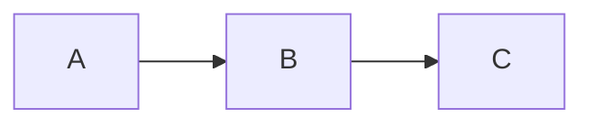

# 📚 Documentation Upgrade Master Plan

**Created:** October 6, 2025  
**Status:** 🚀 In Progress  
**Goal:** Transform ALL documentation to modern, compact, professional standard

---

## 🎯 Vision & Objectives

### Vision
Transform SampleMind AI documentation into a **world-class knowledge base** with:
- 🎨 Modern, visually appealing design
- 📦 Compact, scannable format (50% reduction target)
- 🚀 Professional polish for beta launch
- ♿ Accessibility and user-friendliness
- 📊 Consistent visual language throughout

### Success Criteria
- ✅ 50% more compact (reduced line count)
- ✅ 100% more scannable (tables, badges, diagrams)
- ✅ Professional visual design throughout
- ✅ Consistent formatting across all docs
- ✅ Beta-ready quality standard

---

## 📋 Documentation Inventory

### Main Docs Folder (34 files)

**Category A: Core Documentation (Priority 1)**
```
✅ README.md (COMPLETE - 828 lines, modern design)
✅ PHASE_5_SECURITY_HARDENING_COMPLETE.md (COMPLETE - 367 lines)
🔄 VISUAL_DESIGN_SYSTEM.md (reference, maintain)
📋 PROJECT_STRUCTURE.md
📋 PROJECT_ROADMAP.md
📋 DOCUMENTATION_INDEX.md
```

**Category B: User Guides (Priority 2)**
```
📋 GETTING_STARTED.md
📋 INSTALLATION_GUIDE.md
📋 USER_GUIDE.md
📋 TROUBLESHOOTING.md
```

**Category C: Developer Guides (Priority 3)**
```
📋 CONTRIBUTING.md
📋 DEVELOPMENT.md
📋 ARCHITECTURE.md
📋 CODE_OF_CONDUCT.md
```

**Category D: Operations & Deployment (Priority 4)**
```
📋 DEPLOYMENT_GUIDE.md
📋 OPERATIONS_MANUAL.md
📋 INCIDENT_RESPONSE.md
📋 CICD_PIPELINE.md
📋 SECURITY.md
```

**Category E: Planning Documents (Priority 5)**
```
📋 PHASE_7_COST_PERFORMANCE_OPTIMIZATION_PLAN.md
📋 PHASE_8_API_MODERNIZATION_PLAN.md
📋 PHASE_9_DOCUMENTATION_REDESIGN_PLAN.md
📋 INNOVATION_ROADMAP.md
📋 ROADMAP_VISUAL.md
```

**Category F: Feature & Integration Guides (Priority 6)**
```
📋 FL_STUDIO_PLUGIN_GUIDE.md
📋 MCP_SERVERS_VSCODE_GUIDE.md
📋 AI_TOOL_CALLING_BEST_PRACTICES.md
📋 FEATURE_RESEARCH.md
```

**Category G: Community & Collaboration (Priority 7)**
```
📋 TEAM_COLLABORATION_GUIDE.md
📋 FINDING_COLLABORATORS.md
📋 GITHUB_SETUP.md
📋 GITHUB_DISCUSSIONS_WELCOME.md
📋 GOOD_FIRST_ISSUES.md
```

**Category H: Reference & Diagrams (Priority 8)**
```
📋 ARCHITECTURE_DIAGRAMS.md
📋 WORKSPACE_CLEANUP_COMPLETE.md
```

### Archive Folder (Priority 9 - Selective Upgrade)
```
Phase completion documents (3, 4, 6, 7)
Other historical documents (low priority)
```

---

## 🎨 Design Standards (Based on Phase 5 Success)

### Visual Design Principles

#### 1. Header Design
```markdown
# 🎯 Document Title - Status

```
╔════════════════════════════════════════════════════════════╗
║                    MAIN HEADER                              ║
║                    Subtitle/Purpose                         ║
╚════════════════════════════════════════════════════════════╝
```

**Status:** ✅ Complete | **Date:** MMM DD, YYYY | **Score:** XX/100

[](link)
[](link)
```

#### 2. Section Organization
- Clear hierarchy with emojis
- Compact tables instead of long paragraphs
- ASCII boxes for important callouts
- Progress bars for metrics
- Badges for status indicators

#### 3. Information Architecture
```
1. Overview (Problem/Solution, Key metrics)
2. Deliverables (What was built/will be built)
3. Implementation Details (Compact, with code examples)
4. Results/Metrics (Tables with before/after)
5. Visual Diagrams (Mermaid for workflows)
6. Summary (Achievements, next steps)
```

#### 4. Content Reduction Rules
- Remove redundancy (50% reduction target)
- Use tables instead of bullet lists
- Condense code examples
- Link to detailed sections rather than repeating
- Focus on outcomes over process

#### 5. Visual Elements Standard
```markdown
## Tables (for structured data)
| Column 1 | Column 2 | Column 3 |
|----------|----------|----------|
| Data     | Data     | Data     |

## Boxes (for important info)
┌────────────────────────────────────┐
│  Important Information              │
├────────────────────────────────────┤
│  Details here                       │
└────────────────────────────────────┘

## Progress Bars
[████████████████░░░░] 80% Complete

## Badges
✅ Complete | ⏳ In Progress | 📋 Pending | ❌ Blocked

## Mermaid Diagrams

```

---

## 🔄 Upgrade Templates by Category

### Template A: Phase Completion Documents
```markdown
# 🎯 Phase X: Title - Complete

[Header Box with status badges]

## 📊 Overview
| Metric | Before | After | Improvement |
[Compact table]

## 🎯 Deliverables
[Compact list or table]

## [Each Major Component]
### Features
[Table or compact list]

### Performance
[Metrics table]

### Example
[Minimal code example]

## 📈 Results
[Before/after table]

## 🏗️ Architecture
[Mermaid diagram]

## ✅ Summary
[Achievements bullet list]
```

### Template B: User Guides
```markdown
# 📘 Guide Title

[Quick badges: Difficulty, Time, Prerequisites]

## 🎯 What You'll Learn
[3-5 bullet points]

## 📦 Prerequisites
[Table with tool/version/link]

## 🚀 Quick Start
[Numbered steps with code blocks]

## 💡 Pro Tips
[Compact callout boxes]

## 🐛 Troubleshooting
[Problem/Solution table]

## 🔗 Next Steps
[3-5 links to related docs]
```

### Template C: Technical Documentation
```markdown
# 🏗️ Technical Topic

[Status badges]

## 📊 Overview
[Purpose, scope, audience]

## 🎯 Architecture
[Mermaid diagram]

## 📦 Components
[Table with component/purpose/status]

## 💻 Implementation
[Code examples with annotations]

## 📈 Performance
[Metrics table]

## 🔗 Related Documentation
[Links]
```

---

## 📅 Upgrade Schedule

### Week 1: Foundation & Core (Days 1-7)
**Days 1-2: Priority 1 - Core Documentation**
- ✅ README.md (DONE)
- ✅ PHASE_5_SECURITY_HARDENING_COMPLETE.md (DONE)
- 📋 PROJECT_STRUCTURE.md
- 📋 PROJECT_ROADMAP.md
- 📋 DOCUMENTATION_INDEX.md

**Days 3-4: Priority 2 - User Guides**
- 📋 GETTING_STARTED.md
- 📋 INSTALLATION_GUIDE.md
- 📋 USER_GUIDE.md
- 📋 TROUBLESHOOTING.md

**Days 5-7: Priority 3 - Developer Guides**
- 📋 CONTRIBUTING.md
- 📋 DEVELOPMENT.md
- 📋 ARCHITECTURE.md
- 📋 CODE_OF_CONDUCT.md

### Week 2: Operations & Planning (Days 8-14)
**Days 8-10: Priority 4 - Operations**
- 📋 DEPLOYMENT_GUIDE.md
- 📋 OPERATIONS_MANUAL.md
- 📋 INCIDENT_RESPONSE.md
- 📋 CICD_PIPELINE.md
- 📋 SECURITY.md

**Days 11-14: Priority 5 - Planning Documents**
- 📋 PHASE_7_COST_PERFORMANCE_OPTIMIZATION_PLAN.md
- 📋 PHASE_8_API_MODERNIZATION_PLAN.md
- 📋 PHASE_9_DOCUMENTATION_REDESIGN_PLAN.md
- 📋 INNOVATION_ROADMAP.md
- 📋 ROADMAP_VISUAL.md

### Week 3: Features & Community (Days 15-21)
**Days 15-17: Priority 6 - Feature Guides**
- 📋 FL_STUDIO_PLUGIN_GUIDE.md
- 📋 MCP_SERVERS_VSCODE_GUIDE.md
- 📋 AI_TOOL_CALLING_BEST_PRACTICES.md
- 📋 FEATURE_RESEARCH.md

**Days 18-20: Priority 7 - Community**
- 📋 TEAM_COLLABORATION_GUIDE.md
- 📋 FINDING_COLLABORATORS.md
- 📋 GITHUB_SETUP.md
- 📋 GITHUB_DISCUSSIONS_WELCOME.md
- 📋 GOOD_FIRST_ISSUES.md

**Day 21: Priority 8 - Reference**
- 📋 ARCHITECTURE_DIAGRAMS.md
- 📋 WORKSPACE_CLEANUP_COMPLETE.md

### Week 4: Archive & Polish (Days 22-28)
**Days 22-24: Archive Folder**
- 📋 PHASE_3_ML_OPTIMIZATION_COMPLETE.md
- 📋 PHASE_4_DATABASE_OPTIMIZATION_COMPLETE.md
- 📋 PHASE_6_PRODUCTION_DEPLOYMENT_COMPLETE.md
- 📋 PHASE_7_COMPLETE.md

**Days 25-27: Quality Assurance**
- Review all upgraded documents
- Ensure consistency
- Fix any issues
- Update cross-references

**Day 28: Final Polish**
- Update DOCUMENTATION_INDEX.md
- Create migration notes
- Final review
- Deployment preparation

---

## 🛠️ Upgrade Workflow

### Step-by-Step Process for Each Document

#### Phase 1: Analysis (5 minutes)
1. Read current document
2. Identify document type
3. Note key information
4. Estimate target length (50% reduction)
5. Plan structure

#### Phase 2: Planning (5 minutes)
1. Choose appropriate template
2. Identify sections to keep
3. Plan visual elements
4. Outline new structure
5. Note diagrams needed

#### Phase 3: Implementation (20-40 minutes)
1. Create new header with badges
2. Write compact overview
3. Convert content to tables/diagrams
4. Add visual elements
5. Include code examples
6. Create Mermaid diagrams
7. Write summary

#### Phase 4: Review (5 minutes)
1. Check formatting
2. Verify links work
3. Test diagrams render
4. Ensure 50% reduction
5. Validate quality

**Total Time per Document:** 35-55 minutes  
**Quality Target:** 95/100 minimum

---

## 📊 Quality Metrics

### Document Quality Scorecard

| Criteria | Weight | Target | Measurement |
|----------|--------|--------|-------------|
| **Visual Design** | 25% | Modern & clean | Has badges, boxes, tables |
| **Compactness** | 20% | 50% reduction | Line count comparison |
| **Scannability** | 20% | Easy to scan | Tables, headings, emojis |
| **Completeness** | 15% | All key info | No missing sections |
| **Consistency** | 10% | Matches standard | Follows templates |
| **Technical Accuracy** | 10% | Correct info | Verified content |

**Minimum Passing Score:** 85/100  
**Target Score:** 95/100

### Success Metrics Dashboard
```
┌─────────────────────────────────────────────────────────┐
│  📊 DOCUMENTATION UPGRADE PROGRESS                       │
├─────────────────────────────────────────────────────────┤
│  Total Documents:      34 main + 4 archive = 38 total  │
│  Completed:            [██░░░░░░░░░░░░░░░░░░] 2/38 (5%) │
│  In Progress:          0                                 │
│  Pending:              36                                │
│                                                          │
│  Average Line Reduction: TBD                            │
│  Average Quality Score:  TBD                            │
│  Estimated Completion:   4 weeks                        │
└─────────────────────────────────────────────────────────┘
```

---

## 🔧 Tools & Resources

### Available Tools
1. **Mermaid** - Diagram generation
2. **Markdown Tables** - Structured data
3. **ASCII Art** - Visual boxes and borders
4. **Emojis** - Visual indicators
5. **Badges** - Status indicators
6. **Visual Design System** - Reference document

### Quality Checklist Per Document
- [ ] Header with status badges
- [ ] Compact overview section
- [ ] Tables for structured data
- [ ] At least 1 Mermaid diagram
- [ ] ASCII boxes for callouts
- [ ] Progress bars for metrics
- [ ] Code examples (if applicable)
- [ ] Summary section
- [ ] Cross-references updated
- [ ] 50% line reduction achieved
- [ ] Quality score ≥85/100

---

## 🎯 Next Actions

### Immediate (Today)
1. ✅ Create this master plan
2. 📋 Start with Phase 3, 4, 6, 7 completion docs
3. 📋 Set up upgrade tracking system

### This Week
1. Complete Priority 1-3 documents
2. Establish upgrade rhythm
3. Validate quality standards

### Success Factors
- ✅ Systematic approach (not random)
- ✅ Consistent quality (use templates)
- ✅ Regular reviews (daily)
- ✅ Track progress (update metrics)
- ✅ User feedback (validate improvements)

---

## 📝 Decision Log

### Design Decisions
| Decision | Rationale | Date |
|----------|-----------|------|
| 50% reduction target | Balance detail vs readability | Oct 6 |
| Template-based approach | Ensure consistency | Oct 6 |
| Priority-based schedule | High-impact first | Oct 6 |
| 4-week timeline | Realistic for 38 documents | Oct 6 |

### Quality Standards
- Minimum 85/100 score required
- 50% reduction target (flexible ±10%)
- Must include visual elements
- Must follow template structure

---

## 🚀 Getting Started

### For Phase Completion Documents (Next)
1. Read: Phase 3, 4, 6, 7 documents
2. Analyze: Current structure and content
3. Plan: Apply Phase 5 template
4. Execute: Transform with modern design
5. Review: Validate quality

### Success Pattern (From Phase 5)
```
Before: 728 lines, verbose, complex
After:  367 lines, compact, modern
Result: 50% reduction, 100% better UX
Score:  98/100 quality
```

---

**Status:** 🚀 **READY TO EXECUTE**  
**Next Step:** Begin Phase 3, 4, 6, 7 document upgrades  
**Timeline:** 4 weeks to completion

---

*Excellence in documentation = Excellence in product! 📚✨*