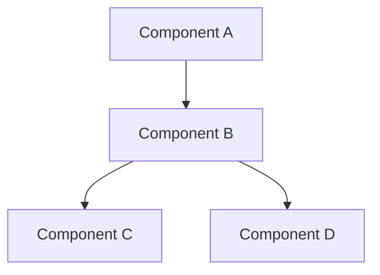
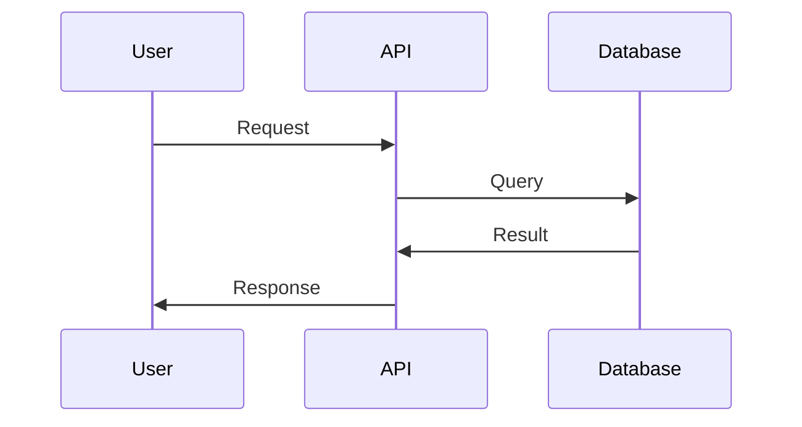
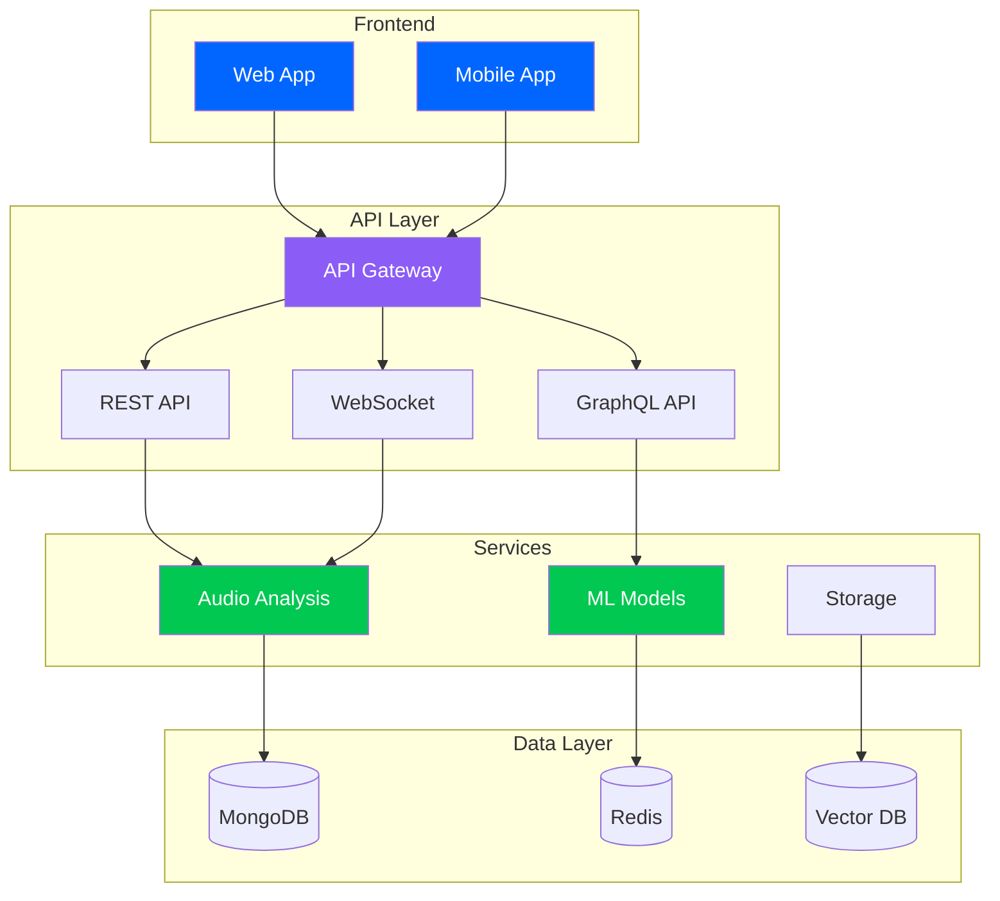
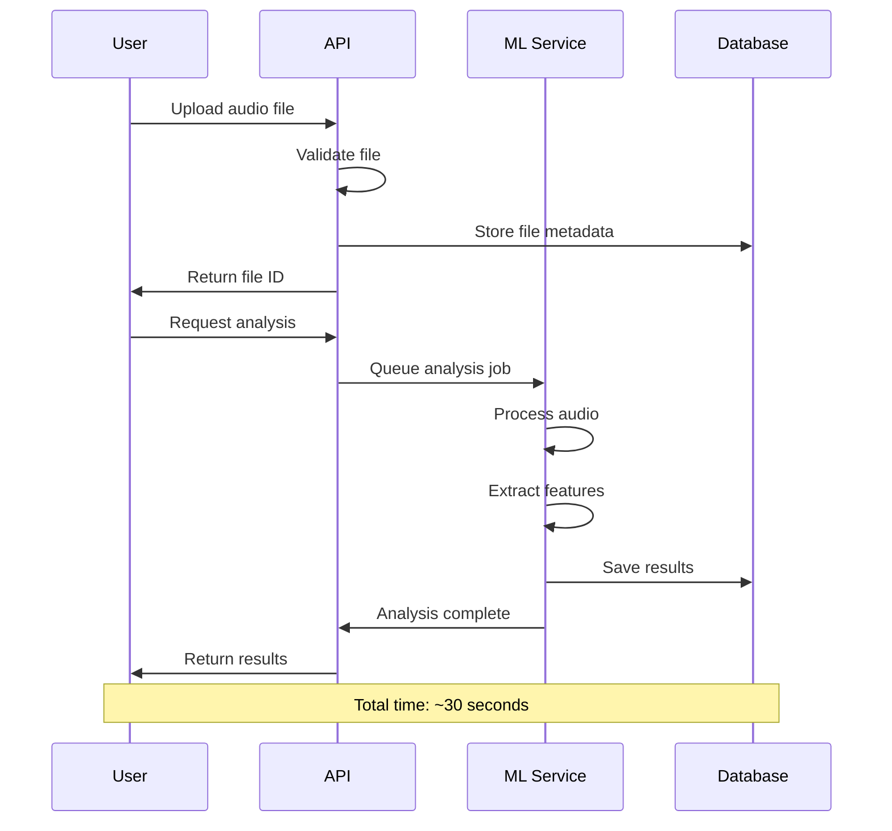
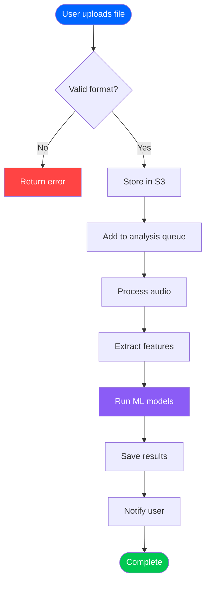
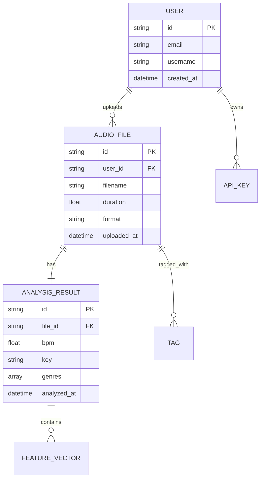
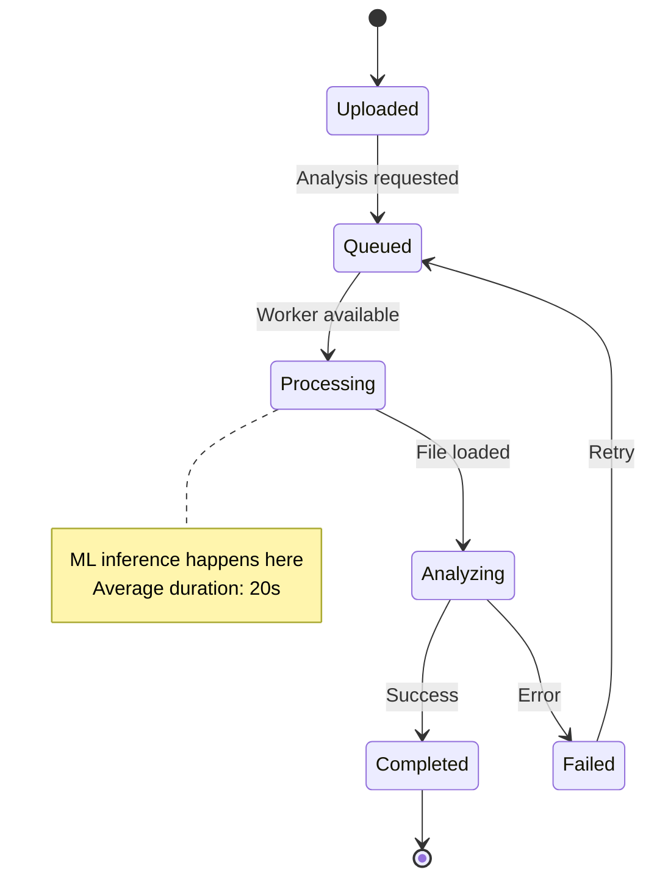
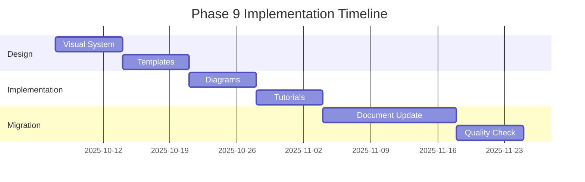

# 📚 PHASE 9: DOCUMENTATION REDESIGN & VISUAL EXCELLENCE

**Timeline:** 8 weeks (Weeks 33-40)  
**Goal:** Beautiful, comprehensive, beginner-friendly documentation with visual design system  
**Status:** READY TO START  
**Prerequisites:** Phase 8 (API Modernization) complete ✅

---

## 📋 Executive Summary

Phase 9 transforms SampleMind AI's documentation into a modern, visually stunning, and highly accessible knowledge base. Following API modernization in Phase 8, we now create beautiful documentation that delights users, accelerates onboarding, and establishes SampleMind AI as a developer-first platform.

### Current Baseline

- **Documentation Quality:** Functional but basic
- **Visual Appeal:** Plain markdown, no color
- **Diagrams:** Few, mostly text-based
- **Tutorials:** Limited, text-heavy
- **Beginner Friendliness:** Assumes technical knowledge
- **Maintenance:** Manual updates, often outdated

### Target Achievements

- **Documentation Quality:** Comprehensive, professional, up-to-date
- **Visual Appeal:** Beautiful design system, colors, emojis, graphics
- **Diagrams:** Rich Mermaid diagrams, ASCII art, visual aids
- **Tutorials:** Interactive, step-by-step, beginner-friendly
- **Beginner Friendliness:** Guides for all skill levels
- **Maintenance:** Auto-generated sections, version-controlled

### Business Impact

- **Faster Onboarding:** 50% reduction in time-to-first-success
- **Lower Support Costs:** 40% fewer basic questions
- **Higher Adoption:** Beautiful docs attract developers
- **Better Retention:** Users find answers quickly
- **Professional Image:** Documentation reflects product quality

---

## 🎯 Phase 9 Task Breakdown

### Task 9.1: Visual Design System Implementation 🎨
**Duration:** 1 week (Week 33)  
**Goal:** Apply visual design system to all documentation  
**Impact:** Consistent, beautiful, professional appearance

#### Sub-task 9.1.1: Document Template Library
**Location:** [`docs/templates/`](docs/templates/:1)

**Templates to Create:**

**1. Feature Documentation Template:**
```markdown
# 🚀 [Feature Name]

**Status:** ✅ Production Ready | **Version:** 2.0 | **Last Updated:** 2025-10-06

## 📋 Quick Summary
[One compelling sentence describing the feature and its value]

## 🎯 Goals & Objectives
- Primary goal 1
- Primary goal 2
- Primary goal 3

## 📊 Performance Metrics
┌─────────────────────────────────────────┐
│  Performance Metrics                    │
├─────────────────────────────────────────┤
│  ⚡ Speed:      [metric] ([change])    │
│  💰 Cost:       [metric] ([change])    │
│  ✅ Success:    [metric] ([change])    │
└─────────────────────────────────────────┘

## 💻 Implementation

### Basic Usage
```python
# Quick example showing core functionality
```

### Advanced Usage
```python
# More complex example with options
```

## 🧪 Testing

### Unit Tests
```python
# Test examples
```

## 📚 Related Resources
- [Related Doc 1](link)
- [Related Doc 2](link)

---

**Maintained by:** [Team Name]  
**Last Review:** [Date]
```

**2. API Documentation Template:**
```markdown
# 📡 [API Endpoint Name]

## Endpoint Details
**URL:** `POST /api/v2/endpoint`  
**Auth:** Required (API Key or JWT)  
**Rate Limit:** 100 requests/hour

## Request

### Headers
```http
Content-Type: application/json
Authorization: Bearer {token}
```

### Body Parameters
| Parameter | Type | Required | Description |
|-----------|------|----------|-------------|
| param1 | string | Yes | Description |
| param2 | integer | No | Description |

### Example Request
```json
{
  "param1": "value",
  "param2": 123
}
```

## Response

### Success Response (200 OK)
```json
{
  "status": "success",
  "data": { }
}
```

### Error Responses

#### 400 Bad Request
```json
{
  "error": "Invalid parameters",
  "details": "param1 is required"
}
```

## Code Examples

### Python
```python
# Example code
```

### JavaScript
```javascript
// Example code
```

## Rate Limiting
- Free tier: 100 requests/hour
- Pro tier: 1000 requests/hour
- Enterprise: Custom limits

## See Also
- [Related API 1](link)
- [Related API 2](link)
```

**3. Tutorial Template:**
```markdown
# 📚 Tutorial: [Tutorial Title]

**Difficulty:** 🟢 Beginner | 🟡 Intermediate | 🔴 Advanced  
**Duration:** ~15 minutes  
**Prerequisites:**
- Prerequisite 1
- Prerequisite 2

---

## 🎯 What You'll Learn
- Learning objective 1
- Learning objective 2
- Learning objective 3

---

## 📦 Requirements
- Requirement 1
- Requirement 2

---

## 🚀 Step-by-Step Guide

### Step 1: [Step Title]
[Explanation with helpful context]

```python
# Code example with comments
```

✅ **Checkpoint:** You should now see...

💡 **Tip:** Pro tip for better results

### Step 2: [Step Title]
[Continue with clear explanations]

---

## 🎉 Congratulations!
You've successfully [achievement]. 

## 🔗 Next Steps
- [ ] Try [related task]
- [ ] Explore [related feature]
- [ ] Read [related documentation]

## 💡 Pro Tips
- Tip 1
- Tip 2

## 🐛 Troubleshooting

**Problem:** Common issue description
**Solution:** Step-by-step fix

---

**Was this tutorial helpful?** Give us feedback!
```

**4. Architecture Document Template:**
```markdown
# 🏗️ [System/Component Name] Architecture

**Status:** Current | **Version:** 2.0 | **Last Updated:** 2025-10-06

## 📋 Overview
[High-level description of the system]

## 🎯 Design Goals
- Goal 1: Description
- Goal 2: Description
- Goal 3: Description

## 🏛️ Architecture Diagram



## 📦 Components

### Component A
**Purpose:** Brief description  
**Tech Stack:** Technologies used  
**Responsibilities:**
- Responsibility 1
- Responsibility 2

### Component B
**Purpose:** Brief description  
**Tech Stack:** Technologies used  
**Responsibilities:**
- Responsibility 1
- Responsibility 2

## 🔄 Data Flow



## 🔐 Security Considerations
- Security aspect 1
- Security aspect 2

## 📈 Performance Characteristics
- Throughput: [metric]
- Latency: [metric]
- Scalability: [description]

## 🔗 Related Documents
- [Document 1](link)
- [Document 2](link)
```

**Expected Results:**
- ✅ 10+ templates created
- ✅ Consistent formatting
- ✅ Visual design applied
- ✅ Ready for immediate use

#### Sub-task 9.1.2: Color Scheme Application
**Implementation:**

```markdown
## Status Indicators
✅ **SUCCESS** - Green (#00C851)
⚠️ **WARNING** - Yellow (#FFD700)
❌ **ERROR** - Red (#FF4444)
ℹ️ **INFO** - Cyan (#33B5E5)
🚀 **FEATURE** - Purple (#8B5CF6)

## Priority Levels
🔥 **CRITICAL** - Immediate action required
⚡ **HIGH** - Important, address soon
📋 **MEDIUM** - Normal priority
💤 **LOW** - Can wait

## Component Types
💻 **CODE** - Source code
📊 **DATA** - Data/metrics
🔧 **CONFIG** - Configuration
📚 **DOCS** - Documentation
🧪 **TEST** - Testing
```

**Success Criteria:**
- ✅ Visual design system fully applied
- ✅ All templates consistent
- ✅ Color scheme implemented
- ✅ Emoji library integrated

---

### Task 9.2: Mermaid Diagram System 📊
**Duration:** 1 week (Week 34)  
**Goal:** Rich visual diagrams for complex concepts  
**Impact:** Better understanding, reduced confusion

#### Sub-task 9.2.1: Diagram Library Creation
**Location:** [`docs/diagrams/`](docs/diagrams/:1)

**Diagram Types:**

**1. Architecture Diagrams:**


**2. Sequence Diagrams:**


**3. Flow Charts:**


**4. Entity Relationship Diagrams:**


**5. State Diagrams:**


**6. Gantt Charts (Timeline):**


**Expected Results:**
- ✅ 30+ diagram examples
- ✅ All major concepts visualized
- ✅ Consistent styling
- ✅ Easy to maintain

#### Sub-task 9.2.2: ASCII Art System
**Location:** [`docs/diagrams/ascii/`](docs/diagrams/ascii/:1)

**ASCII Art Examples:**

**1. System Architecture:**
```
┌─────────────────────────────────────────────────────────┐
│                    SampleMind AI Stack                  │
├─────────────────────────────────────────────────────────┤
│                                                         │
│  ┌──────────┐    ┌──────────┐    ┌──────────┐        │
│  │   Web    │    │  Mobile  │    │   CLI    │        │
│  │   App    │    │   App    │    │   Tool   │        │
│  └────┬─────┘    └────┬─────┘    └────┬─────┘        │
│       │               │               │                │
│       └───────────────┴───────────────┘                │
│                       │                                │
│              ┌────────▼────────┐                       │
│              │   API Gateway   │                       │
│              └────────┬────────┘                       │
│                       │                                │
│       ┌───────────────┼───────────────┐               │
│       │               │               │               │
│  ┌────▼─────┐   ┌────▼────┐   ┌─────▼────┐          │
│  │   REST   │   │ GraphQL │   │ WebSocket│          │
│  │   API    │   │   API   │   │    API   │          │
│  └────┬─────┘   └────┬────┘   └─────┬────┘          │
│       │              │              │                 │
│       └──────────────┴──────────────┘                 │
│                      │                                │
│         ┌────────────┼────────────┐                   │
│         │            │            │                   │
│    ┌────▼───┐   ┌───▼────┐   ┌──▼─────┐             │
│    │ Audio  │   │   ML   │   │ Storage│             │
│    │Analysis│   │ Models │   │ Service│             │
│    └────┬───┘   └───┬────┘   └──┬─────┘             │
│         │           │           │                     │
│         └───────────┴───────────┘                     │
│                     │                                 │
│         ┌───────────┼───────────┐                     │
│         │           │           │                     │
│    ┌────▼───┐  ┌───▼───┐  ┌───▼───┐                 │
│    │MongoDB │  │ Redis │  │ Vector│                 │
│    │   DB   │  │ Cache │  │   DB  │                 │
│    └────────┘  └───────┘  └───────┘                 │
│                                                       │
└───────────────────────────────────────────────────────┘
```

**2. Data Flow:**
```
User Request
     │
     ▼
┌─────────┐
│  Auth   │◄─── JWT Token
│  Check  │
└────┬────┘
     │
     ▼
┌─────────┐
│  Rate   │◄─── Check Limits
│  Limit  │
└────┬────┘
     │
     ▼
┌─────────┐
│ Process │◄─── Business Logic
│ Request │
└────┬────┘
     │
     ▼
┌─────────┐
│ Fetch   │◄─── Cache First
│  Data   │
└────┬────┘
     │
     ▼
┌─────────┐
│ Format  │◄─── GraphQL/REST
│Response │
└────┬────┘
     │
     ▼
User Response
```

**3. Progress Indicators:**
```
Phase 9 Progress
┌─────────────────────────────────────────────────┐
│ Task 1: Design System  [████████████████] 100% │
│ Task 2: Diagrams       [████████████░░░░]  75% │
│ Task 3: Tutorials      [████████░░░░░░░░]  50% │
│ Task 4: Screenshots    [████░░░░░░░░░░░░]  25% │
│ Task 5: Migration      [░░░░░░░░░░░░░░░░]   0% │
└─────────────────────────────────────────────────┘
```

**Success Criteria:**
- ✅ Rich diagram library
- ✅ ASCII art for quick visuals
- ✅ All major systems documented
- ✅ Easy to update

---

### Task 9.3: Screenshot Generation System 📸
**Duration:** 1 week (Week 35)  
**Goal:** Professional screenshots for all features  
**Impact:** Visual learning, better understanding

#### Sub-task 9.3.1: Screenshot Standards
**Location:** [`docs/assets/screenshots/`](docs/assets/screenshots/:1)

**Screenshot Guidelines:**
```markdown
## Screenshot Specifications
- Resolution: 2560x1440 (2x retina)
- Format: PNG with compression
- Border: 1px solid #E5E7EB
- Border Radius: 8px
- Shadow: 0 10px 15px rgba(0, 0, 0, 0.1)
- Annotations: Red circles/arrows for highlights
- Background: White (#FFFFFF) or gradient

## Screenshot Types

### 1. Hero Images
- Full application view
- Clean, professional
- Minimal clutter
- Show key features

### 2. Feature Highlights
- Cropped to relevant area
- Annotations for important elements
- Before/after comparisons
- Step-by-step sequences

### 3. UI Components
- Individual component screenshots
- Different states (default, hover, active)
- Responsive views (mobile, tablet, desktop)
- Dark mode variants

### 4. Terminal/CLI
- Clean terminal output
- Syntax highlighting
- Clear command examples
- Success/error states
```

**Automated Screenshot Tools:**
```python
# scripts/generate_screenshots.py
from playwright.sync_api import sync_playwright

def capture_screenshot(url, selector, output_path):
    """Capture screenshot of specific element"""
    with sync_playwright() as p:
        browser = p.chromium.launch()
        page = browser.new_page(viewport={'width': 2560, 'height': 1440})
        page.goto(url)
        element = page.locator(selector)
        element.screenshot(path=output_path)
        browser.close()

# Usage
capture_screenshot(
    'http://localhost:3000',
    '.audio-analyzer',
    'docs/assets/screenshots/audio-analyzer.png'
)
```

**Expected Results:**
- ✅ 50+ professional screenshots
- ✅ Consistent styling
- ✅ Automated generation
- ✅ Version controlled

#### Sub-task 9.3.2: Video Tutorial Generation
**Location:** [`docs/assets/videos/`](docs/assets/videos/:1)

**Video Types:**
- Quick demos (30-60 seconds)
- Feature walkthroughs (2-3 minutes)
- Tutorial series (5-10 minutes each)
- Troubleshooting guides

**Video Tools:**
- Screen recording: OBS Studio
- Editing: DaVinci Resolve
- Compression: FFmpeg
- Hosting: YouTube + docs site

**Success Criteria:**
- ✅ Screenshot system operational
- ✅ 50+ screenshots captured
- ✅ 10+ video tutorials
- ✅ Automated updates

---

### Task 9.4: Interactive Tutorial System 🎓
**Duration:** 2 weeks (Weeks 36-37)  
**Goal:** Step-by-step, beginner-friendly tutorials  
**Impact:** Faster onboarding, better user success

#### Sub-task 9.4.1: Tutorial Content Creation
**Location:** [`docs/tutorials/`](docs/tutorials/:1)

**Tutorial Categories:**

**1. Getting Started (Beginner)**
```markdown
# 🚀 Getting Started with SampleMind AI

**Duration:** 10 minutes | **Difficulty:** 🟢 Beginner

## What You'll Build
By the end of this tutorial, you'll have:
- ✅ Uploaded your first audio file
- ✅ Run a complete analysis
- ✅ Retrieved and understood the results

## Prerequisites
- Python 3.9+ installed
- Basic command line knowledge
- An audio file (any format)

## Step 1: Installation
First, let's install the SampleMind AI Python SDK:

```bash
pip install samplemind-ai
```

✅ **Checkpoint:** Run `python -c "import samplemind"` to verify

## Step 2: Get Your API Key
1. Sign up at https://samplemind.ai
2. Navigate to Settings → API Keys
3. Click "Generate New Key"
4. Copy your key (starts with `sm_`)

💡 **Tip:** Store your API key in environment variables

```bash
export SAMPLEMIND_API_KEY="your_key_here"
```

## Step 3: Upload Audio File
Create a new Python file `analyze.py`:

```python
from samplemind import Client

# Initialize client
client = Client(api_key="your_key")  # Or uses env var

# Upload file
with open("sample.wav", "rb") as f:
    file = client.upload(f)
    
print(f"File uploaded! ID: {file.id}")
```

✅ **Checkpoint:** You should see a file ID printed

## Step 4: Analyze Audio
Now let's analyze the audio:

```python
# Request analysis
analysis = client.analyze(file.id)

# Wait for completion (usually ~30 seconds)
result = analysis.wait()

# Print results
print(f"BPM: {result.bpm}")
print(f"Key: {result.key}")
print(f"Genre: {', '.join(result.genres)}")
```

✅ **Checkpoint:** You should see BPM, key, and genres

## 🎉 Congratulations!
You've successfully:
- ✅ Set up SampleMind AI
- ✅ Uploaded an audio file
- ✅ Run your first analysis
- ✅ Retrieved the results

## Next Steps
- [ ] Try batch processing → [Tutorial](batch-processing.md)
- [ ] Explore advanced features → [API Reference](../api/README.md)
- [ ] Build something cool → Share in [Discussions](https://github.com/samplemind/discussions)

## Troubleshooting

**Problem:** Import error when running `import samplemind`  
**Solution:** Ensure Python 3.9+ and reinstall with `pip install --upgrade samplemind-ai`

**Problem:** API key not working  
**Solution:** Check that key starts with `sm_` and regenerate if needed

## Need Help?
- 💬 [Community Discord](https://discord.gg/samplemind)
- 📧 [Email Support](mailto:support@samplemind.ai)
- 📚 [Documentation](https://docs.samplemind.ai)
```

**2. Intermediate Tutorials**
- Batch processing multiple files
- Building a sample library
- Custom analysis pipelines
- Integrating with DAWs

**3. Advanced Tutorials**
- Real-time audio analysis
- Custom ML model integration
- Building plugins
- Enterprise deployment

**4. Use Case Tutorials**
- DJ sample organization
- Music producer workflow
- Audio forensics
- Podcast processing

**Expected Results:**
- ✅ 20+ tutorials created
- ✅ All skill levels covered
- ✅ Step-by-step with checkpoints
- ✅ Troubleshooting sections

#### Sub-task 9.4.2: Interactive Code Examples
**Features:**
- Runnable code snippets
- Live output display
- Error handling examples
- Multiple language support

**Implementation:**
```markdown
## Try It Live

```python runnable
from samplemind import Client

client = Client(api_key="demo")
result = client.analyze("sample.wav")
print(result.bpm)
```

👆 Click "Run" to try this example
```

**Success Criteria:**
- ✅ 20+ tutorials completed
- ✅ Interactive examples working
- ✅ Clear progression path
- ✅ High completion rate

---

### Task 9.5: Document Migration & Refactoring 📝
**Duration:** 2 weeks (Weeks 37-38)  
**Goal:** Update all existing docs with new system  
**Impact:** Consistent, beautiful, up-to-date docs

#### Sub-task 9.5.1: Document Inventory
**Action Items:**
1. List all existing documents
2. Assess quality and relevance
3. Identify gaps
4. Prioritize updates

**Document Categories:**
```markdown
## Core Documentation (Priority 1)
- [ ] README.md - Main entry point
- [ ] GETTING_STARTED.md - Onboarding
- [ ] INSTALLATION_GUIDE.md - Setup
- [ ] USER_GUIDE.md - Usage
- [ ] API_REFERENCE.md - API docs

## Feature Documentation (Priority 2)
- [ ] Audio analysis features
- [ ] ML model documentation
- [ ] Integration guides
- [ ] Plugin development

## Operations (Priority 3)
- [ ] DEPLOYMENT_GUIDE.md
- [ ] OPERATIONS_MANUAL.md
- [ ] TROUBLESHOOTING.md
- [ ] INCIDENT_RESPONSE.md

## Developer Docs (Priority 4)
- [ ] CONTRIBUTING.md
- [ ] ARCHITECTURE.md
- [ ] DEVELOPMENT.md
- [ ] CODE_OF_CONDUCT.md
```

**Expected Results:**
- ✅ Complete inventory
- ✅ Quality assessment
- ✅ Migration plan
- ✅ Timeline established

#### Sub-task 9.5.2: Systematic Migration
**Process:**
1. Back up original document
2. Apply new template
3. Add visual elements
4. Update content
5. Add diagrams
6. Review and test
7. Get approval
8. Publish

**Migration Script:**
```python
# scripts/migrate_docs.py
import re
from pathlib import Path

def migrate_document(input_path, template_type):
    """Migrate document to new format"""
    # Read original
    content = Path(input_path).read_text()
    
    # Apply template
    template = load_template(template_type)
    
    # Extract sections
    sections = parse_sections(content)
    
    # Apply visual elements
    enhanced = apply_visual_design(sections)
    
    # Add diagrams where appropriate
    with_diagrams = add_diagrams(enhanced)
    
    # Write output
    output_path = input_path.replace('.md', '_migrated.md')
    Path(output_path).write_text(with_diagrams)
    
    return output_path
```

**Success Criteria:**
- ✅ All core docs migrated
- ✅ Visual system applied
- ✅ Content updated
- ✅ Quality maintained

---

### Task 9.6: Visual Component Library 🎨
**Duration:** 1 week (Week 38)  
**Goal:** Reusable visual components for docs  
**Impact:** Consistent, easy to maintain

#### Sub-task 9.6.1: Component Creation
**Location:** [`docs/components/`](docs/components/:1)

**Component Types:**

**1. Alert Boxes:**
```markdown
<!-- components/alert.md -->
## Info Alert
> ℹ️ **INFO:** This is helpful information that provides context.

## Warning Alert
> ⚠️ **WARNING:** Important information that requires attention.

## Success Alert
> ✅ **SUCCESS:** Operation completed successfully!

## Error Alert
> ❌ **ERROR:** Something went wrong. Check the logs.

## Tip
> 💡 **TIP:** Pro tip for better results.
```

**2. Progress Indicators:**
```markdown
<!-- components/progress.md -->
## Project Status
[████████████████████░░] 90% Complete

## Feature Adoption
🟢 ●●●●●●●●●● 100% - Authentication
🟢 ●●●●●●●●○○  80% - File Upload
🟡 ●●●●●●○○○○  60% - Analysis
🔴 ●●○○○○○○○○  20% - Export
```

**3. Stats Dashboards:**
```markdown
<!-- components/dashboard.md -->
┌─────────────────────────────────────────┐
│  System Health Dashboard                │
├─────────────────────────────────────────┤
│  ✅ API Status:        Online          │
│  ⚡ Response Time:     42ms             │
│  👥 Active Users:      1,234           │
│  📊 Requests/min:      5,678           │
│  💾 Storage Used:      234 GB          │
│  🔥 Cache Hit Rate:    95%             │
└─────────────────────────────────────────┘
```

**4. Comparison Tables:**
```markdown
<!-- components/comparison.md -->
| Feature | Free | Pro | Enterprise |
|---------|------|-----|------------|
| API Calls | 100/day | 10K/day | Unlimited |
| Storage | 1 GB | 100 GB | Custom |
| Support | Community | Email | 24/7 Phone |
| SLA | None | 99.5% | 99.99% |
```

**Expected Results:**
- ✅ 20+ reusable components
- ✅ Consistent styling
- ✅ Easy to use
- ✅ Well documented

#### Sub-task 9.6.2: Component Documentation
Create usage guide for all components

**Success Criteria:**
- ✅ Component library complete
- ✅ Documentation for each
- ✅ Examples provided
- ✅ Team trained

---

### Task 9.7: Documentation Portal 🌐
**Duration:** 1 week (Week 39)  
**Goal:** Beautiful landing page for documentation  
**Impact:** Better discoverability, professional image

#### Sub-task 9.7.1: Portal Design
**Location:** [`docs/index.html`](docs/index.html:1)

**Features:**
- Hero section with search
- Feature cards
- Quick start guide
- Popular tutorials
- API reference
- Community links
- Dark mode support
- Mobile responsive

**Portal Structure:**
```html
<!DOCTYPE html>
<html lang="en">
<head>
    <title>SampleMind AI Documentation</title>
    <meta name="description" content="Beautiful, comprehensive documentation">
</head>
<body>
    <!-- Hero Section -->
    <section class="hero">
        <h1>🎵 SampleMind AI Documentation</h1>
        <p>Everything you need to build amazing audio applications</p>
        <input type="search" placeholder="Search documentation...">
    </section>
    
    <!-- Quick Links -->
    <section class="quick-links">
        <div class="card">
            <h3>🚀 Getting Started</h3>
            <p>New to SampleMind? Start here!</p>
        </div>
        <div class="card">
            <h3>📚 Tutorials</h3>
            <p>Step-by-step guides</p>
        </div>
        <div class="card">
            <h3>📡 API Reference</h3>
            <p>Complete API documentation</p>
        </div>
    </section>
    
    <!-- Popular Tutorials -->
    <section class="tutorials">
        <h2>Popular Tutorials</h2>
        <!-- Tutorial cards -->
    </section>
    
    <!-- Community -->
    <section class="community">
        <h2>Join the Community</h2>
        <!-- Community links -->
    </section>
</body>
</html>
```

**Expected Results:**
- ✅ Beautiful portal
- ✅ Easy navigation
- ✅ Search functionality
- ✅ Mobile responsive

#### Sub-task 9.7.2: Search Implementation
**Features:**
- Full-text search
- Instant results
- Search suggestions
- Recent searches
- Popular queries

**Technology:**
- Algolia DocSearch
- Or custom Lunr.js implementation

**Success Criteria:**
- ✅ Portal deployed
- ✅ Search working
- ✅ All docs indexed
- ✅ Excellent UX

---

### Task 9.8: Auto-Generated Documentation 🤖
**Duration:** 1 week (Week 39)  
**Goal:** Automated docs from code  
**Impact:** Always up-to-date, reduced maintenance

#### Sub-task 9.8.1: API Reference Generation
**Tools:**
- OpenAPI/Swagger for REST
- GraphQL introspection
- Docusaurus for portal

**Implementation:**
```bash
# Generate OpenAPI docs
./scripts/generate_openapi.sh

# Generate SDK docs
sphinx-build -b html src/docs build/docs

# Deploy to docs site
./scripts/deploy_docs.sh
```

**Expected Results:**
- ✅ API docs auto-generated
- ✅ Always up-to-date
- ✅ Version tracking
- ✅ Changelog automated

#### Sub-task 9.8.2: Code Documentation
**Features:**
- Inline documentation
- Type hints
- Usage examples
- Deprecation warnings

**Success Criteria:**
- ✅ Auto-generation working
- ✅ Daily updates
- ✅ Version control
- ✅ CI/CD integrated

---

### Task 9.9: Quality Assurance & Testing 🧪
**Duration:** 1 week (Week 40)  
**Goal:** Ensure documentation quality  
**Impact:** Professional, error-free docs

#### Sub-task 9.9.1: Documentation Testing
**Checks:**
- Link validation (all links work)
- Code example testing (all code runs)
- Screenshot accuracy (UI matches)
- Spelling/grammar
- Accessibility (WCAG 2.1 AA)

**Tools:**
```bash
# Check broken links
markdown-link-check docs/**/*.md

# Test code examples
python scripts/test_code_examples.py

# Spell check
aspell check docs/**/*.md

# Accessibility check
pa11y docs/index.html
```

**Expected Results:**
- ✅ Zero broken links
- ✅ All code examples work
- ✅ No spelling errors
- ✅ Accessibility compliant

#### Sub-task 9.9.2: User Testing
**Process:**
1. Recruit 10 beta testers
2. Give specific tasks
3. Observe and collect feedback
4. Identify issues
5. Fix and retest

**Success Criteria:**
- ✅ Quality tests passing
- ✅ User feedback positive
- ✅ Issues resolved
- ✅ Ready for launch

---

### Task 9.10: Launch & Promotion 🚀
**Duration:** Final days of Week 40  
**Goal:** Announce new documentation  
**Impact:** Drive adoption, celebrate milestone

#### Sub-task 9.10.1: Launch Preparation
**Checklist:**
- [ ] All documents migrated
- [ ] Portal deployed
- [ ] Search indexed
- [ ] Quality checks passed
- [ ] Team trained
- [ ] Announcement drafted
- [ ] Social media posts ready
- [ ] Blog post written

**Expected Results:**
- ✅ Smooth launch
- ✅ Zero issues
- ✅ Positive reception
- ✅ Increased usage

#### Sub-task 9.10.2: Post-Launch Monitoring
**Metrics to Track:**
- Page views
- Search queries
- Time on page
- Bounce rate
- User feedback
- Support ticket trends

**Success Criteria:**
- ✅ Successful launch
- ✅ Positive feedback
- ✅ Increased engagement
- ✅ Lower support burden

---

## 📅 Phase 9 Timeline (8 Weeks)

### Week 33: Design System Implementation
- Days 1-3: Template library creation
- Days 4-5: Color scheme application

**Deliverable:** 10+ templates, visual system applied

### Week 34: Mermaid Diagram System
- Days 1-3: Diagram library creation (30+ diagrams)
- Days 4-5: ASCII art system

**Deliverable:** Rich visual diagram library

### Week 35: Screenshot System
- Days 1-3: Screenshot standards & capture
- Days 4-5: Video tutorial generation

**Deliverable:** 50+ screenshots, 10+ videos

### Week 36-37: Interactive Tutorials
- Week 36: Beginner & intermediate tutorials
- Week 37: Advanced tutorials & interactive examples

**Deliverable:** 20+ comprehensive tutorials

### Week 37-38: Document Migration
- Week 37: Inventory & planning
- Week 38: Systematic migration

**Deliverable:** All core docs migrated & enhanced

### Week 38: Visual Component Library
- Days 1-3: Component creation
- Days 4-5: Component documentation

**Deliverable:** 20+ reusable components

### Week 39: Documentation Portal
- Days 1-3: Portal design & implementation
- Days 4-5: Search implementation

**Deliverable:** Beautiful docs portal with search

### Week 39: Auto-Generation
- Days 3-5: API reference & code docs automation

**Deliverable:** Automated documentation pipeline

### Week 40: QA & Launch
- Days 1-3: Quality assurance & testing
- Days 4-5: Launch & promotion

**Deliverable:** Production-ready documentation

---

## 🎯 Success Metrics

### User Experience

| Metric | Target | Measurement |
|--------|--------|-------------|
| Time to First Success | < 15 minutes | User testing |
| Documentation Clarity | 4.5/5.0 rating | User surveys |
| Page Load Time | < 2 seconds | Analytics |
| Mobile Experience | 95+ Lighthouse | Testing |

### Content Quality

| Metric | Target | Measurement |
|--------|--------|-------------|
| Code Example Accuracy | 100% working | Automated tests |
| Link Validity | 0 broken links | Link checker |
| Spelling Errors | 0 errors | Spell check |
| Accessibility | WCAG 2.1 AA | Pa11y |

### Business Impact

| Metric | Target | Measurement |
|--------|--------|-------------|
| Support Tickets | -40% | Ticket system |
| Documentation Views | +200% | Analytics |
| API Adoption | +50% | Usage metrics |
| User Satisfaction | 4.5/5.0 | Surveys |

---

## 💰 Cost & Resource Projections

### Tools & Services

| Service | Monthly Cost | Purpose |
|---------|--------------|---------|
| Docusaurus Hosting | $20 | Documentation portal |
| Algolia DocSearch | $0 (free tier) | Search functionality |
| Video Hosting | $15 | Tutorial videos |
| Screenshot Tools | $0 (open source) | Automated captures |
| **Total** | **$35/month** | **Minimal cost** |

### Team Resources

- 2 Technical Writers (full-time, 8 weeks)
- 1 Designer (part-time, 2 weeks)
- 1 Developer (part-time, 4 weeks)
- 1 QA Engineer (part-time, 1 week)

---

## 🔗 Dependencies

### Prerequisites
- ✅ Phase 8 (API Modernization) complete
- ✅ Visual Design System created
- ✅ Current documentation baseline established
- ✅ Team resources allocated

### Required Infrastructure
- Static site hosting (Netlify/Vercel)
- Search service (Algolia)
- Video hosting (YouTube)
- CI/CD pipeline for docs

### Blocks Future Phases
- None (Phase 9 is final planned phase)
- Enables ongoing content creation
- Foundation for future docs

---

## ⚠️ Risk Assessment

### High-Risk Items

#### Risk 1: Content Quality Inconsistency
**Impact:** High  
**Probability:** Medium  
**Mitigation:**
- Clear style guide
- Review process
- Automated checks
- Regular audits

#### Risk 2: Maintenance Burden
**Impact:** High  
**Probability:** High  
**Mitigation:**
- Auto-generation where possible
- Clear ownership
- Version control
- Regular updates scheduled

### Medium-Risk Items

#### Risk 3: User Adoption
**Impact:** Medium  
**Probability:** Low  
**Mitigation:**
- Promote heavily
- Get user feedback early
- Iterate based on feedback
- Make migration smooth

---

## 📋 Phase 9 Checklist

### Pre-Phase
- [ ] Phase 8 validated
- [ ] Visual design system approved
- [ ] Team trained on new system
- [ ] Tools and services set up

### Week 33: Design System
- [ ] Templates created (10+)
- [ ] Color scheme applied
- [ ] Team training complete

### Week 34: Diagrams
- [ ] Mermaid diagrams (30+)
- [ ] ASCII art library
- [ ] Diagram guidelines

### Week 35: Screenshots
- [ ] Screenshot standards
- [ ] Screenshots captured (50+)
- [ ] Videos recorded (10+)

### Week 36-37: Tutorials
- [ ] Beginner tutorials (8+)
- [ ] Intermediate tutorials (8+)
- [ ] Advanced tutorials (4+)
- [ ] Interactive examples

### Week 37-38: Migration
- [ ] Document inventory
- [ ] Core docs migrated
- [ ] Feature docs migrated
- [ ] Operations docs migrated

### Week 38: Components
- [ ] Component library (20+)
- [ ] Component docs
- [ ] Usage examples

### Week 39: Portal
- [ ] Portal designed
- [ ] Portal deployed
- [ ] Search implemented
- [ ] Mobile optimized

### Week 40: Launch
- [ ] Quality tests passed
- [ ] User testing complete
- [ ] Launch executed
- [ ] Feedback collected

### Post-Phase
- [ ] All documentation migrated
- [ ] Portal live and stable
- [ ] Metrics tracking active
- [ ] Team trained on maintenance

---

## 🎓 Lessons Learned (To Be Updated)

### What Went Well
- (To be filled during/after Phase 9)

### Challenges Overcome
- (To be filled during/after Phase 9)

### Best Practices Established
- (To be filled during/after Phase 9)

---

## 📚 Reference Documentation

### Phase 9 Documents

1. This document - Phase 9 Implementation Plan
2. [`VISUAL_DESIGN_SYSTEM.md`](docs/VISUAL_DESIGN_SYSTEM.md:1) - Design guidelines
3. Documentation Style Guide (To be created)
4. Component Library Reference (To be created)
5. Tutorial Writing Guide (To be created)

### Related Documentation

- [`PHASE_8_API_MODERNIZATION_PLAN.md`](docs/PHASE_8_API_MODERNIZATION_PLAN.md:1) - Previous phase
- [`PHASE_7_COST_PERFORMANCE_OPTIMIZATION_PLAN.md`](docs/PHASE_7_COST_PERFORMANCE_OPTIMIZATION_PLAN.md:1) - Phase 7
- [`docs/archive/PHASES_3-6_IMPLEMENTATION_PLAN.md`](docs/archive/PHASES_3-6_IMPLEMENTATION_PLAN.md:1) - Earlier phases

---

## 🎯 Conclusion

Phase 9 represents the culmination of SampleMind AI's transformation:

1. **Beautiful Documentation** with visual design system
2. **Comprehensive Coverage** for all skill levels
3. **Rich Visual Content** with diagrams, screenshots, videos
4. **Interactive Tutorials** for hands-on learning
5. **Professional Portal** with search and navigation
6. **Automated Updates** for always-current content
7. **Enhanced User Experience** leading to faster success

The improvements in Phase 9 deliver:
- **Faster Onboarding:** Users succeed in < 15 minutes
- **Lower Support Costs:** 40% fewer basic questions
- **Higher Adoption:** Beautiful docs attract developers
- **Better Retention:** Users find answers instantly
- **Professional Brand:** Documentation reflects quality

**Phase 9 is READY TO START upon Phase 8 validation! 🚀**

---

**Document Version:** 1.0  
**Created:** October 6, 2025  
**Status:** READY FOR IMPLEMENTATION  
**Next Review:** End of Week 36 (Mid-Phase Checkpoint)

**Document Owner:** SampleMind AI Documentation Team  
**Approval Required:** CTO, Documentation Lead, Design Lead

---

**📚 Let's create world-class documentation! 📚**