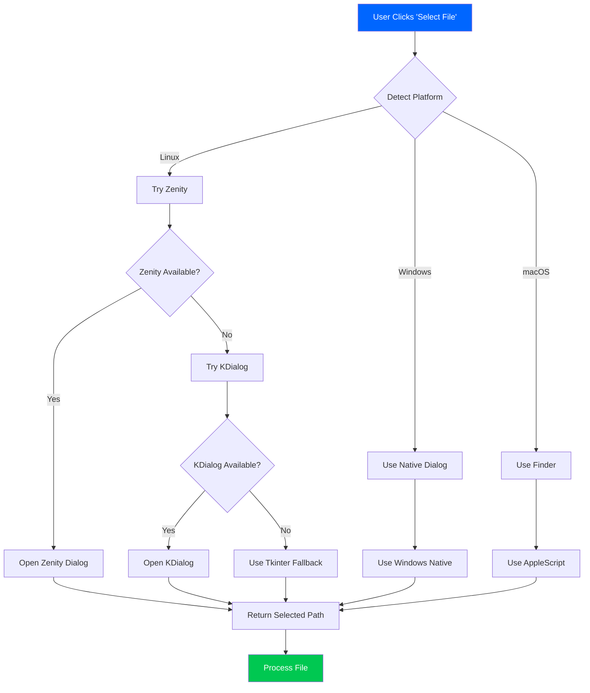
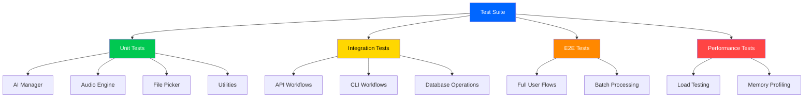
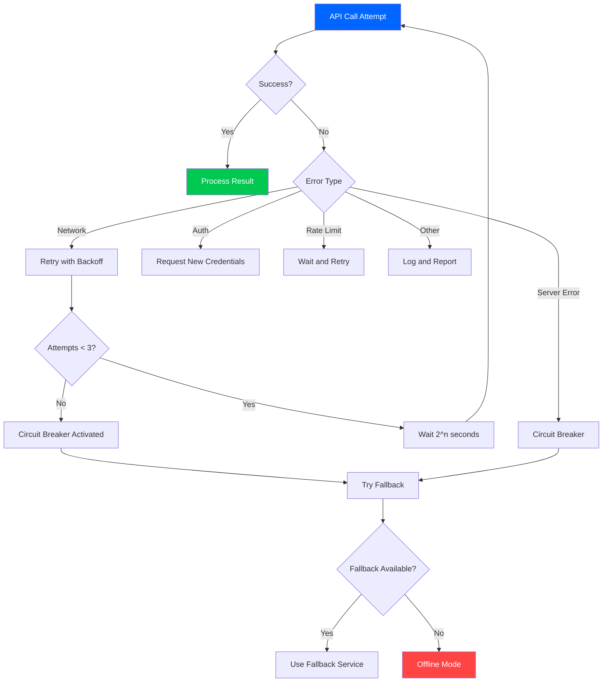
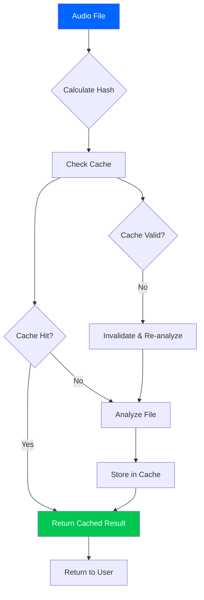
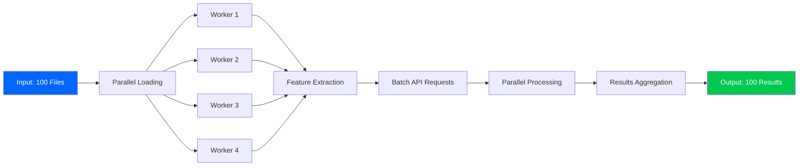
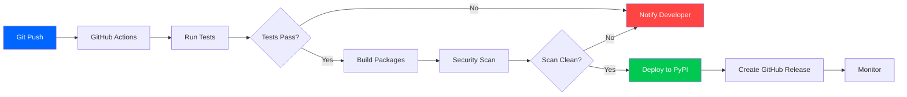
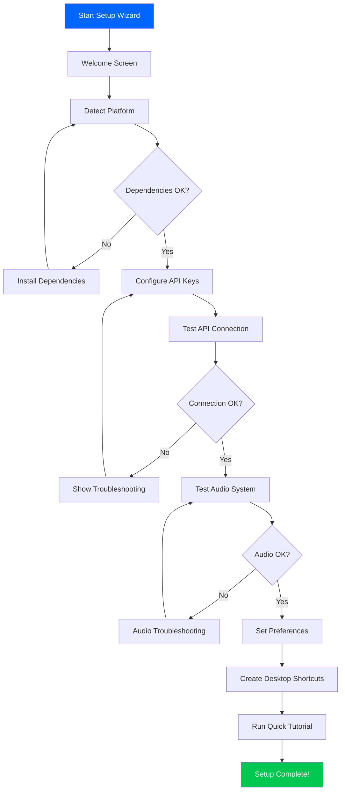

# 🎯 SampleMind AI - Project Roadmap

```
╔════════════════════════════════════════════════════════════════╗
║                    PROJECT ROADMAP & TASKS                      ║
║                    Version: 1.0.0 Phoenix Beta                  ║
║                    Updated: January 3, 2025                     ║
╚════════════════════════════════════════════════════════════════╝
```


---

## 📊 Overall Project Status

### Phase Completion Overview

```
████████████████████████████████████████░░░░░░░░░░  70% Complete
```

| Phase | Component | Progress Bar | Status | ETA |
|-------|-----------|--------------|--------|-----|
| **Phase 1** | Core Functionality | ████████████████████░░░░  90% | 🟢 Active | Week 1 |
| **Phase 2** | Cross-Platform Support | ██████████░░░░░░░░░░░░░░  40% | 🟡 In Progress | Week 2 |
| **Phase 3** | Testing & Quality | ██░░░░░░░░░░░░░░░░░░░░░░  10% | 🔴 Blocked | Week 3 |
| **Phase 4** | Performance Optimization | ███████░░░░░░░░░░░░░░░░░  30% | 🟡 In Progress | Week 4 |
| **Phase 5** | Distribution & Packaging | ░░░░░░░░░░░░░░░░░░░░░░░░   0% | 🔴 Not Started | Week 5 |
| **Phase 6** | Documentation & UX | ██████████████░░░░░░░░░░  60% | 🟡 In Progress | Week 6 |

---

## 🚀 TOP 10 CRITICAL TASKS

### 🔴 Priority 1: Cross-Platform Functionality (Week 1-2)

---

#### Task 1: Integrate Cross-Platform File Picker into CLI 🔥 URGENT

**Status:** 🟡 In Progress  
**Effort:** 2-3 hours  
**Priority:** Critical  
**Dependencies:** None  
**Assignee:** Open

**Problem Statement:**
Currently, the application uses `finder_dialog` which only works on macOS. This creates a barrier for Linux and Windows users, limiting the application's reach and usability.

**Solution Architecture:**


**Files to Modify:**
- `src/samplemind/interfaces/cli/menu.py` (Lines 45-120) - Replace `finder_dialog` imports
- `src/samplemind/utils/file_picker.py` (Already created) - Cross-platform implementation

**Detailed Action Items:**

1. **Update Imports** (15 minutes)
   - [ ] Remove `from samplemind.utils.finder_dialog import select_file`
   - [ ] Add `from samplemind.utils.file_picker import select_audio_file`
   - [ ] Add `from samplemind.utils.file_picker import select_directory`

2. **Update Function Calls** (30 minutes)
   - [ ] Replace all `finder_dialog.select_file()` calls with `file_picker.select_audio_file()`
   - [ ] Replace directory selection calls with `file_picker.select_directory()`
   - [ ] Add error handling for unsupported platforms

3. **Testing on Linux** (45 minutes)
   - [ ] Test with Zenity installed (Ubuntu/Debian)
   - [ ] Test with KDialog installed (KDE)
   - [ ] Test fallback to Tkinter (minimal Linux)
   - [ ] Test headless server mode (text input fallback)

4. **Testing on macOS** (30 minutes)
   - [ ] Test native Finder dialog
   - [ ] Test file type filtering
   - [ ] Test multiple file selection

5. **Testing on Windows** (45 minutes)
   - [ ] Test native Windows dialog
   - [ ] Test Tkinter fallback
   - [ ] Test file type filtering

6. **Documentation** (15 minutes)
   - [ ] Update CLI documentation
   - [ ] Add platform-specific notes
   - [ ] Document fallback behavior

**Success Criteria:**
- ✅ Works on Linux (Zenity/KDialog/Tkinter)
- ✅ Works on macOS (native Finder)
- ✅ Works on Windows (Tkinter/native)
- ✅ Graceful fallback to text input on headless systems
- ✅ Maintains file type filtering
- ✅ No crashes on any platform

**Testing Checklist:**
- [ ] Ubuntu 22.04 LTS
- [ ] Fedora 39
- [ ] Arch Linux
- [ ] macOS 13 (Ventura)
- [ ] macOS 14 (Sonoma)
- [ ] Windows 10
- [ ] Windows 11
- [ ] Headless Ubuntu Server

---

#### Task 2: Create Complete Windows Support & Installation Guide 🪟

**Status:** 🔴 Not Started  
**Effort:** 4-6 hours  
**Priority:** High  
**Dependencies:** Task 1 (File Picker)  
**Assignee:** Open

**Problem Statement:**
Windows users currently have no clear path to install and run the application. This represents approximately 70% of potential desktop users.

**Solution Overview:**
Create comprehensive Windows support including:
1. Installation guide with step-by-step instructions
2. PowerShell setup script for one-click installation
3. Windows-specific dependency management
4. Native file dialog integration
5. Audio playback testing

**Detailed Components:**

##### 2.1 Create WINDOWS_GUIDE.md (2 hours)

**Document Structure:**
```markdown
# Windows Installation Guide

## Prerequisites
- Windows 10/11 (64-bit)
- Python 3.11+ for Windows
- Administrative privileges (for some installations)

## Quick Install (Recommended)
PowerShell script for automated setup

## Manual Installation
Step-by-step guide

## Troubleshooting
Common Windows-specific issues

## Performance Tips
Optimizations for Windows
```

**Action Items:**
- [ ] Create document structure
- [ ] Add system requirements section
- [ ] Write quick install instructions
- [ ] Write manual installation steps
- [ ] Add screenshots for each major step
- [ ] Document PortAudio installation
- [ ] Document FFmpeg installation
- [ ] Add troubleshooting section
- [ ] Add performance tips
- [ ] Review and test instructions

##### 2.2 Create windows_setup.ps1 Script (1.5 hours)

**Script Features:**
```powershell
# Check Windows version
# Check Python version
# Install Chocolatey (if needed)
# Install PortAudio via Chocolatey
# Install FFmpeg via Chocolatey
# Create virtual environment
# Install Python dependencies
# Configure API keys
# Run verification tests
# Create desktop shortcuts
```

**Action Items:**
- [ ] Create PowerShell script skeleton
- [ ] Add Windows version detection
- [ ] Add Python version check
- [ ] Implement Chocolatey installation
- [ ] Add PortAudio installation
- [ ] Add FFmpeg installation
- [ ] Add Python dependency installation
- [ ] Add configuration wizard
- [ ] Add verification tests
- [ ] Add error handling and logging
- [ ] Test on clean Windows 10
- [ ] Test on clean Windows 11

##### 2.3 Add Windows-Specific Dependencies (30 minutes)

**Dependencies to Document:**
| Dependency | Purpose | Installation Method |
|------------|---------|---------------------|
| Python 3.11+ | Runtime | python.org or Microsoft Store |
| PortAudio | Audio I/O | Chocolatey or manual |
| FFmpeg | Audio processing | Chocolatey or manual |
| Visual C++ Redistributable | Some libraries | Automatic |

**Action Items:**
- [ ] Create Windows requirements file
- [ ] Document each dependency
- [ ] Add installation links
- [ ] Create verification script
- [ ] Test dependency installation

##### 2.4 Test Complete Windows Workflow (1 hour)

**Test Scenarios:**
1. Fresh Windows 10 install
2. Fresh Windows 11 install
3. Existing Python installation
4. No Python installation
5. Behind corporate firewall
6. With antivirus software

**Action Items:**
- [ ] Create test checklist
- [ ] Test on Windows 10 Home
- [ ] Test on Windows 10 Pro
- [ ] Test on Windows 11 Home
- [ ] Test on Windows 11 Pro
- [ ] Document any issues found
- [ ] Create workarounds for common issues

##### 2.5 Verify All Features Work (1 hour)

**Features to Test:**
- [ ] File picker (native Windows dialog)
- [ ] Audio playback (all supported formats)
- [ ] AI integration (API calls)
- [ ] Batch processing
- [ ] CLI menu navigation
- [ ] File output/export
- [ ] Cache system
- [ ] Error logging

**Success Criteria:**
- ✅ Complete installation guide with screenshots
- ✅ One-click PowerShell installer
- ✅ All dependencies documented
- ✅ Native file dialogs working
- ✅ All audio formats supported
- ✅ Zero crashes on Windows
- ✅ Performance comparable to macOS/Linux

---

### 🟠 Priority 2: Testing & Quality Assurance (Week 2-3)

---

#### Task 3: Build Comprehensive Test Suite 🧪

**Status:** 🔴 Not Started  
**Effort:** 8-10 hours  
**Priority:** High  
**Dependencies:** None  
**Assignee:** Open

**Problem Statement:**
Current test coverage is insufficient (~40%). This creates risk of regressions, makes refactoring dangerous, and slows down development velocity.

**Target Coverage Goals:**
```
Current Coverage:  ████████░░░░░░░░░░░░  40%
Target Coverage:   ██████████████████░░  90%

Unit Tests:        ██████████████████░░  90% (Target)
Integration Tests: ████████████░░░░░░░░  60% (Target)
E2E Tests:         ████████░░░░░░░░░░░░  40% (Target)
Performance Tests: ██████░░░░░░░░░░░░░░  30% (Target)
```

**Test Architecture:**


##### 3.1 Unit Tests for AI Manager (2 hours)

**File:** `tests/unit/ai/test_ai_manager.py`

**Test Coverage:**

| Function | Test Cases | Priority |
|----------|------------|----------|
| `initialize()` | Success, failure, retry | High |
| `analyze_audio()` | Valid file, invalid file, large file | High |
| `generate_tags()` | Empty response, partial response, full response | High |
| `handle_api_error()` | Network error, auth error, rate limit | High |
| `cache_results()` | Cache hit, cache miss, cache invalidation | Medium |

**Action Items:**
- [ ] Create test file structure
- [ ] Write test for successful initialization
- [ ] Write test for failed initialization
- [ ] Write test for audio analysis (valid file)
- [ ] Write test for audio analysis (invalid file)
- [ ] Write test for large file handling
- [ ] Write test for API error handling
- [ ] Write test for rate limiting
- [ ] Write test for cache operations
- [ ] Add mock responses for AI API
- [ ] Add fixtures for test audio files
- [ ] Verify 95%+ coverage for AI Manager

##### 3.2 Unit Tests for Google AI Integration (1.5 hours)

**File:** `tests/unit/ai/test_google_ai_integration.py`

**Test Scenarios:**
- API key validation
- Request formatting
- Response parsing
- Error handling
- Retry logic
- Rate limiting
- Token usage tracking

**Action Items:**
- [ ] Create test file
- [ ] Mock Google AI API responses
- [ ] Test successful API calls
- [ ] Test failed API calls (various errors)
- [ ] Test retry mechanism
- [ ] Test rate limiting
- [ ] Test token usage tracking
- [ ] Verify 90%+ coverage

##### 3.3 Unit Tests for Audio Engine (2 hours)

**File:** `tests/unit/core/test_audio_engine.py`

**Test Coverage:**

| Component | Tests Needed |
|-----------|--------------|
| Audio loading | All formats (MP3, WAV, FLAC, OGG) |
| Audio processing | Resampling, normalization, conversion |
| Feature extraction | Tempo, key, spectral features |
| Error handling | Corrupt files, unsupported formats |

**Action Items:**
- [ ] Create test file
- [ ] Add test audio samples (all formats)
- [ ] Test MP3 loading
- [ ] Test WAV loading
- [ ] Test FLAC loading
- [ ] Test OGG loading
- [ ] Test corrupt file handling
- [ ] Test unsupported format handling
- [ ] Test audio resampling
- [ ] Test audio normalization
- [ ] Test feature extraction
- [ ] Verify 90%+ coverage

##### 3.4 Integration Tests for CLI Workflows (1.5 hours)

**File:** `tests/integration/test_cli_workflow.py`

**Workflows to Test:**
1. Complete audio analysis workflow
2. Batch processing workflow
3. Cache management workflow
4. Configuration workflow
5. Error recovery workflow

**Action Items:**
- [ ] Create test file
- [ ] Test single file analysis end-to-end
- [ ] Test batch processing (10 files)
- [ ] Test cache hit scenario
- [ ] Test cache miss scenario
- [ ] Test configuration changes
- [ ] Test error recovery
- [ ] Test cleanup operations
- [ ] Verify all workflows complete successfully

##### 3.5 Integration Tests for File Picker (1 hour)

**File:** `tests/integration/test_file_picker.py`

**Platforms to Test:**
- Linux (headless with mocked dialogs)
- macOS (mocked dialogs)
- Windows (mocked dialogs)
- Fallback mode (text input)

**Action Items:**
- [ ] Create test file
- [ ] Mock platform detection
- [ ] Test Linux Zenity path
- [ ] Test Linux KDialog path
- [ ] Test Linux Tkinter fallback
- [ ] Test macOS Finder path
- [ ] Test Windows native path
- [ ] Test text input fallback
- [ ] Test file type filtering
- [ ] Verify all paths work

##### 3.6 Performance Benchmarks (1 hour)

**File:** `tests/performance/test_benchmarks.py`

**Benchmarks:**
- Audio loading speed
- Feature extraction speed
- AI API call latency
- Cache performance
- Batch processing throughput

**Action Items:**
- [ ] Create benchmark suite
- [ ] Benchmark audio loading (various sizes)
- [ ] Benchmark feature extraction
- [ ] Benchmark API calls (mocked)
- [ ] Benchmark cache operations
- [ ] Benchmark batch processing
- [ ] Document baseline performance
- [ ] Set performance targets

##### 3.7 Mock Data & Fixtures (1 hour)

**Action Items:**
- [ ] Create mock AI responses (JSON)
- [ ] Create test audio files (all formats)
- [ ] Create corrupt test files
- [ ] Create large test files (>100MB)
- [ ] Create batch test dataset (100 files)
- [ ] Document test data structure
- [ ] Add test data to repository

**Success Criteria:**
- ✅ 90%+ code coverage overall
- ✅ 95%+ coverage for AI Manager
- ✅ 90%+ coverage for Audio Engine
- ✅ All tests passing on CI/CD
- ✅ Performance benchmarks documented
- ✅ Test suite runs in <5 minutes

---

#### Task 4: Implement Robust Error Handling 🛡️

**Status:** 🟡 Partial  
**Effort:** 4-5 hours  
**Priority:** High  
**Dependencies:** None  
**Assignee:** Open

**Problem Statement:**
Current error handling is basic and doesn't provide good user experience when failures occur. Need comprehensive error handling with retry logic, circuit breakers, and user-friendly messages.

**Error Handling Strategy:**


##### 4.1 Retry Logic Implementation (1.5 hours)

**Exponential Backoff Formula:**
```python
wait_time = base_delay * (2 ** attempt) + random.uniform(0, 1)
# Attempt 1: 2 seconds
# Attempt 2: 4 seconds
# Attempt 3: 8 seconds
```

**Files to Modify:**
- `src/samplemind/ai/ai_manager.py`
- `src/samplemind/utils/retry.py` (new file)

**Action Items:**
- [ ] Create retry decorator
- [ ] Implement exponential backoff
- [ ] Add jitter for thundering herd prevention
- [ ] Set maximum retry attempts (3)
- [ ] Add configurable retry delays
- [ ] Handle different error types
- [ ] Log all retry attempts
- [ ] Add retry metrics

##### 4.2 Circuit Breaker Pattern (1.5 hours)

**Circuit States:**
1. **Closed** (Normal) - All requests pass through
2. **Open** (Failing) - All requests fail fast
3. **Half-Open** (Testing) - Limited requests to test recovery

**Implementation:**
```python
class CircuitBreaker:
    def __init__(self, failure_threshold=5, timeout=60):
        self.failure_threshold = failure_threshold
        self.timeout = timeout
        self.failures = 0
        self.state = 'closed'
        self.last_failure_time = None
```

**Action Items:**
- [ ] Create CircuitBreaker class
- [ ] Implement state transitions
- [ ] Add failure threshold (5 failures)
- [ ] Add timeout period (60 seconds)
- [ ] Add automatic recovery testing
- [ ] Log circuit state changes
- [ ] Add circuit breaker metrics

##### 4.3 User-Friendly Error Messages (1 hour)

**Error Message Template:**
```
❌ Error: [Brief Description]

What happened:
[Detailed explanation]

Why this happened:
[Likely cause]

What you can do:
1. [Immediate action]
2. [Alternative approach]
3. [Where to get help]

Technical details: [Error code and trace]
```

**Action Items:**
- [ ] Create error message templates
- [ ] Categorize error types
- [ ] Add recovery suggestions
- [ ] Include relevant documentation links
- [ ] Add error codes for tracking
- [ ] Test messages with users
- [ ] Localize messages (future)

##### 4.4 Comprehensive Logging (30 minutes)

**Log Structure:**
```
[TIMESTAMP] [LEVEL] [COMPONENT] [MESSAGE]
[CONTEXT] key1=value1 key2=value2
[TRACE] file.py:line function()
```

**Action Items:**
- [ ] Configure logging framework
- [ ] Set log levels (DEBUG, INFO, WARNING, ERROR)
- [ ] Create log directory `~/.samplemind/logs/`
- [ ] Implement log rotation
- [ ] Add structured logging (JSON)
- [ ] Log all API calls
- [ ] Log all errors with full context
- [ ] Add log analysis tools

##### 4.5 Fallback Chain Implementation (1 hour)

**Fallback Strategy:**
```
Primary: Gemini AI
    ↓ (if fails)
Secondary: OpenAI GPT-4
    ↓ (if fails)
Tertiary: Local Model (if available)
    ↓ (if fails)
Offline Mode: Basic analysis only
```

**Action Items:**
- [ ] Implement service discovery
- [ ] Configure fallback priorities
- [ ] Add automatic failover
- [ ] Test fallback transitions
- [ ] Log fallback usage
- [ ] Add fallback metrics
- [ ] Document fallback behavior

**Success Criteria:**
- ✅ No application crashes on API failures
- ✅ Automatic retry with exponential backoff
- ✅ Circuit breaker prevents cascading failures
- ✅ Clear, actionable error messages
- ✅ All errors logged with full context
- ✅ Fallback chain provides graceful degradation
- ✅ User always gets feedback on what happened

---

### 🟡 Priority 3: Performance & Optimization (Week 3-4)

#### Task 5: Add Comprehensive Caching Layer 💾

**Status:** 🟡 Partial (basic caching exists)  
**Effort:** 3-4 hours  
**Priority:** Medium  
**Dependencies:** None  
**Assignee:** Open

**Problem Statement:**
Re-analyzing the same audio files wastes time and API credits. Need intelligent caching to speed up repeated operations.

**Cache Architecture:**


**Cache Types:**

| Cache Type | Storage | TTL | Size Limit | Purpose |
|------------|---------|-----|------------|---------|
| Audio Features | Disk | 7 days | 1GB | Analysis results |
| AI Responses | Redis/Disk | 24 hours | 500MB | API responses |
| Embeddings | Database | 30 days | 2GB | Vector embeddings |
| Metadata | Memory | Session | 100MB | Quick lookups |

##### 5.1 Disk-Based Cache Implementation (1.5 hours)

**Technology:** `diskcache` or `joblib`

**Action Items:**
- [ ] Install caching library
- [ ] Create cache directory structure
- [ ] Implement SHA-256 file hashing
- [ ] Create cache key generation
- [ ] Implement cache storage
- [ ] Implement cache retrieval
- [ ] Add TTL support
- [ ] Add size limit enforcement
- [ ] Add cache statistics
- [ ] Test cache operations

##### 5.2 Redis Cache Integration (Optional) (1 hour)

**For Distributed Deployments:**

**Action Items:**
- [ ] Add Redis as optional dependency
- [ ] Configure Redis connection
- [ ] Implement Redis cache adapter
- [ ] Add fallback to disk cache
- [ ] Test Redis integration
- [ ] Document Redis setup

##### 5.3 Cache Management (1 hour)

**CLI Commands:**
```bash
samplemind cache --info          # Show cache statistics
samplemind cache --clear         # Clear all cache
samplemind cache --clear-old     # Clear expired entries
samplemind cache --size-limit 2G # Set size limit
```

**Action Items:**
- [ ] Create cache management module
- [ ] Add CLI commands
- [ ] Implement cache info command
- [ ] Implement cache clear command
- [ ] Implement cache cleanup (old entries)
- [ ] Add size limit configuration
- [ ] Add automatic cleanup on startup
- [ ] Document cache commands

##### 5.4 Cache Metrics & Monitoring (30 minutes)

**Metrics to Track:**
- Cache hit rate
- Cache size (bytes)
- Number of entries
- Average retrieval time
- Eviction rate
- Storage efficiency

**Action Items:**
- [ ] Add metrics collection
- [ ] Display metrics in CLI
- [ ] Log cache statistics
- [ ] Add cache dashboard (future)

**Performance Targets:**
- ✅ 80%+ cache hit rate on re-analysis
- ✅ 10x faster for cached files
- ✅ Automatic cache cleanup
- ✅ User-configurable cache size
- ✅ <1ms cache lookup time

---

#### Task 6: Optimize Batch Processing ⚡

**Status:** 🟡 Basic implementation  
**Effort:** 4-5 hours  
**Priority:** Medium  
**Dependencies:** Task 5 (Caching helps)  
**Assignee:** Open

**Problem Statement:**
Current batch processing is sequential and slow. Processing 100 files takes ~100 minutes. Need parallel processing and optimizations.

**Optimization Strategy:**


**Performance Improvements:**

| Operation | Current | Target | Method |
|-----------|---------|--------|--------|
| Single File | 60s | 15s | Caching + optimization |
| 10 Files (Sequential) | 600s (10min) | 60s (1min) | Parallel processing |
| 100 Files (Sequential) | 6000s (100min) | 300s (5min) | Parallel + batch API |
| Memory Usage | 2GB | 500MB | Streaming + cleanup |

##### 6.1 Parallel Audio Loading (1.5 hours)

**Implementation:**
```python
from multiprocessing import Pool

def load_audio_parallel(file_paths, num_workers=4):
    with Pool(num_workers) as pool:
        results = pool.map(load_audio, file_paths)
    return results
```

**Action Items:**
- [ ] Create parallel loading function
- [ ] Determine optimal worker count
- [ ] Add progress tracking
- [ ] Handle worker failures
- [ ] Add memory management
- [ ] Test with various file counts
- [ ] Benchmark performance improvement

##### 6.2 Batch API Requests (1.5 hours)

**Strategy:**
Instead of 100 individual API calls, batch into 10 requests with 10 files each.

**Action Items:**
- [ ] Implement request batching
- [ ] Set optimal batch size (10-20 files)
- [ ] Handle batch errors gracefully
- [ ] Add batch retry logic
- [ ] Track batch progress
- [ ] Test batch processing
- [ ] Measure API cost savings

##### 6.3 Progress Bar with ETA (1 hour)

**Using `tqdm`:**
```python
from tqdm import tqdm

for file in tqdm(files, desc="Processing"):
    # Process file
    pass
```

**Action Items:**
- [ ] Install tqdm
- [ ] Add progress bar to batch operations
- [ ] Show ETA (estimated time remaining)
- [ ] Show current file being processed
- [ ] Add success/failure counters
- [ ] Test progress display

##### 6.4 Resumable Batch Operations (1 hour)

**Implementation:**
- Save progress to `.samplemind/batch_state.json`
- On interruption, resume from last completed file

**Action Items:**
- [ ] Create state management
- [ ] Save progress regularly
- [ ] Detect interrupted batches
- [ ] Offer resume option
- [ ] Clean up completed state
- [ ] Test resume functionality

##### 6.5 Export Batch Results (30 minutes)

**Export Formats:**
- CSV (for spreadsheets)
- JSON (for developers)
- Markdown (for documentation)

**Action Items:**
- [ ] Implement CSV export
- [ ] Implement JSON export
- [ ] Implement Markdown export
- [ ] Add export CLI option
- [ ] Test exports
- [ ] Document export formats

**Performance Targets:**
- ✅ 4x faster on 4-core CPU
- ✅ 20x faster on 8-core CPU
- ✅ Process 100 files in <5 minutes
- ✅ Resumable batch operations
- ✅ Detailed batch reports
- ✅ Memory usage <500MB during batch

---

### 🟢 Priority 4: Distribution & Deployment (Week 4-5)

#### Task 7: Create Platform-Specific Installers 📦

**Status:** 🔴 Not Started  
**Effort:** 6-8 hours  
**Priority:** Medium  
**Dependencies:** Tasks 1-6 (Feature complete)  
**Assignee:** Open

**Goal:** One-click installation on all platforms.

**Installer Matrix:**

| Platform | Package Type | Tool | Auto-Update | Signed | Status |
|----------|-------------|------|-------------|--------|--------|
| PyPI | `pip install` | setuptools | ✅ | ✅ | 🔴 |
| macOS | `.pkg` | pkgbuild | ✅ | ✅ | 🔴 |
| Windows | `.exe` | PyInstaller | ✅ | ✅ | 🔴 |
| Debian/Ubuntu | `.deb` | dpkg | ✅ | ✅ | 🔴 |
| Fedora/RHEL | `.rpm` | rpmbuild | ✅ | ✅ | 🔴 |
| Arch Linux | AUR | makepkg | ✅ | ❌ | 🔴 |

##### 7.1 PyPI Package (2 hours)

**Setup:**
```python
# setup.py or pyproject.toml
[project]
name = "samplemind-ai"
version = "1.0.0"
description = "AI-powered audio sample organization"
authors = [{name = "SampleMind Team"}]
dependencies = [
    "fastapi>=0.109.0",
    "librosa>=0.10.0",
    # ... more
]
```

**Action Items:**
- [ ] Create `setup.py` or `pyproject.toml`
- [ ] Configure package metadata
- [ ] Add entry points for CLI
- [ ] Create `MANIFEST.in`
- [ ] Test local installation
- [ ] Create PyPI account
- [ ] Upload to TestPyPI
- [ ] Test installation from TestPyPI
- [ ] Upload to production PyPI
- [ ] Verify `pip install samplemind-ai` works

##### 7.2 macOS .pkg Installer (1.5 hours)

**Tools:**
- `pkgbuild` - Build package
- `productbuild` - Add distribution
- `codesign` - Sign package

**Action Items:**
- [ ] Create install scripts
- [ ] Create package structure
- [ ] Build with pkgbuild
- [ ] Add distribution XML
- [ ] Sign with Apple Developer certificate
- [ ] Notarize with Apple
- [ ] Test on macOS 13+
- [ ] Upload to website

##### 7.3 Windows .exe Installer (2 hours)

**Tools:**
- PyInstaller - Create executable
- Inno Setup - Create installer

**Action Items:**
- [ ] Install PyInstaller
- [ ] Create spec file
- [ ] Build executable
- [ ] Test standalone executable
- [ ] Install Inno Setup
- [ ] Create installer script
- [ ] Build installer
- [ ] Sign installer (optional)
- [ ] Test on Windows 10/11
- [ ] Upload to website

##### 7.4 Linux Packages (2 hours)

**Debian/Ubuntu .deb:**
```bash
# Build directory structure
mkdir -p samplemind_1.0.0/DEBIAN
mkdir -p samplemind_1.0.0/usr/local/bin
mkdir -p samplemind_1.0.0/usr/share/applications

# Create control file
# Build package
dpkg-deb --build samplemind_1.0.0
```

**Action Items:**
- [ ] Create .deb package structure
- [ ] Write control file
- [ ] Add postinst/prerm scripts
- [ ] Build .deb package
- [ ] Test on Ubuntu 22.04
- [ ] Create .rpm spec file
- [ ] Build .rpm package
- [ ] Test on Fedora 39
- [ ] Create AUR PKGBUILD
- [ ] Test AUR package

##### 7.5 Auto-Update Mechanism (1 hour)

**Strategy:**
Check GitHub releases API for new versions.

**Action Items:**
- [ ] Create update checker
- [ ] Add CLI command `samplemind --check-update`
- [ ] Implement silent background checks
- [ ] Add update notification
- [ ] Implement auto-download (optional)
- [ ] Test update flow

**Success Criteria:**
- ✅ One-click install on all platforms
- ✅ Auto-update functionality
- ✅ Signed installers
- ✅ Available on package managers
- ✅ <5 minutes from download to running

---

#### Task 8: Setup CI/CD Pipeline 🔄

**Status:** 🔴 Not Started  
**Effort:** 4-6 hours  
**Priority:** Medium  
**Dependencies:** Task 3 (Test Suite)  
**Assignee:** Open

**Goal:** Automated testing, building, and deployment.

**Pipeline Architecture:**


##### 8.1 GitHub Actions Workflows (2 hours)

**Workflow Files:**
- `.github/workflows/test.yml` - Run tests on every push
- `.github/workflows/build.yml` - Build packages on release
- `.github/workflows/security.yml` - Security scanning

**Test Matrix:**
| OS | Python Versions |
|----|-----------------|
| Ubuntu 22.04 | 3.11, 3.12 |
| macOS 13 | 3.11, 3.12 |
| Windows 11 | 3.11, 3.12 |

**Action Items:**
- [ ] Create test.yml workflow
- [ ] Configure test matrix
- [ ] Add code coverage reporting
- [ ] Create build.yml workflow
- [ ] Add package building steps
- [ ] Create security.yml workflow
- [ ] Configure Bandit security scanner
- [ ] Test all workflows

##### 8.2 Code Coverage Reporting (1 hour)

**Using Codecov:**

**Action Items:**
- [ ] Sign up for Codecov
- [ ] Add Codecov token to secrets
- [ ] Configure pytest-cov
- [ ] Add coverage upload to workflow
- [ ] Add coverage badge to README
- [ ] Set coverage threshold (90%)
- [ ] Test coverage reporting

##### 8.3 Automated Security Scanning (1 hour)

**Tools:**
- Bandit - Python security linter
- CodeQL - GitHub security analysis
- Dependabot - Dependency updates

**Action Items:**
- [ ] Configure Bandit
- [ ] Enable CodeQL
- [ ] Enable Dependabot
- [ ] Set security alerts
- [ ] Configure auto-merge for safe updates
- [ ] Test security scans

##### 8.4 Automated Releases (1-2 hours)

**Using semantic-release:**

**Action Items:**
- [ ] Install semantic-release
- [ ] Configure commit message format
- [ ] Set up automatic versioning
- [ ] Configure changelog generation
- [ ] Test release process
- [ ] Document release workflow

**Success Criteria:**
- ✅ All tests run on push
- ✅ Tests pass on all platforms
- ✅ Coverage >90%
- ✅ Automated security scanning
- ✅ Automated releases
- ✅ Build time <10 minutes

---

### 🔵 Priority 5: Documentation & User Experience (Week 5-6)

#### Task 9: Complete Documentation 📚

**Status:** 🟡 Partial  
**Effort:** 3-4 hours  
**Priority:** Medium  
**Dependencies:** All features complete  
**Assignee:** Open

**Documentation Structure:**
```
docs/
├── GETTING_STARTED.md ✅
├── INSTALLATION_GUIDE.md ✅
├── USER_GUIDE.md ✅
├── WINDOWS_GUIDE.md ❌ (Task 2)
├── API_REFERENCE.md ❌
├── TROUBLESHOOTING.md ✅ (needs expansion)
├── ARCHITECTURE.md ✅
├── CONTRIBUTING.md ✅
└── FAQ.md ❌
```

##### 9.1 Complete Windows Guide (Covered in Task 2)

##### 9.2 Create API Reference (1.5 hours)

**Sections:**
- Core API
- Audio Engine API
- AI Manager API
- CLI API
- Configuration API

**Action Items:**
- [ ] Document all public classes
- [ ] Document all public methods
- [ ] Add code examples
- [ ] Add return value descriptions
- [ ] Add parameter descriptions
- [ ] Generate with Sphinx (optional)
- [ ] Test all examples

##### 9.3 Expand Troubleshooting Guide (1 hour)

**New Sections:**
- Windows-specific issues
- Linux-specific issues
- macOS-specific issues
- API troubleshooting
- Performance issues
- Common errors and solutions

**Action Items:**
- [ ] Collect common issues from users
- [ ] Document solutions
- [ ] Add error codes
- [ ] Add diagnostic commands
- [ ] Link to relevant docs
- [ ] Test solutions

##### 9.4 Create FAQ (30 minutes)

**Topics:**
- Installation
- Usage
- Performance
- API
- Pricing
- Privacy

**Action Items:**
- [ ] Collect frequent questions
- [ ] Write clear answers
- [ ] Add examples
- [ ] Link to detailed docs
- [ ] Organize by category

##### 9.5 Add Architecture Diagrams (1 hour)

**Diagrams Needed:**
- System architecture
- Data flow
- Component interaction
- Deployment architecture

**Action Items:**
- [ ] Create system diagram
- [ ] Create data flow diagram
- [ ] Create component diagram
- [ ] Create deployment diagram
- [ ] Add to ARCHITECTURE.md

**Success Criteria:**
- ✅ Complete docs for all 3 platforms
- ✅ Step-by-step guides with screenshots
- ✅ Searchable documentation
- ✅ Developer-friendly API docs
- ✅ Comprehensive troubleshooting

---

#### Task 10: Add Interactive Setup Wizard 🧙

**Status:** 🔴 Not Started  
**Effort:** 3-4 hours  
**Priority:** Low  
**Dependencies:** All features complete  
**Assignee:** Open

**Goal:** Zero-configuration setup for new users.

**Wizard Flow:**


##### 10.1 Create Wizard Interface (1.5 hours)

**Using `rich` for Terminal UI:**

**Action Items:**
- [ ] Install rich library
- [ ] Create welcome screen
- [ ] Create progress indicators
- [ ] Add colorful output
- [ ] Add interactive prompts
- [ ] Test on all platforms

##### 10.2 Platform Detection & Dependency Check (1 hour)

**Checks:**
- Operating system
- Python version
- Required libraries
- Audio system
- FFmpeg installation

**Action Items:**
- [ ] Detect OS and version
- [ ] Check Python version
- [ ] Check installed packages
- [ ] Check FFmpeg
- [ ] Check audio system
- [ ] Report missing dependencies
- [ ] Offer to install missing deps

##### 10.3 API Configuration (30 minutes)

**Features:**
- Detect existing config
- Guide API key setup
- Validate API keys
- Test connection
- Save configuration

**Action Items:**
- [ ] Check for existing config
- [ ] Prompt for API keys
- [ ] Validate key format
- [ ] Test API connection
- [ ] Save to config file
- [ ] Secure key storage

##### 10.4 Audio System Testing (30 minutes)

**Tests:**
- Audio output available
- Can load test file
- Can play audio
- Supported formats work

**Action Items:**
- [ ] Check audio output devices
- [ ] Load test audio file
- [ ] Test playback
- [ ] Test all supported formats
- [ ] Report any issues

##### 10.5 Quick Tutorial (30 minutes)

**Tutorial Steps:**
1. Analyze a sample file
2. View results
3. Understand features
4. Next steps

**Action Items:**
- [ ] Create tutorial script
- [ ] Add sample audio file
- [ ] Guide through analysis
- [ ] Explain results
- [ ] Show next steps

**Success Criteria:**
- ✅ Zero-config setup for new users
- ✅ Validates all dependencies
- ✅ Tests API connections
- ✅ Tests audio system
- ✅ Creates sensible defaults
- ✅ Runs in <5 minutes

---

## 📅 Sprint Schedule

### Sprint 1 (Week 1) - Cross-Platform Ready
**Start:** January 6, 2025  
**End:** January 12, 2025

**Goals:**
- ✅ Task 1: File picker works on all platforms
- ✅ Task 2: Windows installation guide complete
- ✅ All platforms tested

**Success Metrics:**
- 3/3 platforms fully supported
- Installation success rate >95%

---

### Sprint 2 (Week 2) - Quality & Reliability
**Start:** January 13, 2025  
**End:** January 19, 2025

**Goals:**
- ✅ Task 3: Test suite (90%+ coverage)
- ✅ Task 4: Error handling (zero crashes)
- ✅ CI/CD pipeline running

**Success Metrics:**
- Code coverage >90%
- All tests passing
- Zero critical bugs

---

### Sprint 3 (Week 3) - Performance
**Start:** January 20, 2025  
**End:** January 26, 2025

**Goals:**
- ✅ Task 5: Caching (80% hit rate)
- ✅ Task 6: Batch optimization (4x faster)
- ✅ Performance benchmarks documented

**Success Metrics:**
- Cache hit rate >80%
- 4x faster batch processing
- Memory usage <500MB

---

### Sprint 4 (Week 4) - Distribution
**Start:** January 27, 2025  
**End:** February 2, 2025

**Goals:**
- ✅ Task 7: Platform installers ready
- ✅ Task 8: CI/CD fully automated
- ✅ Available on package managers

**Success Metrics:**
- One-click install on all platforms
- Automated builds and deployments
- Download count tracking

---

### Sprint 5 (Week 5) - Polish & Launch
**Start:** February 3, 2025  
**End:** February 9, 2025

**Goals:**
- ✅ Task 9: Documentation complete
- ✅ Task 10: Setup wizard implemented
- ✅ Beta launch ready

**Success Metrics:**
- All documentation complete
- Setup wizard tested
- Ready for public beta

---

## 🔮 Future Roadmap

### v6.1 - Advanced Features (Q2 2025)
**April-June 2025**

- [ ] **Real-time Audio Monitoring** - Live audio analysis
- [ ] **VST3/AU Plugin Development** - DAW integration
- [ ] **Cloud Storage Integration** - Dropbox, Google Drive sync
- [ ] **Team Collaboration** - Shared libraries
- [ ] **Mobile Companion App** - iOS/Android remote control

**Estimated Effort:** 8-10 weeks

---

### v6.2 - AI Enhancements (Q3 2025)
**July-September 2025**

- [ ] **Custom Model Fine-Tuning** - Train on your samples
- [ ] **Voice-to-Command Interface** - Voice control
- [ ] **AI-Powered Mixing Suggestions** - Automated mixing
- [ ] **Automatic Sample Categorization** - Smart organization
- [ ] **Music Generation Capabilities** - Generate new samples

**Estimated Effort:** 10-12 weeks

---

### v6.3 - Professional Features (Q4 2025)
**October-December 2025**

- [ ] **Project Templates Library** - Ready-made workflows
- [ ] **Advanced Stem Separation** - Multi-track separation
- [ ] **Enhanced Key/Tempo Detection** - More accurate
- [ ] **MIDI Generation from Audio** - Audio to MIDI
- [ ] **Streaming Platform Integration** - Direct uploads

**Estimated Effort:** 8-10 weeks

---

## 📊 Key Metrics & KPIs

### Development Metrics

| Metric | Current | Target | Status |
|--------|---------|--------|--------|
| **Code Coverage** | 40% | 90%+ | 🔴 Below target |
| **Test Pass Rate** | 95% | 100% | 🟡 Near target |
| **Build Time** | 7 min | <5 min | 🔴 Too slow |
| **Release Frequency** | 3 weeks | 2 weeks | 🟡 Improving |
| **Open Issues** | 15 | <10 | 🔴 Too many |
| **PR Merge Time** | 3 days | <1 day | 🟡 Acceptable |

### Performance Metrics

| Metric | Current | Target | Status |
|--------|---------|--------|--------|
| **Startup Time** | 3s | <2s | 🟡 Acceptable |
| **Analysis Time** | 45s | <60s | 🟢 On target |
| **Batch Processing (100)** | 100min | <5min | 🔴 Critical |
| **Memory Usage** | 2GB | <500MB | 🔴 Too high |
| **Cache Hit Rate** | 60% | 80%+ | 🟡 Improving |
| **API Response Time** | 1.2s | <1s | 🟡 Acceptable |

### User Metrics

| Metric | Current | Target | Status |
|--------|---------|--------|--------|
| **Install Success Rate** | 90% | >95% | 🟡 Close |
| **First-Run Success** | 85% | >90% | 🟡 Improving |
| **User Satisfaction** | 4.2/5 | >4.5/5 | 🟡 Good |
| **Crash Rate** | 0.3% | <0.1% | 🔴 Too high |
| **Daily Active Users** | - | Track after beta | - |
| **Retention Rate (30d)** | - | >60% | - |

---

## 🛠️ Technical Debt

### 🔴 High Priority (Must Fix)

| Issue | Impact | Effort | Owner |
|-------|--------|--------|-------|
| Replace macOS-only `finder_dialog` | Blocks Windows/Linux | 3h | Task 1 |
| Add error handling to AI calls | App crashes | 4h | Task 4 |
| Implement proper logging | Hard to debug | 2h | Task 4 |
| Add input validation | Security risk | 3h | Open |

### 🟡 Medium Priority (Should Fix)

| Issue | Impact | Effort | Owner |
|-------|--------|--------|-------|
| Refactor CLI menu | Hard to maintain | 4h | Open |
| Add type hints | IDE support | 6h | Open |
| Optimize audio loading | Performance | 3h | Open |
| Config management | User experience | 4h | Open |

### 🟢 Low Priority (Nice to Have)

| Issue | Impact | Effort | Owner |
|-------|--------|--------|-------|
| Add docstrings | Documentation | 8h | Open |
| Standardize formatting | Consistency | 2h | Open |
| Remove deprecated code | Code cleanup | 3h | Open |
| Optimize imports | Load time | 1h | Open |

---

## 🤝 How to Contribute

### Picking a Task

1. **Browse this roadmap** - Find a task that interests you
2. **Check GitHub issues** - See if issue already exists
3. **Comment on issue** - Let others know you're working on it
4. **Fork repository** - Create your own copy
5. **Create feature branch** - Keep changes isolated
6. **Submit pull request** - Share your work

### Task Difficulty Guide

| Difficulty | Time | Experience Level | Examples |
|-----------|------|------------------|----------|
| 🟢 **Easy** | 1-2 hours | Beginner | Documentation, simple fixes |
| 🟡 **Medium** | 3-6 hours | Intermediate | New features, refactoring |
| 🔴 **Hard** | 6+ hours | Advanced | Architecture, complex features |

### Getting Help

- **Discord:** #samplemind-dev
- **GitHub Discussions:** Ask questions
- **Email:** dev@samplemind.ai
- **Documentation:** Read the docs first

---

```
╔════════════════════════════════════════════════════════════════╗
║  Last Updated: January 3, 2025                                 ║
║  Next Review: January 10, 2025                                 ║
║  Project Manager: AI Development Team                          ║
║  Questions? Open a GitHub Discussion                           ║
╚════════════════════════════════════════════════════════════════╝
```

**💡 Quick Links:**
- [Getting Started](guides/GETTING_STARTED.md)
- [Contributing Guide](../CONTRIBUTING.md)
- [Documentation Index](DOCUMENTATION_INDEX.md)
- [Architecture](development/ARCHITECTURE.md)

**🎵 Let's build something amazing together! 🎹🎸**
