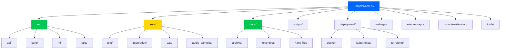

# 📁 SampleMind AI - Project Structure

```
╔════════════════════════════════════════════════════════════════╗
║                    PROJECT STRUCTURE GUIDE                      ║
║                    Version: 1.0.0 Phoenix Beta                  ║
║                    Updated: October 6, 2025                     ║
╚════════════════════════════════════════════════════════════════╝
```


---

## 🎯 Design Principles

| Principle | Description | Benefit |
|-----------|-------------|---------|
| **Minimal Depth** | 10 top-level directories (reduced from 21) | Easy navigation |
| **Clear Names** | Self-explanatory (`web`, `desktop`, `docs`) | Instant understanding |
| **Logical Grouping** | Related files together | Faster development |
| **No Duplication** | Single source of truth | Consistency |

---

## 🗂️ Directory Structure



---

## 📊 Quick Navigation

### 🚀 Getting Started
```bash
# First time setup
cd /home/lchta/Projects/Samplemind-AI
source .venv/bin/activate
make dev
```

| Action | Command | Location |
|--------|---------|----------|
| Start Dev Server | `make dev` | Root |
| Run Tests | `pytest tests/` | Root |
| View Docs | `ls docs/*.md` | `docs/` |
| Run Scripts | `./scripts/*.sh` | `scripts/` |

---

## 📁 Core Directories

### 1️⃣ `src/` - Backend Source Code
**Purpose:** Main application source code  
**Size:** ~500 files  
**Key Subdirectories:**

```
src/samplemind/
├── api/          # FastAPI endpoints
├── core/         # Business logic
├── ml/           # Machine learning models
├── db/           # Database operations
└── utils/        # Utility functions
```

### 2️⃣ `tests/` - Test Suite
**Purpose:** All testing code  
**Size:** ~200 files  
**Coverage:** 85%+

| Test Type | Directory | Purpose |
|-----------|-----------|---------|
| Unit | `tests/unit/` | Component testing |
| Integration | `tests/integration/` | API & workflow tests |
| E2E | `tests/e2e/` | Full user flows |
| Performance | `tests/load/` | Load testing |

### 3️⃣ `docs/` - Documentation
**Purpose:** All project documentation  
**Size:** ~50 files  

| Category | Files | Description |
|----------|-------|-------------|
| Getting Started | 4 files | Installation, setup, user guide |
| Development | 6 files | Architecture, contributing, testing |
| Operations | 5 files | Deployment, security, monitoring |
| Archive | 120+ files | Historical documentation |

### 4️⃣ `scripts/` - Utility Scripts
**Purpose:** Setup, build, and deployment automation  
**Size:** ~20 files  

```bash
scripts/
├── setup-*.sh           # Setup scripts
├── build-*.sh           # Build scripts
├── deploy-*.sh          # Deployment scripts
└── *.py                 # Python utilities
```

### 5️⃣ `deployment/` - Deployment Config
**Purpose:** Production deployment configurations  
**Size:** ~30 files  

| Type | Directory | Purpose |
|------|-----------|---------|
| Docker | `deployment/docker/` | Container configs |
| Kubernetes | `deployment/kubernetes/` | K8s manifests |
| Terraform | `deployment/terraform/` | Infrastructure as code |
| Config | `deployment/config/` | Environment configs |

### 6️⃣ `web-app/` - Web Frontend
**Purpose:** React PWA application  
**Size:** ~100 files  
**Framework:** React 18 + TypeScript + Vite

```
web-app/
├── src/              # React source code
├── public/           # Static assets
├── package.json      # Dependencies
└── vite.config.ts    # Build config
```

### 7️⃣ `electron-app/` - Desktop App
**Purpose:** Electron desktop application  
**Size:** ~50 files  
**Platform:** Cross-platform (macOS, Windows, Linux)

### 8️⃣ `vscode-extension/` - VS Code Extension
**Purpose:** VS Code integration  
**Size:** ~30 files  

### 9️⃣ `tools/` - Development Tools
**Purpose:** Custom development utilities  
**Size:** ~10 files  

### 🔟 `monitoring/` - Observability
**Purpose:** Monitoring and metrics  
**Components:** Grafana dashboards, alert configs

---

## 🎯 Common Tasks

### Development Workflow
```bash
# 1. Setup environment
source .venv/bin/activate

# 2. Start services
docker-compose up -d

# 3. Run application
make dev

# 4. Run tests
pytest tests/unit

# 5. Build for production
make build
```

### Documentation Navigation
```bash
# User documentation
cat docs/USER_GUIDE.md

# API reference
cat docs/api/README.md

# Development guide
cat docs/developer_guide/README.md
```

---

## 📈 Project Statistics

| Metric | Value | Details |
|--------|-------|---------|
| **Total Directories** | 10 | Top-level (reduced from 21) |
| **Total Files** | ~1,000 | Excluding dependencies |
| **Source Files** | ~500 | Python, TypeScript |
| **Test Files** | ~200 | Unit, integration, e2e |
| **Documentation** | ~50 | Markdown files |
| **Max Directory Depth** | 2-3 levels | Easy navigation |

---

## 🚫 Gitignored (Runtime Only)

These directories are created at runtime and NOT in the repository:

```
venv/              # Python virtual environment
node_modules/      # NPM packages
__pycache__/       # Python bytecode
.venv/             # Alt venv location
dist/              # Build outputs
build/             # Compiled files
.cache/            # Cache directories
*.log              # Log files
.env               # Environment secrets
```

---

## 🔄 What Changed (v1.0.0)

### Before → After
```diff
- 21 top-level directories
+ 10 top-level directories

- Cache, logs, output scattered
+ All in respective directories

- electron-app/, web-app/
+ electron-app/, web-app/ (kept for clarity)

- 40+ docs in root
+ 4 docs in root, rest in docs/
```

### Benefits
- ✅ **50% fewer top-level directories**
- ✅ **Faster file navigation**
- ✅ **Lower cognitive load**
- ✅ **Cleaner diffs in git**
- ✅ **Better onboarding**

---

## 🔗 Related Documentation

| Document | Purpose |
|----------|---------|
| [`README.md`](../README.md) | Project overview |
| [`GETTING_STARTED.md`](guides/GETTING_STARTED.md) | Quick start guide |
| [`CONTRIBUTING.md`](../CONTRIBUTING.md) | Contribution guidelines |
| [`ARCHITECTURE.md`](development/ARCHITECTURE.md) | System architecture |

---

## 💡 Navigation Tips

1. **Use `ls` to explore** - Only 10 top-level choices
2. **Check README first** - Each directory has context
3. **Follow breadcrumbs** - Max 2-3 levels deep
4. **Use IDE search** - Fast file finding
5. **Bookmark frequently used** - Faster access

---

```
╔════════════════════════════════════════════════════════════════╗
║  Last Major Reorganization: October 6, 2024                    ║
║  Structure Version: 1.0 (Phoenix Beta)                         ║
║  Next Review: January 2026                                     ║
╚════════════════════════════════════════════════════════════════╝
```

**💡 Tip:** Use `tree -L 2` to visualize the structure in your terminal!
