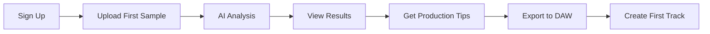

# 🎨 SAMPLEMIND AI - PRODUCT FEATURES & USER EXPERIENCE BLUEPRINT

## Revolutionary Music Production Interface Design
### Cyberpunk Glassmorphic UI with Multi-Dimensional Visualizations

---

## 🌟 CORE PRODUCT FEATURES

### 1. 🧠 AI-POWERED AUDIO INTELLIGENCE

#### Instant Audio Classification
```yaml
feature: Smart Audio Analysis
capabilities:
  - Tempo Detection: 20-300 BPM (±0.1 BPM accuracy)
  - Key & Scale: All major/minor + modes
  - Genre Classification: 50+ genres/subgenres
  - Mood Mapping: 20 emotional categories
  - Energy Levels: 1-10 scale with sub-metrics
  - Instrument Detection: 100+ instruments
  
ai_models:
  primary: Gemini 2.5 Pro
  specialist: Claude 3.5 Sonnet
  local: Phi3, Llama3.1
  
response_time: <500ms
accuracy: >95%
```

#### Intelligent Sample Organization
- **Auto-Tagging:** AI-generated semantic tags
- **Smart Folders:** Dynamic organization by attributes
- **Similarity Clusters:** Vector-based grouping
- **Duplicate Detection:** Perceptual hash matching
- **Quality Scoring:** Production-ready assessment

#### Production Coaching
- **Arrangement Suggestions:** Structure optimization
- **Mix Feedback:** EQ, compression, spatial recommendations
- **Harmonic Analysis:** Chord progression enhancement
- **Rhythm Patterns:** Groove improvement tips
- **Reference Matching:** Similar professional tracks

---

### 2. 🎭 MULTI-DIMENSIONAL VISUALIZATIONS

#### Neurologic Waveform Display
```javascript
class NeurologicVisualizer {
  features: {
    - Synaptic pulse patterns
    - Neural network activation maps
    - Consciousness wave simulations
    - Quantum entanglement effects
    - Fractal audio representations
  }
  
  rendering: {
    engine: "Three.js + WebGL 2.0"
    fps: 60
    resolution: "4K capable"
    vr_ready: true
  }
}
```

#### Interactive 3D Spectrum
- **Real-time FFT:** 2048-point analysis
- **Frequency Waterfall:** Time-based depth
- **Harmonic Highlighting:** Note detection overlay
- **Interactive Manipulation:** Click to isolate frequencies
- **Color Mapping:** Customizable amplitude visualization

#### Rhythm Matrix Grid
- **Step Sequencer View:** 16/32/64 steps
- **Polyrhythm Layers:** Up to 8 simultaneous patterns
- **Velocity Mapping:** Color-coded dynamics
- **Pattern Recognition:** AI-detected grooves
- **Export to MIDI:** Direct DAW integration

---

### 3. 🎹 DAW INTEGRATION SUITE

#### FL Studio Native Plugin
```cpp
class SampleMindFLPlugin : public FL_Plugin {
  features:
    - Drag & drop from plugin to playlist
    - Real-time tempo sync
    - Pattern integration
    - Mixer routing automation
    - Project-wide sample management
    
  shortcuts:
    - Ctrl+Shift+S: Open SampleMind panel
    - Alt+A: Analyze current sample
    - Ctrl+G: Generate similar samples
}
```

#### Ableton Live Integration
- **Push Controller Support:** Hardware integration
- **Live Set Scanning:** Automatic project analysis
- **Clip Launcher Integration:** Smart sample suggestions
- **Warping Assistance:** AI-powered time stretching
- **Effect Chain Recommendations:** Context-aware processing

#### Universal VST3/AU/AAX Plugin
- **Cross-DAW Compatibility:** All major DAWs
- **Preset Management:** Cloud-synced settings
- **MIDI Learn:** Full parameter mapping
- **Automation Support:** All parameters exposed
- **Sidechain Analysis:** Multi-input processing

---

## 🎨 CYBERPUNK GLASSMORPHIC UI DESIGN

### Visual Design Language

#### Glass Components
```css
.glass-panel {
  /* Glassmorphic Base */
  background: linear-gradient(
    135deg,
    rgba(0, 255, 255, 0.1),
    rgba(255, 0, 255, 0.05)
  );
  backdrop-filter: blur(20px) saturate(180%);
  -webkit-backdrop-filter: blur(20px) saturate(180%);
  border: 1px solid rgba(255, 255, 255, 0.18);
  border-radius: 20px;
  box-shadow: 
    0 8px 32px rgba(0, 255, 255, 0.37),
    inset 0 0 20px rgba(255, 0, 255, 0.1);
    
  /* Neon Glow Effects */
  animation: pulse-glow 2s ease-in-out infinite;
}

@keyframes pulse-glow {
  0%, 100% { box-shadow: 0 0 20px rgba(0, 255, 255, 0.5); }
  50% { box-shadow: 0 0 40px rgba(0, 255, 255, 0.8); }
}
```

#### Neon Color System
```javascript
const colorTheme = {
  primary: {
    neonCyan: '#00FFFF',
    electricBlue: '#0080FF',
    quantumPurple: '#8000FF'
  },
  accent: {
    hotPink: '#FF0080',
    laserGreen: '#00FF80',
    plasmaYellow: '#FFFF00'
  },
  glass: {
    dark: 'rgba(0, 0, 0, 0.3)',
    medium: 'rgba(0, 0, 0, 0.5)',
    heavy: 'rgba(0, 0, 0, 0.7)'
  },
  grid: {
    color: '#00FFFF',
    opacity: 0.1,
    size: '20px'
  }
}
```

### Interface Layouts

#### Main Dashboard
```
┌─────────────────────────────────────────────────────┐
│  🎵 SAMPLEMIND AI                    [≡] [🔔] [👤]  │
├─────────────────────────────────────────────────────┤
│                                                      │
│  ┌────────────────┐  ┌──────────────────────────┐  │
│  │                │  │     3D VISUALIZER        │  │
│  │   WAVEFORM     │  │   [Neurologic Mode]      │  │
│  │                │  │                          │  │
│  │  ∿∿∿∿∿∿∿∿∿∿∿∿  │  │    ✦ ◈ ✧ ◆ ✦           │  │
│  │                │  │      ◇ ★ ◈ ✧             │  │
│  └────────────────┘  │        ✦ ◆ ★             │  │
│                      └──────────────────────────┘  │
│                                                      │
│  ┌─────────────────────────────────────────────┐   │
│  │ 📊 ANALYSIS RESULTS                         │   │
│  │ ├─ Tempo: 128.0 BPM      ├─ Mood: Energetic│   │
│  │ ├─ Key: C Minor          ├─ Energy: 8.5/10 │   │
│  │ └─ Genre: Future Bass    └─ Quality: Pro   │   │
│  └─────────────────────────────────────────────┘   │
│                                                      │
│  ┌─────────────────────────────────────────────┐   │
│  │ 🤖 AI INSIGHTS                              │   │
│  │ "This track has strong dancefloor potential │   │
│  │  with its driving bassline. Consider adding │   │
│  │  more high-frequency elements at 2:30..."   │   │
│  └─────────────────────────────────────────────┘   │
│                                                      │
└─────────────────────────────────────────────────────┘
```

#### Sample Browser
```
┌─────────────────────────────────────────────────────┐
│  🔍 SMART SAMPLE BROWSER           [Grid] [List]    │
├─────────────────────────────────────────────────────┤
│                                                      │
│  Filters: [Genre ▼] [BPM ▼] [Key ▼] [Mood ▼]      │
│  AI Search: "Find dark atmospheric pads in Cm"  🔍  │
│                                                      │
│  ┌─────────┬─────────┬─────────┬─────────┐        │
│  │  KICK   │  SNARE  │  HI-HAT │  CLAP   │ Fav    │
│  │  128bpm │  Trap   │ Rolling │ Reverb  │        │
│  │  ♪ ▶ ⬇ │  ♪ ▶ ⬇ │  ♪ ▶ ⬇ │  ♪ ▶ ⬇ │        │
│  ├─────────┼─────────┼─────────┼─────────┤        │
│  │  BASS   │  PAD    │  LEAD   │  PLUCK  │        │
│  │  Sub    │ Ambient │ Supersaw│ Mallet  │        │
│  │  ♪ ▶ ⬇ │  ♪ ▶ ⬇ │  ♪ ▶ ⬇ │  ♪ ▶ ⬇ │        │
│  └─────────┴─────────┴─────────┴─────────┘        │
│                                                      │
│  Similarity Map: [Show samples similar to selected] │
│                                                      │
└─────────────────────────────────────────────────────┘
```

---

## 🎮 USER WORKFLOWS & JOURNEYS

### Workflow 1: First-Time Producer



**Journey Steps:**
1. **Onboarding** (2 minutes)
   - Email/Google sign-up
   - Choose music style preference
   - Select DAW (FL Studio, Ableton, etc.)

2. **First Analysis** (30 seconds)
   - Drag & drop audio file
   - Watch real-time visualization
   - Receive instant AI feedback

3. **Learning Mode**
   - Interactive tutorials
   - Guided production tips
   - Video walkthroughs

### Workflow 2: Professional Producer

```yaml
professional_workflow:
  1_batch_import:
    - Upload entire sample library
    - Background processing (1000 files/hour)
    - Automatic organization
    
  2_project_integration:
    - Connect to active DAW project
    - Real-time sync
    - Contextual suggestions
    
  3_advanced_analysis:
    - Harmonic mixing preparation
    - Reference track comparison
    - Stem separation
    
  4_collaboration:
    - Share projects with team
    - Version control
    - Comment system
```

### Workflow 3: Live Performance

**Real-Time Mode Features:**
- **BPM Sync:** Automatic tempo matching
- **Key Lock:** Harmonic mixing assistant
- **Next Track Suggestion:** AI-powered selection
- **Energy Flow:** Crowd reading algorithms
- **Visual Sync:** VJ integration ready

---

## 📱 PLATFORM-SPECIFIC EXPERIENCES

### Desktop Application (Windows/Mac/Linux)

```yaml
desktop_features:
  exclusive:
    - Full VST3/AU plugin support
    - Unlimited file processing
    - Local AI model option
    - Hardware controller support
    - Multi-monitor layouts
    
  performance:
    - Native OS integration
    - GPU acceleration
    - Background processing
    - System-wide hotkeys
```

### Web Application

```javascript
// Progressive Web App Configuration
const webAppFeatures = {
  responsive: {
    mobile: '320px - 768px',
    tablet: '768px - 1024px',
    desktop: '1024px+'
  },
  
  offline_mode: {
    cached_analyses: 100,
    local_storage: '50MB',
    service_worker: true
  },
  
  browser_support: [
    'Chrome 100+',
    'Firefox 100+',
    'Safari 15+',
    'Edge 100+'
  ]
}
```

### Mobile Companion App

**iOS/Android Features:**
- Quick audio capture
- Remote DAW control
- Sample preview on-the-go
- Push notifications
- Gesture controls

---

## 🎯 GAMIFICATION & ENGAGEMENT

### Achievement System

```python
achievements = {
    'First Beat': 'Analyze your first sample',
    'Sonic Explorer': 'Analyze 100 different genres',
    'Tempo Master': 'Correctly identify 50 BPMs',
    'Harmonic Wizard': 'Master key detection',
    'Production Guru': 'Complete 10 AI coaching sessions',
    'Collaboration King': 'Share 5 projects',
    'Early Adopter': 'Beta tester badge',
    'Genre Bender': 'Mix 5 different genres successfully'
}

rewards = {
    'badges': 'Display on profile',
    'credits': 'Extra AI analyses',
    'features': 'Unlock premium visualizations',
    'recognition': 'Featured producer status'
}
```

### Social Features

- **Producer Profiles:** Showcase your work
- **Community Challenges:** Weekly production contests
- **Sample Exchange:** Trade with other producers
- **Collaboration Rooms:** Real-time co-production
- **Tutorial Creation:** Earn by teaching

---

## 🔧 CUSTOMIZATION & PERSONALIZATION

### User Preferences

```yaml
personalization:
  ui_themes:
    - Cyberpunk Neon (default)
    - Dark Minimal
    - Light Professional
    - Custom RGB Builder
    
  workflow_presets:
    - Hip-Hop Producer
    - EDM Creator
    - Film Composer
    - Live Performer
    
  ai_personality:
    - Professional Coach
    - Creative Partner
    - Technical Assistant
    - Minimal Guidance
    
  visualization_modes:
    - Neurologic Waves
    - Classic Spectrum
    - Particle System
    - Matrix Grid
```

### Adaptive Learning

**AI Learns Your Style:**
1. Track preference patterns
2. Adjust recommendations
3. Customize UI based on usage
4. Predict next actions
5. Optimize for your workflow

---

## 📊 ANALYTICS DASHBOARD

### Producer Statistics

```sql
-- User Analytics View
CREATE VIEW producer_stats AS
SELECT 
  samples_analyzed,
  genres_explored,
  production_hours,
  ai_interactions,
  collaboration_count,
  success_tracks,
  learning_progress
FROM user_metrics
WHERE user_id = :current_user;
```

**Metrics Displayed:**
- Daily/Weekly/Monthly activity
- Genre distribution pie chart
- BPM preference histogram
- Production time heatmap
- AI usage patterns
- Collaboration network graph

---

## 🎓 EDUCATION & LEARNING

### Interactive Tutorials

```javascript
const tutorialSystem = {
  beginner: [
    'Understanding Audio Basics',
    'Your First Beat',
    'Introduction to Mixing',
    'Using AI Assistance'
  ],
  
  intermediate: [
    'Advanced Arrangement',
    'Harmonic Mixing',
    'Sound Design Basics',
    'Collaboration Techniques'
  ],
  
  advanced: [
    'Neurologic Physics',
    'AI Model Training',
    'Custom Visualizations',
    'Production Mastery'
  ]
}
```

### AI Coaching Sessions

**Personalized Learning Paths:**
1. **Initial Assessment:** Skill level evaluation
2. **Custom Curriculum:** Tailored to goals
3. **Progress Tracking:** Milestone achievements
4. **Live Feedback:** Real-time corrections
5. **Certification:** Industry-recognized credentials

---

## 🔒 PRIVACY & USER CONTROL

### Data Management

```yaml
privacy_features:
  user_control:
    - Download all data (GDPR)
    - Delete account permanently
    - Selective data sharing
    - Anonymous mode option
    
  audio_protection:
    - End-to-end encryption
    - No permanent storage (optional)
    - Watermarking (optional)
    - Copyright protection
    
  ai_transparency:
    - See what AI analyzes
    - Opt-out of training data
    - Model selection control
    - Processing location choice
```

---

## 📱 NOTIFICATION SYSTEM

### Smart Alerts

```javascript
const notificationTypes = {
  production: {
    'Analysis Complete': 'Your batch is ready',
    'Similar Sample Found': 'New match in library',
    'Collaboration Request': 'Producer wants to work with you'
  },
  
  learning: {
    'New Tutorial': 'Learn advanced mixing',
    'Achievement Unlocked': 'You're a Tempo Master!',
    'Weekly Challenge': 'Create a future bass track'
  },
  
  system: {
    'Update Available': 'New features ready',
    'Maintenance': 'Scheduled downtime',
    'Subscription': 'Renewal reminder'
  }
}
```

---

## 🚀 FEATURE ROADMAP

### Phase 1 (Beta 2026)
- ✅ Core audio analysis
- ✅ Basic AI integration
- ✅ Web interface
- ✅ FL Studio plugin
- 🔄 User onboarding

### Phase 2 (Launch 2027)
- Advanced visualizations
- Multi-DAW support
- Mobile apps
- Collaboration features
- Marketplace launch

### Phase 3 (Scale 2028)
- AI model marketplace
- Hardware integration
- VR/AR support
- Stem separation
- Live performance mode

### Phase 4 (Innovation 2029+)
- Brain-computer interface
- Quantum processing
- Holographic displays
- Neural synthesis
- Consciousness integration

---

## 🎯 SUCCESS METRICS

### User Experience KPIs

| Metric | Target | Measurement |
|--------|--------|-------------|
| Onboarding Completion | >80% | Funnel analysis |
| Daily Active Users | >40% | DAU/MAU ratio |
| Session Duration | >20 min | Analytics tracking |
| Feature Adoption | >60% | Usage statistics |
| User Satisfaction | >4.5/5 | NPS surveys |
| Churn Rate | <5% | Monthly cohorts |

---

**Document Version:** 1.0  
**Last Updated:** October 2024  
**Status:** PRODUCT SPECIFICATION  
**Classification:** CONFIDENTIAL  

© 2024 SampleMind AI - Designing the Future of Music Production